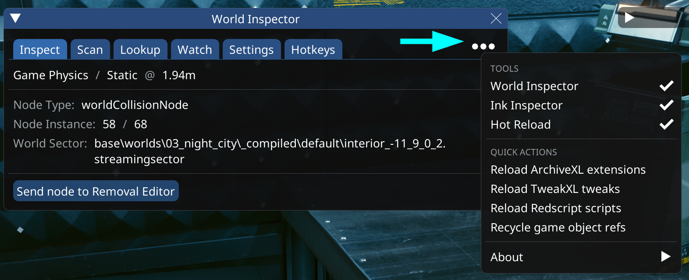
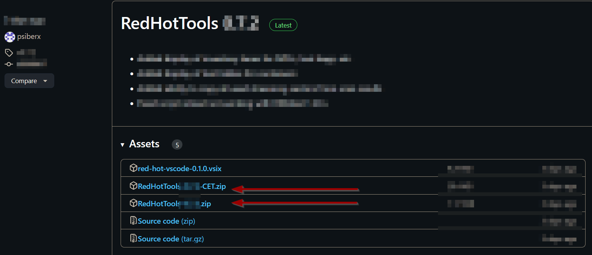

# RedHotTools

## Summary

**Created:** Jun 13 2024 by [manavortex](https://app.gitbook.com/u/NfZBoxGegfUqB33J9HXuCs6PVaC3 "mention")\
**Last documented edit:** Aug 18 2024 by [manavortex](https://app.gitbook.com/u/NfZBoxGegfUqB33J9HXuCs6PVaC3 "mention")

This page will give you an overview about psiberx's mod **RedHotTools**, give you an [#installation-guide](./#installation-guide "mention"), and link you to more detailed documentation on the sub-pages.

## What does it do?

Integrated with Cyber Engine Tweaks, Wolvenkit and VisualStudio Code, RHT offers an invaluable toolikit for mod developers:

<figure><figcaption></figcaption></figure>

### World Inspector

This CET widget lets you inspect the world around you, as well as the player and their equipment. Read more about it under [rht-the-world-inspector.md](rht-the-world-inspector.md "mention")

### Inspect the player

Via [#world-inspector-watch-the-player](rht-the-world-inspector.md#world-inspector-watch-the-player "mention") you can see the player puppet's component in both first and third person, seeing changes to their appearance in real time.

### Ink inspector

This CEt widget lets you inspect the game's interface. Read more about it under [rht-ink-inspector.md](rht-ink-inspector.md "mention")

### Hot Reload

This feature allows reloading mod files without restarting the game. You can use the CET widget to trigger it at any time, or rely on the integration with WolvenKit.

For more information, read [rht-hot-reload.md](rht-hot-reload.md "mention")

#### Script checking

This feature is enabled automatically

* See scripts validation and binding errors
* Prevent game from starting if scripts compilation fails

## Installation guide

### Without a mod manager

You can download RedHotTools on [psiberx's github](https://github.com/psiberx/cp2077-red-hot-tools/releases):

<figure><figcaption></figcaption></figure>

To install it, extract both downloaded files **directly** into your [Cyberpunk 2077 game directory](../../../for-mod-users/users-modding-cyberpunk-2077/the-cyberpunk-2077-game-directory/).

### With Mod Organizer 2

Historically, RHT and MO2 have not been officially compatible, which means you cannot test mod changes using Hot Reload if you're using Mod Organizer 2. Fortunately, there's now one documented work-around that is 99% of the functionality that works as-of Cyberpunk 2.31:

1. Starting from a fresh install with no mods manually installed, install your mods (including the ones that say "manual install only") using MO2. That means following [this guide](https://wiki.redmodding.org/cyberpunk-2077-modding/for-mod-users/users-modding-cyberpunk-2077/getting-started/mo2-mod-organizer-2#script-extenders-plugin-installation-guide) for MO2 setup.
2. Run your game once and quit normally (if it's a truly clean install, you should get prompted to set up your CET hotkey).
3. You should now have some files in your MO2 Overwrite; let's back those up, as it will contain (among other things) your CET bind. Create an empty mod called "Overwrites", right-click on Overwrite and "Move content to mod..." to your new empty mod. Consider this a backup you can always go back to if installing RHT messes up your install.

<figure><figcaption>
MO2 "Create empty mod"
</figcaption></figure>

4. Install RHT and RHT Overlay as two separate mods, using "Install mod" on each .zip file downloaded from the [GitHub releases for RHT](https://github.com/psiberx/cp2077-red-hot-tools/releases). Importantly, do NOT install RHT via Wolvenkit's Plugins page (actually make sure it's actively uninstalled)!
5. Now you should be able to use hot reload. Unfortunately, you can't use the Hot Reload shortcut from Wolvenkit, but you can do it manually: While your game is running, move your `.archive` file for your mod (found in `/(your_project)/packed/archive/pc/mod`) into the `/archive/pc/hot` folder. Your `.archive` file will disappear while in that folder, which should mean the game picked up your changes.
