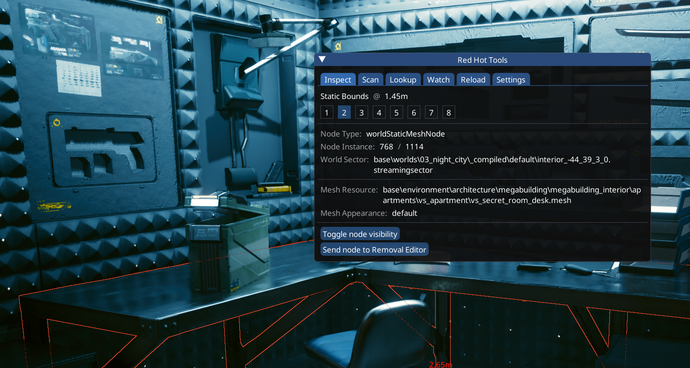
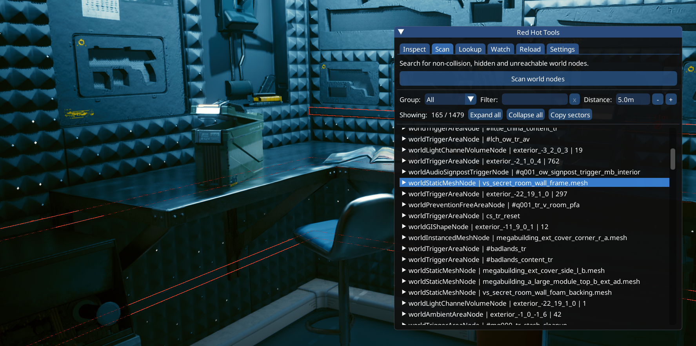
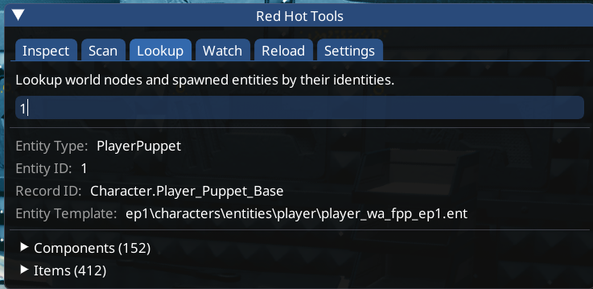
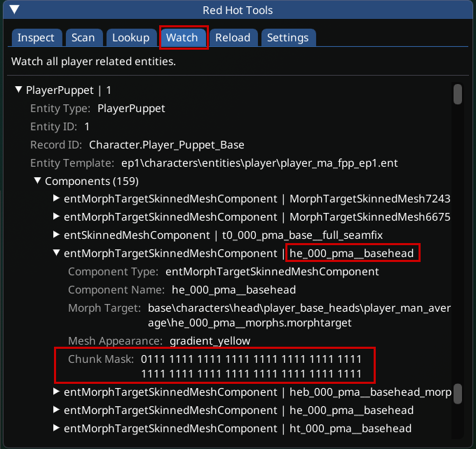

# RedHotTools

## Installation guide

You can download RedHotTools on [psiberx's github](https://github.com/psiberx/cp2077-red-hot-tools/releases):

<figure><figcaption></figcaption></figure>

To install it, extract both downloaded files directly into your Cyberpunk 2077 game directory.

## What does it do?

Integrated with Cyber Engine Tweaks, Wolvenkit and VisualStudioCode, it offers the following features:

### Hot Reload

RHT can reload archives, scripts and tweaks for you at runtime without having to restart the game.

For documentation on how to do this, check [rht-hot-reload.md](rht-hot-reload.md "mention")

### Script checking

* See scripts validation and binding errors
* Prevent game from starting if scripts compilation fails

## Game object inspection

With the RHT overlay for Cyber Engine Tweaks, you can inspect game objects at runtime:

### Inspect

Here, you can inspect world nodes and their properties:

<figure><figcaption></figcaption></figure>

### Scan

Here, you can scan for any nodes around you:

<figure><figcaption></figcaption></figure>

If you expand the node properties, you can simply hide them at run-time, or use the integration with [Removal Editor](https://github.com/justarandomguyintheinternet/CP77\_removalEditor) to create permanent presets:

<figure><figcaption></figcaption></figure>

### Lookup

Reverse search of world nodes and spawned entities

<figure><figcaption></figcaption></figure>

## Inspecting chunkmasks

RedHotTools lets you look up chunk masking of existing items at runtime.


You can inspect chunkmasks of player or NPC equipment via AppearanceCreatorMod; check [submeshes-materials-and-chunks.md](../../files-and-what-they-do/3d-objects-.mesh-files/submeshes-materials-and-chunks.md "mention") -> [#acm](../../files-and-what-they-do/3d-objects-.mesh-files/submeshes-materials-and-chunks.md#acm "mention") for details.


### Components

For player or NPC clothing, you can use the Watch tab. Find the component in the corresponding puppet's component array:

<figure><figcaption></figcaption></figure>

### Entities

TBD
