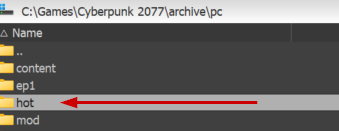
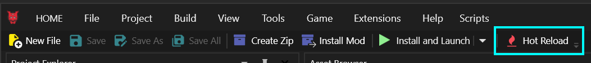
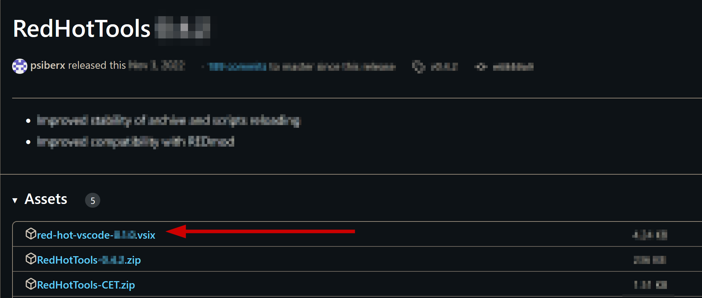
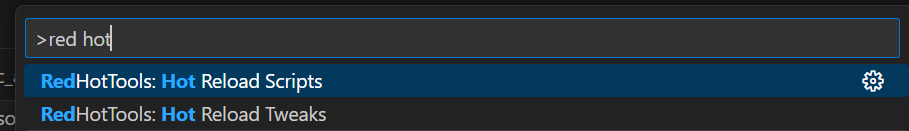
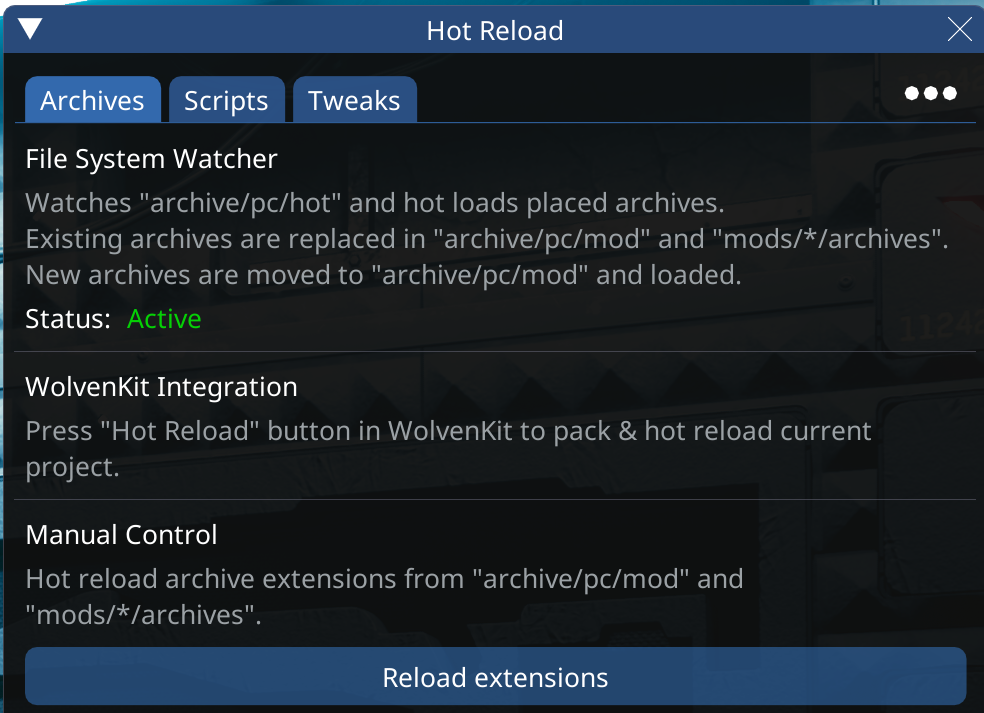
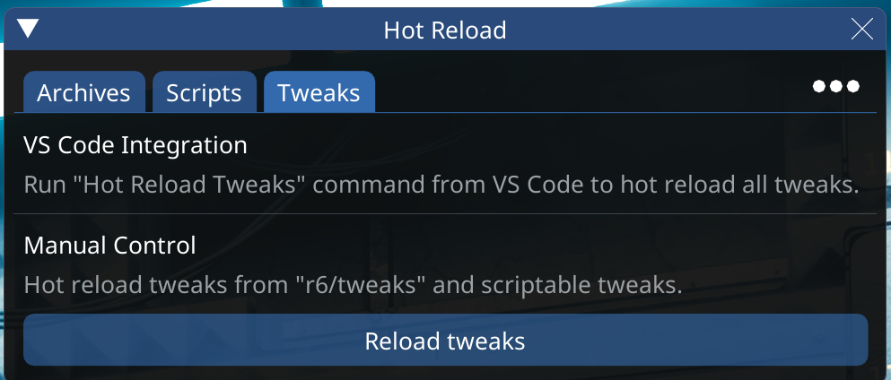

# RHT: Hot Reload

## Summary

**Published:** Aug 18 2024 by [manavortex](https://app.gitbook.com/u/NfZBoxGegfUqB33J9HXuCs6PVaC3 "mention")\
**Last documented edit:** Aug 18 2024 by [manavortex](https://app.gitbook.com/u/NfZBoxGegfUqB33J9HXuCs6PVaC3 "mention")

This page describes Red Hot Tools's **Hot Reload mechanism**.

## How it works

Although there is a CET overlay, Hot Reload is fully integrated with Wolvenkit and Visual Studio Code — you don't have to do anything except pushing the right button.

### The theory

As you know, Cyberpunk 2077 loads its mods from `archive/pc/mod`. While you run around in Night City, it will keep them open and use the files inside as it needs them.&#x20;


As far as the game is concerned, the `.archive` files never change.&#x20;


By placing `.archive`s inside the `hot` folder, you put them under the control of RHT, which will add them to the game's internal pool of never-changing content:

<figure><figcaption></figcaption></figure>

### But the folder is always empty!

That's because RHT moves the file into `mods` and splices them into the game's resource pool.&#x20;


Don't worry if your files disappear from `hot`, that means everything is working as intended.


### But my changes don't show up!

Red Hot Tools invalidates the game's resources and loads your changes, but things that are already spawned won't be affected. Here is how you can trigger change detection:

* Loading a save (always works)
* Spawning a new copy of your item via CET and equipping that (usually works)
* Despawning and respawning the NPC or world entity you're modifying (usually works)
* Respawn the UI widget (usually works)
* Unequipping and re-equipping your item (sometimes works)

## Integrations

### Wolvenkit

Simply push the "Hot Reload" button in your toolbar:

<figure><figcaption></figcaption></figure>

### Visual Studio Code

You can download the RHT plugin `red-hot-vscode-x.x.x.vsix` from [github](https://github.com/psiberx/cp2077-red-hot-tools/releases/):&#x20;

<figure><figcaption></figcaption></figure>

Install the extension via Extension Manager's `...` menu (`Install from VSIX...`) and restart VScode.\
Now you can see the following actions:

<figure><figcaption>
You can open the Commands palette by pressing <code>Ctrl+Shift+P</code>
</figcaption></figure>

## The CET overlay

Hot Reload is integrated with [Cyber Engine Tweaks](https://app.gitbook.com/o/-MP5ijqI11FeeX7c8-N8/s/-MP5jWcLZLbbbzO-\_ua1-887967055/). Depending on your workflow, you don't need these buttons.

### Archives

Here, you can manually trigger a reload of archive extensions (read: `.xl` files). \
You only have to do this if you edit an .xl file in `archive/pc/mods`.


Pushing the button will not reload `.archive` files. RHT will do that automatically by watching the `hot` folder.


<figure><figcaption></figcaption></figure>

### Scripts

Here, you can manually trigger a reload.&#x20;

_You can do this via by running "Hot Reload Scripts" from Visual Studio Code_

<figure><figcaption></figcaption></figure>

### Tweaks

Here, you can manually trigger a reload.&#x20;

_You can do this via by running "Hot Reload Scripts" from Visual Studio Code_

<figure><figcaption></figcaption></figure>

