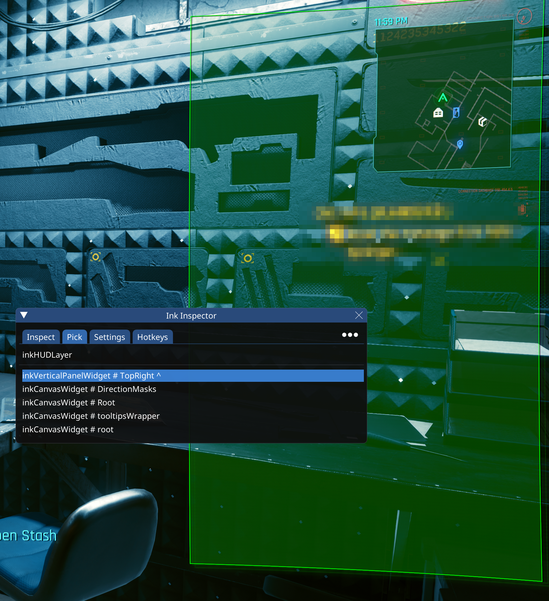

# RHT: Ink Inspector

## Summary

**Created:** Aug 18 2024 by [manavortex](https://app.gitbook.com/u/NfZBoxGegfUqB33J9HXuCs6PVaC3 "mention")\
**Last documented edit:** Aug 18 2024 by [manavortex](https://app.gitbook.com/u/NfZBoxGegfUqB33J9HXuCs6PVaC3 "mention")

This page describes RHT's Ink Inspector and tells you how to analyze Cyberpunk's UI

## Ink Inspector: Inspect

This tab lets you see the UI's entire hierarchy.&#x20;

If you highlight a row, an overlay will appear on the corresponding parts of the screen.

<figure><figcaption></figcaption></figure>

## Ink Inspector: Pick

By binding a custom hotkey, you can analyze any widget on the game's default interface:

<figure><figcaption></figcaption></figure>
