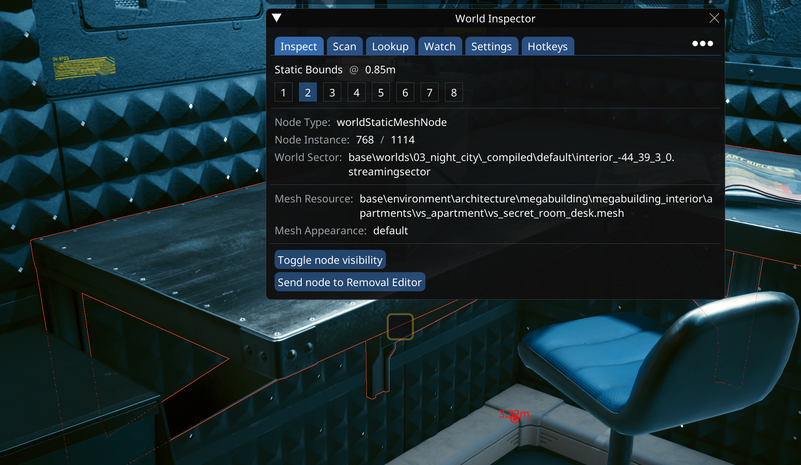
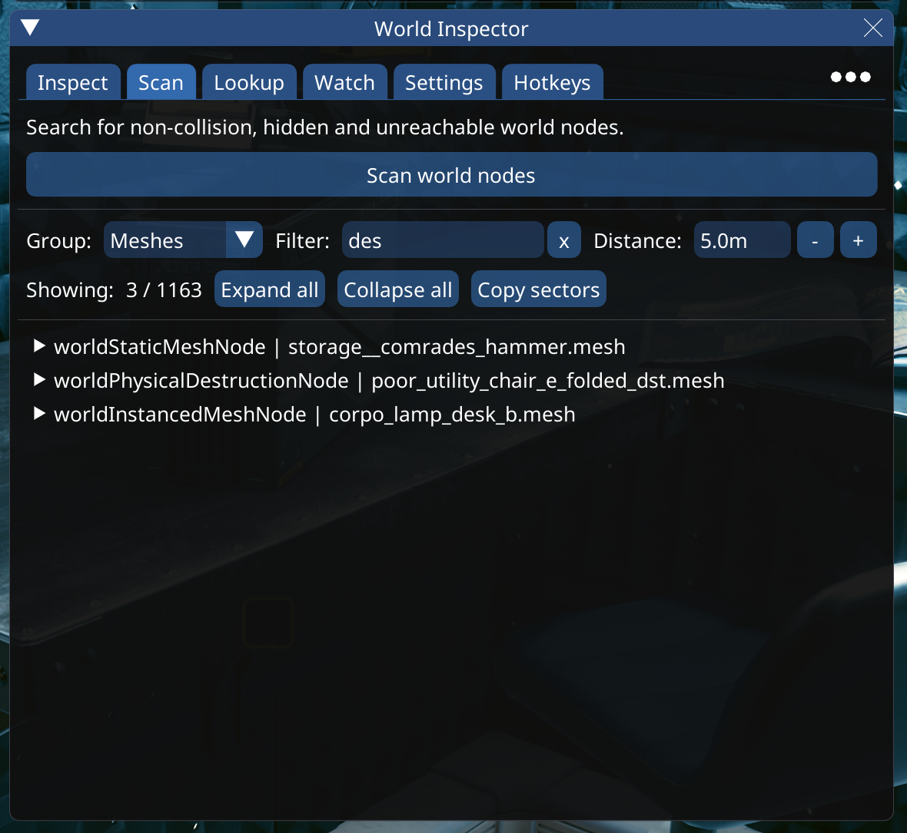
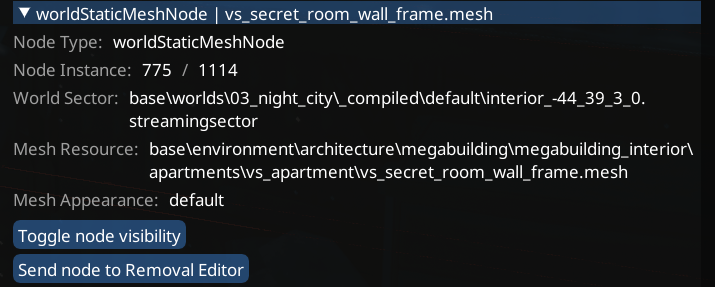
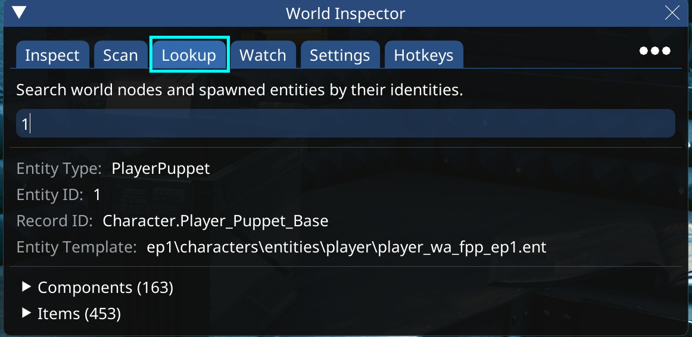
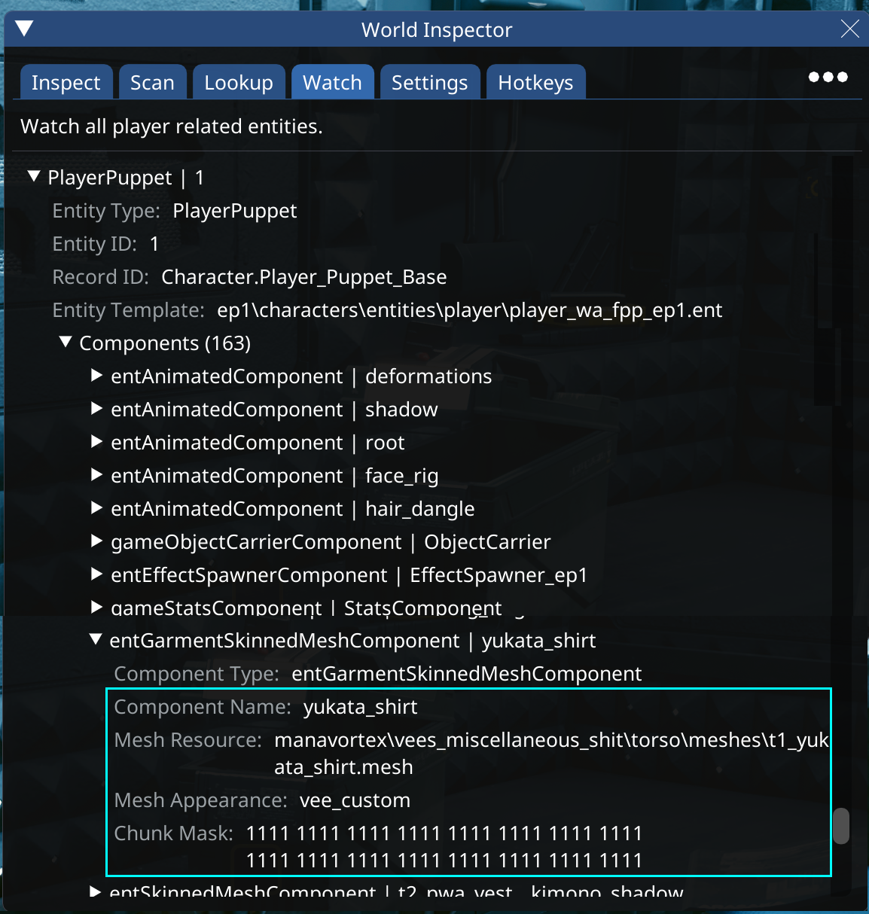

# RHT: The world inspector

## Summary

**Created:** Aug 18 2024 by [manavortex](https://app.gitbook.com/u/NfZBoxGegfUqB33J9HXuCs6PVaC3 "mention")\
**Last documented edit:** Aug 18 2024 by [manavortex](https://app.gitbook.com/u/NfZBoxGegfUqB33J9HXuCs6PVaC3 "mention")

This page describes RHT's World Inspector, telliung you what you can do with it.

## World Inspector: Inspect

Here, you can inspect world nodes and their properties:

<figure><figcaption></figcaption></figure>

## World Inspector: Scan

Here, you can scan for any nodes around you:

<figure><figcaption></figcaption></figure>

If you expand the node properties, you can simply hide them at run-time, or use the integration with [Removal Editor](https://github.com/justarandomguyintheinternet/CP77\_removalEditor) to create permanent presets:

<figure><figcaption></figcaption></figure>

## World Inspector: Lookup

Reverse search of world nodes and spawned entities by their node IDs (e.g. if you're browsing a sector in Wolvenkit)

<figure><figcaption></figcaption></figure>

## World Inspector: Watch (the player)

The world inspector's `Watch` tab lets you inspect the player puppet and all of their components at runtime.&#x20;


You can use the information below for AppearanceCreatorMod; check [submeshes-materials-and-chunks.md](../../files-and-what-they-do/3d-objects-.mesh-files/submeshes-materials-and-chunks.md "mention") -> [#acm](../../files-and-what-they-do/3d-objects-.mesh-files/submeshes-materials-and-chunks.md#acm "mention") for details.


<figure><figcaption>
Invaluable for debugging clothing mods!
</figcaption></figure>
