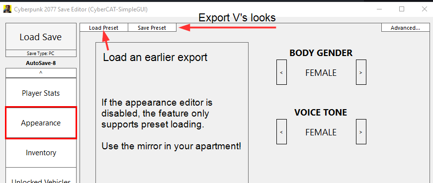
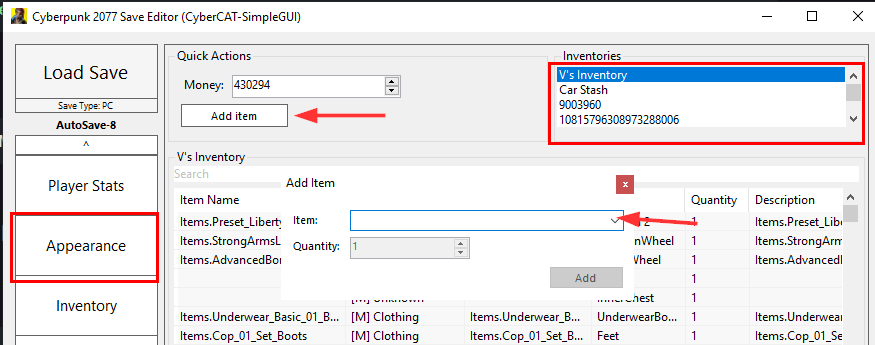
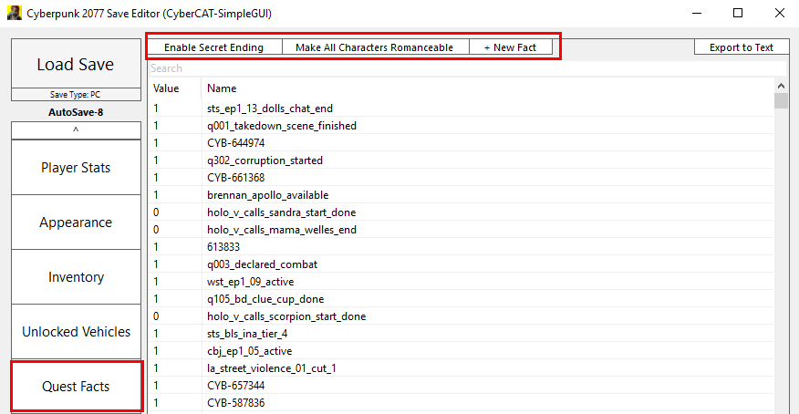

# Savegame Editor: CyberCAT

## This is the documentation for the [CyberCAT save editor](https://www.nexusmods.com/cyberpunk2077/mods/718).


Using the save editor puts you at risk of **creating a bricked savegame**. This means that the save will still load in Cyberpunk, but certain things in the game are broken (e.g. quests are stuck or won't trigger).&#x20;

If your savegame crashes on load, please check the [#troubleshooting](savegame-editor-cybercat.md#troubleshooting "mention") section.


## Version Compatibility

CyberCAT is version dependent. If you want a savegame to load with a certain version of the game, you must use the compatible version of CyberCAT.

| Game Version          | CyberCAT version |
| --------------------- | ---------------- |
| 2.1.1                 | >= 0.27d         |
| 2.0 / Phantom Liberty | >= v0.26         |
| 1.63\_hotfix1         | ???              |

## Usage Instructions

On Windows, save games are stored in&#x20;

```
%USERRPROFILE%\Saved Games\CD Projekt Red\Cyberpunk 2077
```

1. Import your savegame
2. Make the necessary changes
3. Export your savegame again. Save it **in the same folder**.

<figure><figcaption></figcaption></figure>

### Appearance Presets

After loading a save, you can export V's appearance  as a preset from the **Appearance** tab. This will create a `v2preset` file, which you can import via `Load Preset`.

<figure><figcaption></figcaption></figure>

### Adding items

You can add items from the Inventory tab or edit existing items by double-clicking on them.

<figure><figcaption></figcaption></figure>

* Switch inventories in the upper right corner
* Edit items by double-clicking them
* Add new items by using the corresponding button

In the Add Item tab, you can use the dropdown to search the item's base ID. If that doesn't help you, check the top sections of our wiki page [spawn-codes-baseids-hashes.md](../references-lists-and-overviews/equipment/spawn-codes-baseids-hashes.md "mention") on how to find a specific item.

### Quest Facts

CyberCAT lets you edit quest facts:


This is an excellent way to brick your savegame forever. Make a backup. You have been warned. (Check [here](../../modding-guides/quest/#quest-editing-risks-and-side-effects) for an explanation)


<figure><figcaption></figcaption></figure>

### Quest editing: Risks and side effects

While you progress through the main story, Cyberpunk will log your progress by setting `quest facts`.  These are not standardized and will only be checked under specific circumstances, usually when the game is about to trigger the next stage of a quest or event.&#x20;

**Once that moment has passed, there is **_**no**_** way to re-trigger it other than loading an earlier save.** This is not an issue of tooling, it's simply due to how Cyberpunk's quest system works.

#### Can I Change the Outcomes of Quests?

Unfortunately, no. Quest state data is currently not editable with the save editor and there are currently no plans on implementing it.

#### Can Quest Facts Affect Past and/or Future Quests?

Past: no. Future: _Maybe._ Almost all quest facts will at best do nothing by setting or changing them and more commonly will break your quest system. There are **very few** that will work and most are dependent on when they're set.

#### What Can I Do to Change the Outcome of a Quest?

Your only option is to reload from a previous save and make better choices. If only life worked the same way.

#### I Really, Really, Really Want to Set a Quest Fact. What Can I Do?

While the save editor currently supports setting them, we recommend using CET commands if you must go down that route. The [CET command list](https://1drv.ms/x/s!ArM35g0UkWjvjcVPT-fhFPPCZUfDLw?e=BOxScl) contains _some_ that _might_ work in very few instances. Again, most of these are not supported and are highly dependent upon when they are set.

## Known Issues

* Appearance editor is disabled until its fully fixed.&#x20;
  * Only gender and voice tone can be changed.&#x20;
  * Loading / Saving of presets still works
* Item additions might not fully work yet

## Troubleshooting

### Folder structure

Make sure that you export to a savegame folder. They contain the following files:

* metadata.9.json
* sav.dat
* screenshot.png

CyberCAT needs those files to correctly export the savegame.

### Asking for support


Please keep in mind that **nobody is paid** to work on this tool — CyberCAT is maintained by volunteers **in their free time**.&#x20;


Once you have exhausted all other means of support, you can find help in `#save-editing` on the [Wolvenkit Discord](https://discord.gg/redmodding). Please have the following things handy:

* [ ] The original save (before you edited it)
* [ ] The altered (damaged) save
* [ ] A description of what you did, as concise as possible
* [ ] The error.txt (if you have one)
