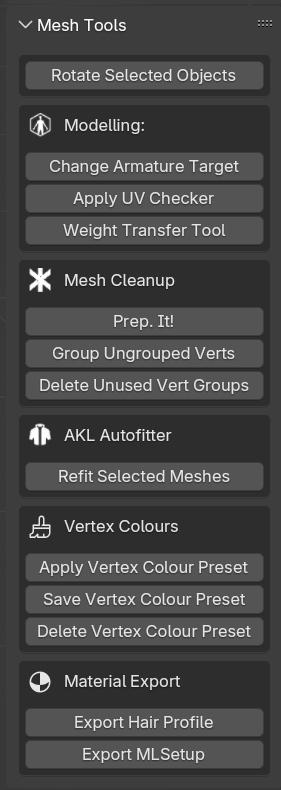
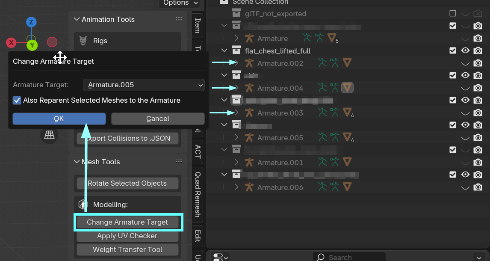
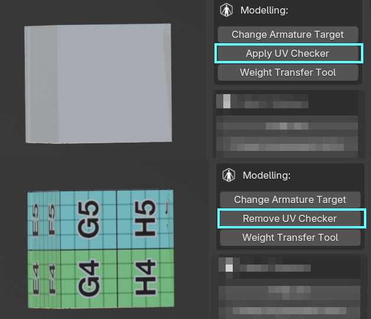
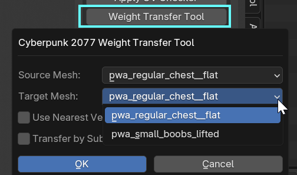

# Wolvenkit Blender IO Suite

## Summary

**Published**: ??? by [mana vortex](https://app.gitbook.com/u/NfZBoxGegfUqB33J9HXuCs6PVaC3 "mention")\
**Last documented edit**: Dec 20 2024 by [mana vortex](https://app.gitbook.com/u/NfZBoxGegfUqB33J9HXuCs6PVaC3 "mention")

This is the landing page for the Wolvenkit Blender plugin.&#x20;

Here, you can find [#usage](./#usage "mention") instructions, as well as an overview of its features:

* [#animation-tools](./#animation-tools "mention")
* [#mesh-tools](./#mesh-tools "mention")
* [#akl-autofitter](./#akl-autofitter "mention")
* [#collision-tools](./#collision-tools "mention")
* [#hair-profiles-.hp](wkit-blender-plugin-import-export.md#hair-profiles-.hp "mention")

You can find a detailed install guide under [installing-the-wolvenkit-blender-plugin](installing-the-wolvenkit-blender-plugin/ "mention").

### Wait, this is not what I want!

* If this is your first time using Blender, you can check out [blender-getting-started](../../3d-modelling/blender-getting-started/ "mention")
* For detailed usage instructions, check [wkit-blender-plugin-import-export.md](wkit-blender-plugin-import-export.md "mention")
* The plug-in's source code and original readme are on [github](https://github.com/WolvenKit/Cyberpunk-Blender-add-on/)
* If you run into issues using the plugin, you can check [wkit-blender-plugin-troubleshooting.md](wkit-blender-plugin-troubleshooting.md "mention")

## Compatibility



## Usage

The toolbar to the right of your viewport will show you the `CP77 Modding` tab.\
(Keyboard shortcut to hide/unhide: **`n`**)&#x20;

<figure><figcaption></figcaption></figure>

## Animation Tools

In the **animation tools**, you can find

* shortcuts for playing, renaming and deleting existing animations
* shortcuts to add new actions and insert keyframes

### Load Bundled Rig

You can load one of Cyberpunk's default armatures at any time:

<figure><figcaption></figcaption></figure>

### Animsets

If you import an .anims file, selecting **any armature** will give you the option to play any existing animation:

<figure><figcaption></figcaption></figure>

***

## Collision Tools

The collision tools and -generator can

* generate of convex colliders with the exact shape of your mesh\
  &#xNAN;_&#x54;he number of vertices to sample should be set to match the number set in the .phys file in order to ensure successful export_
* generate box and capsule colliders with either user specified sizing or sized automatically to match the selected mesh
* export edited collision bodies back to .phys \*\*\*currently requires a wolvenkit converted .phys.json file

***

## Mesh Tools

| 
Select a mesh in the viewport to see all options.  You can find the following tools here:  Modelling <a data-mention href="./#change-armature-target">#change-armature-target</a> <a data-mention href="./#uv-checker">#uv-checker</a> <a data-mention href="./#weight-transfer">#weight-transfer</a>  Mesh Cleanup <a data-mention href="./#prep.-it">#prep.-it</a> <a data-mention href="./#group-ungroup-verts">#group-ungroup-verts</a> <a data-mention href="./#delete-unused-vert-groups">#delete-unused-vert-groups</a>  <a data-mention href="./#akl-autofitter">#akl-autofitter</a>  Vertex Colours <a data-mention href="./#apply-vertex-colour-preset">#apply-vertex-colour-preset</a> <a data-mention href="./#save-vertex-colour-preset">#save-vertex-colour-preset</a> <a data-mention href="./#delete-vertex-colour-preset">#delete-vertex-colour-preset</a>  Material Export <a data-mention href="./#export-hair-profile">#export-hair-profile</a> <a data-mention href="./#export-mlsetup">#export-mlsetup</a>       
 | 

<figure><figcaption></figcaption></figure>
 |
| ---------------------------------------------------------------------------------------------------------------------------------------------------------------------------------------------------------------------------------------------------------------------------------------------------------------------------------------------------------------------------------------------------------------------------------------------------------------------------------------------------------------------------------------------------------------------------------------------------------------------------------------------------------------------------------------------------------------------------------------------------------------------------------------------------------------------------------------------------------------------------------------------------------------------------------------------------------------------------------------------------------------------------------------------------------------------------------------------------------------------------------------- | ------------------------------------------------------------------------------------------------------------------------------------------- |

### Modelling

#### Change Armature Target

Lets you change the armature modifier of all selected meshes.&#x20;

The checkbox `Also Reparent Selected Meshes to the Armature` moves the selected meshes into the armature's hierarchy as children.

<figure><figcaption></figcaption></figure>

#### UV Checker

With the press of a button, you can switch out the currently active material to a coloured and numbered grid for easier [UV mapping](../../materials/uv-mapping-texturing-a-3d-object.md).

If the UV checker is currently assigned, pushing the button again will restore the original material.

<figure><figcaption></figcaption></figure>

#### Weight transfer

Lets you transfer [vertex weights](../../3d-modelling/meshes-and-armatures-rigging/) from one collection to the other. If you don't know what the checkboxes are for, you can just leave them blank.

<figure><figcaption></figcaption></figure>


The plugin will transfer weights by submesh name. If your target armature has more submeshes than your source armature, simply create duplicates and rename them accordingly.


Alternatively: By hand

You can only do this on a mesh-by-mesh basis, so you have to do all meshes in sequence.

To check out the more detailed process with a Transfer Weight modifier, check out the [custom-facial-piercings-prc-framework.md](../../../modding-guides/npcs/custom-facial-piercings-prc-framework.md "mention") page, section [#weight-painting](../../../modding-guides/npcs/custom-facial-piercings-prc-framework.md#weight-painting "mention")

1. Select the mesh with weights
2. Select the mesh that you want your weights transferred to
3. Press `Ctrl+L` and select `Transfer Mesh Data`
4. In the popup at the bottom left of your viewport, change the following properties:

#### 

5. Click anywhere else. You're done!

### Mesh Cleanup

#### Prep. It!

This will run the "Merge by distance" operator on your mesh. This will collapse vertices that are directly on top of each other.

#### Group Ungroup Verts

This can fix export errors by assigning ungrouped vertices to the "closest" vertex group (the nearest bone envelope). If your mesh moves weirdly in-game, you'll have to get [weight painting](../../3d-modelling/meshes-and-armatures-rigging/weight-painting-for-gonks.md), though.

#### Delete Unused Vert Groups

Will remove vertex groups without corresponding vertices. This can make it easier to see what you are working on.

### [AKL Autofitter](wkit-blender-plugin-akl-autofitter.md)

For documentation of the autofitter, see the [corresponding wiki page](wkit-blender-plugin-akl-autofitter.md).

### Vertex Colours

Vertex colour profiles are for e.g. [painting-garment-support-parameters.md](../../3d-modelling/garment-support-how-does-it-work/painting-garment-support-parameters.md "mention") or [hair-vertex-paint-for-transparency.md](../../../modding-guides/npcs/guides-all-about-hair/hair-vertex-paint-for-transparency.md "mention"). This section will let you manage presets.

#### Apply Vertex Colour Preset

Applies a previously-saved preset to your current mesh

#### Save Vertex Colour Preset

Save the current colours as a preset

#### Delete Vertex Colour Preset

Delete a previously saved preset

### Material Export

#### Export Hair Profile

Lets you export a hair profile. For a step-by-step guide, see the corresponding wiki page -> [#hair-profiles-.hp](wkit-blender-plugin-import-export.md#hair-profiles-.hp "mention")

#### Export MLSetup

Lets you export a multilayered material that you have edited in Blender.
