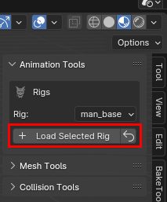
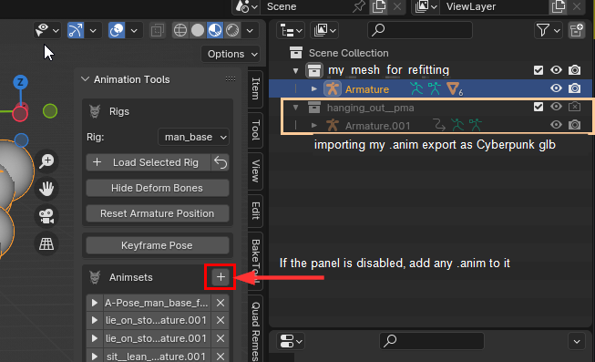
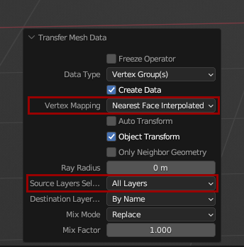

# Wolvenkit Blender IO Suite

## Summary

**Published**: ??? by [mana vortex](https://app.gitbook.com/u/NfZBoxGegfUqB33J9HXuCs6PVaC3 "mention")\
**Last documented edit**: Dec 20 2024 by [mana vortex](https://app.gitbook.com/u/NfZBoxGegfUqB33J9HXuCs6PVaC3 "mention")

This is the landing page for the Wolvenkit Blender plugin.&#x20;

Here, you can find [#usage](./#usage "mention") instructions, as well as an overview of its features:

* [#animation-tools](./#animation-tools "mention")
* [#mesh-tools](./#mesh-tools "mention")
* [#akl-autofitter](./#akl-autofitter "mention")
* [#collision-tools](./#collision-tools "mention")
* [#hair-profiles-.hp](wkit-blender-plugin-import-export.md#hair-profiles-.hp "mention")

### Wait, this is not what I want!

* If this is your first time using Blender, you can check out [blender-getting-started](../../3d-modelling/blender-getting-started/ "mention")
* Under [installing-the-wolvenkit-blender-plugin](installing-the-wolvenkit-blender-plugin/ "mention"), you can find a detailed install guide
* For detailed usage instructions, check [wkit-blender-plugin-import-export.md](wkit-blender-plugin-import-export.md "mention")
* The plug-in's source code and original readme are on [github](https://github.com/WolvenKit/Cyberpunk-Blender-add-on/)
* If you run into issues using the plugin, you can check [wkit-blender-plugin-troubleshooting.md](wkit-blender-plugin-troubleshooting.md "mention")

## Compatibility



## Usage

The toolbar to the right of your viewport will show you the `CP77 Modding` tab.\
(Keyboard shortcut to hide/unhide: **`n`**)&#x20;

<figure><figcaption></figcaption></figure>

## Features

### Animation Tools

In the **animation tools**, you can find

* shortcuts for playing, renaming and deleting existing animations
* shortcuts to add new actions and insert keyframes

You can load one of Cyberpunk's default armatures at any time:

<figure><figcaption></figcaption></figure>

If you import an .anims file, selecting **any armature** will give you the option to play any existing animation:

<figure><figcaption></figcaption></figure>

### Mesh Tools

#### Transfer Vertex Weights

Lets you transfer [vertex weights](../../3d-modelling/meshes-and-armatures-rigging/) from one collection to the other (please read the info box below):

<figure><figcaption>
Transfer weights with the click of a button!
</figcaption></figure>


The plugin will transfer weights by submesh name. If your target armature has more submeshes than your source armature, simply create duplicates and rename them accordingly.


Alternatively: By hand

You can only do this on a mesh-by-mesh basis, so you have to do all meshes in sequence.

To check out the more detailed process with a Transfer Weight modifier, check out the [custom-facial-piercings-prc-framework.md](../../../modding-guides/npcs/custom-facial-piercings-prc-framework.md "mention") page, section [#weight-painting](../../../modding-guides/npcs/custom-facial-piercings-prc-framework.md#weight-painting "mention")

1. Select the mesh with weights
2. Select the mesh that you want your weights transferred to
3. Press `Ctrl+L` and select `Transfer Mesh Data`
4. In the popup at the bottom left of your viewport, change the following properties:

#### 

5. Click anywhere else. You're done!

#### [AKL Autofitter](wkit-blender-plugin-akl-autofitter.md)

For documentation of the autofitter, see the [corresponding wiki page](wkit-blender-plugin-akl-autofitter.md).

#### Modifiers

Lets you change the armature target (the skeleton that'll move and deform your mesh)

#### Material Export: Hair

Lets you export a hair profile. For documentation, see [#hair-profiles-.hp](wkit-blender-plugin-import-export.md#hair-profiles-.hp "mention")


You can find a guide about [hair-modeling-beginner-tutorial.md](../../3d-modelling/hair-modeling-beginner-tutorial.md "mention") at the link.


#### UV Checker

With the press of a button, you can switch out the currently active material to a coloured and numbered grid for easier UV mapping.

If the UV checker is currently assigned, pushing the button again will restore the original material.

### Collision Tools

The collision tools and -generator can

* generate of convex colliders with the exact shape of your mesh\
  &#xNAN;_&#x54;he number of vertices to sample should be set to match the number set in the .phys file in order to ensure successful export_
* generate box and capsule colliders with either user specified sizing or sized automatically to match the selected mesh
* export edited collision bodies back to .phys \*\*\*currently requires a wolvenkit converted .phys.json file
