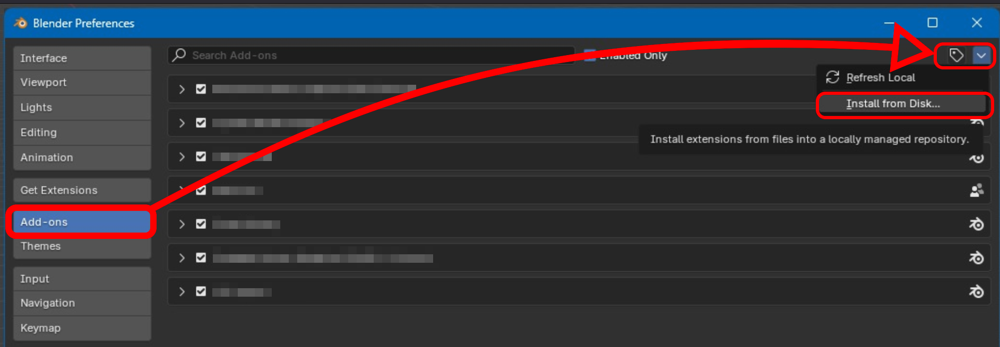

# Installing the Wolvenkit Blender Plugin

## Summary

**Published:** ??? by [manavortex](https://app.gitbook.com/u/NfZBoxGegfUqB33J9HXuCs6PVaC3 "mention")\
**Last documented update:** Nov 29 2024 by [manavortex](https://app.gitbook.com/u/NfZBoxGegfUqB33J9HXuCs6PVaC3 "mention")

This page will show you how to install the Wolvenkit Blender Plugin from a github release or tag. If you want to install the bleeding edge, please check [installing-from-github-source.md](installing-from-github-source.md "mention") instead.

### Compatibility

## Optional: Uninstall the old version


You don't need to do this unless you have trouble updating. Go straight to [#step-0-download-the-plugin](./#step-0-download-the-plugin "mention")


<details>

<summary>Uninstalling the previous plugin version</summary>

1. Open the Blender Preferences (Toolbar: `Edit` -> `Preferences`) and select the `AddOns` tab


2. Complete either of the options below:
   * Click the  `Remove` button\
     The build-in Blender way. Should work. If it doesn't check the second option
   * Delete the files on your disk\
     Check the plugin's `file` entry. It will usually be something like this:

```
%APPDATA%\Blender Foundation\Blender\4.3\scripts\addons\i_scene_cp77_gltf
```

Navigate there with your Windows Explorer (Hotkey: `Windows+R`, paste the path above after changing your Blender version), and delete everything — either the entire folder, or all files inside.

3. Optional: Close and re-open Blender

</details>

## Step 0: Download the plugin


If you want to install the current development version of the plugin, read [installing-from-github-source.md](installing-from-github-source.md "mention").&#x20;


Download the latest release of the plugin from **github:**&#x20;

1. On the [releases](https://github.com/WolvenKit/Cyberpunk-Blender-add-on/releases) page, find the most recent release
2. Scroll past the change notes to the **Assets** section
3. Download the zip file with the plugin:

<figure><figcaption><p>Do not download anything called "Source code", unless you know what you're doing</p></figcaption></figure>

## Step 1: Install the plugin

1. Start Blender
2. Open the Blender Preferences (Toolbar: `Edit` -> `Preferences`) and select the `AddOns` tab

<figure><figcaption></figcaption></figure>

3. Click the "Install" button and select the zip file you downloaded in step 2

## Step 2: Enable the plugin


You only need to do this if you never installed the plugin before.


After you have successfully installed the plugin, you can now use the search bar to find it:

<figure><figcaption></figcaption></figure>

Make sure the box is checked and restart Blender.

## Troubleshooting

### I can't (un)install the plugin!

You can do both by hand. Find your Blender install's plugin folder, the path will look something like this (replace 3.6 with your Blender version):

```
%APPDATA%\Blender Foundation\Blender\4.3\scripts\addons
```

Inside the plugins folder, the Wolvenkit Blender IO Suite will be installed to the subfolder `i_scene_cp77_gltf`.

To **uninstall** the plugin, **delete** the entire folder.

To **install** the plugin, **find** the folder in your **downloaded zip file** that contains the file **`__init__.py`**, move it here, and rename it.

Now, **restart Blender**.


