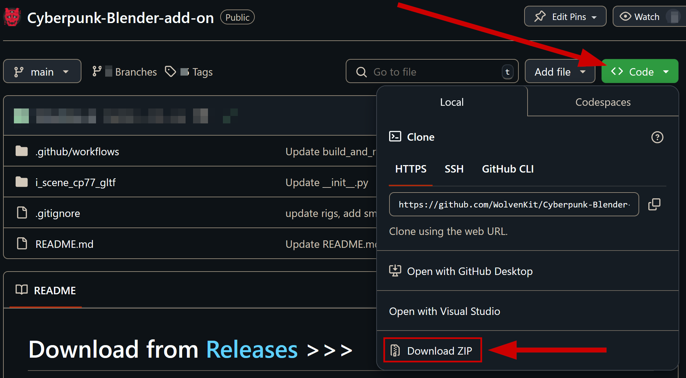
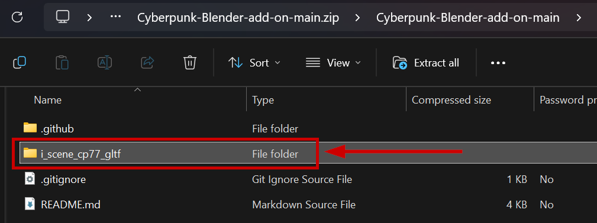

# Installing from github source

## Summary

**Published:** 22.09.2024 by [manavortex](https://app.gitbook.com/u/NfZBoxGegfUqB33J9HXuCs6PVaC3 "mention")\
**Last documented update:** 22.09.2024 by [manavortex](https://app.gitbook.com/u/NfZBoxGegfUqB33J9HXuCs6PVaC3 "mention")

This guide will show you how to download and install the [..](../ "mention") from github source.&#x20;


Unless you either **know what you're doing** or have been **told by someone in the** [**discord support channel**](https://discord.com/channels/717692382849663036/1033120509216444550) to install the current development version, you should stick to the release version.


## Step 1: Download from github

1. Head to the Wolvenkit Blender IO suite's [github repository](https://github.com/WolvenKit/Cyberpunk-Blender-add-on)
2. Click the green `Code` button
3. Click "`Download ZIP`" at the bottom

<figure><figcaption></figcaption></figure>

4. You should have downloaded a file called `Cyberpunk-Blender-add-on-main.zip`.

## Step 2: Finding the install location

### 2.1: Find the correct install path

1. Open the Blender Preferences (Toolbar: `Edit` -> `Preferences`) and select the `AddOns` tab
2. Search for `cyberpunk`
3. See the current install path under `File`. It should be something like this:

```
C:\Users\USERNAME\AppData\Roaming\Blender Foundation\Blender\VERSION\scripts\addons\i_scene_cp77_gltf\__init__.py
```

4. Everything before the `__init__.py`  is the path to the current install.

### 2.2: Delete the old install

1. Navigate your Windows Explorer to the path you found in 2.3\
   (Shortcut: `Windows+R`, type  `%APPDATA%`, confirm, then browse from there)
2. Delete the whole `i_scene_cp77_gltf` folder.
3. Leave the explorer window open, you need it for Step 3!

### Step 3: Extract the download

1. Open `Cyberpunk-Blender-add-on-main.zip` that you downloaded in step 1.
2. Find the folder named  `i_scene_cp77_gltf`. This is the blender add-on:

<figure><figcaption></figcaption></figure>

3. Copy or drag the folder to the `addons` folder from step 2.2.&#x20;

## Step 3: Restart Blender

After restarting Blender, you now have the **very latest** version of the plugin. If you want anything more recent, you have to become a developer yourself.


Please remember to report any bugs you find — either in the [**discord support channel**](https://discord.com/channels/717692382849663036/1033120509216444550), or by opening an [issue on github](https://github.com/WolvenKit/Cyberpunk-Blender-add-on/issues) (you need an account for this).

Remember to include all necessary information:&#x20;

* The exact version you installed
* Unless you can always cause the exact bug, the `.blend` file with your problem


Happy modding!
