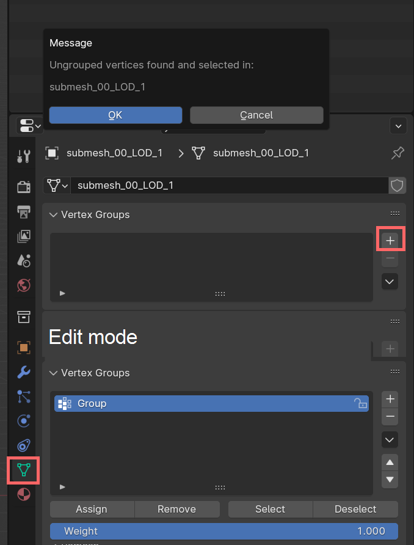
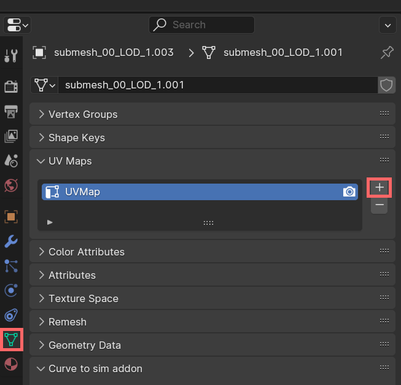
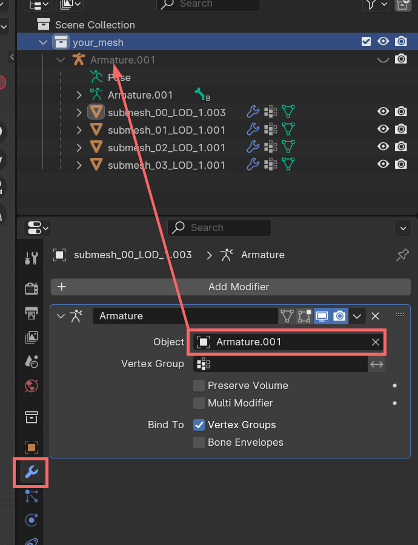

# WKit Blender Plugin: Error messages

## Summary

**Published:** Apr 19 2024 by [manavortex](https://app.gitbook.com/u/NfZBoxGegfUqB33J9HXuCs6PVaC3 "mention")\
**Last documented update:** Apr 19 2024 by [manavortex](https://app.gitbook.com/u/NfZBoxGegfUqB33J9HXuCs6PVaC3 "mention")

This page will tell you how to resolve error messages from the [.](./ "mention").

## Assign weights before exporting

This should only happen for meshes with armatures.

* Switch to the Data tab (the green triangle)
* If you don't have vertex groups, add one
* If you already have vertex groups, select the one named to the bone closest to your ungrouped vertices
* If you aren't already, switch to Edit Mode (Hotkey: `Tab`)
* Click the "Assign" button under the vertex groups panel

<figure><figcaption></figcaption></figure>

## Ungrouped vertices found

This should only happen for meshes with armatures. You can check the screenshot under [#assign-weights-before-exporting](wkit-blender-plugin-error-messages.md#assign-weights-before-exporting "mention") for references.

1. Switch to the Data tab (the green triangle)
2. The plugin should have switched your viewport to Edit Mode (if not, do it yourself - hotkey: `Tab`)
3. Find out which vertices are the problem by moving them around in the edit view
4. In the list of vertex groups, select the armature bone closest to your ungrouped verts
5. Click the "Assign" button under the vertex groups panel
6. Rinse and repeat the process for all submeshes until the plugin lets you export

## No armature objects are selected

You are trying to export a pose, but you didn't select your armature. Click on the armature object in the outliner:

<figure><figcaption></figcaption></figure>

## No meshes selected

You're trying to export something, but you haven't selected any meshes. Select everything that you want to export in the outliner (top-right panel) - the armature parent will be auto-selected for you.

<figure><figcaption></figcaption></figure>

## Meshes must have UV layers

For Cyberpunk material assignments to work, your mesh must have UV maps.&#x20;


For more information on this, check [uv-mapping-texturing-a-3d-object.md](../../materials/uv-mapping-texturing-a-3d-object.md "mention").


Switch to the Data tab and add one:

<figure><figcaption></figcaption></figure>

You should now be able to export, but your material will most likely look funky. To remedy this, refer to [adding-decals.md](../../../modding-guides/items-equipment/editing-existing-items/adding-decals.md "mention") -> [#step-5-uv-projection](../../../modding-guides/items-equipment/editing-existing-items/adding-decals.md#step-5-uv-projection "mention")

## All faces must be triangulated before exporting

Triangulation means that faces must have exactly three corners.

1. The plugin should have switched the viewport to Edit Mode. If not, do it yourself (Hotkey: `Tab`)
2. Triangulate faces (Hotkey: `Ctrl+T`). The default settings are fine.
3. You should now be able to export.

## Vertex groups not assigned to a bone

You have vertex groups in your mesh that don't have a corresponding bone in the armature. [Run the following Python script](../../3d-modelling/blender-getting-started/blender-running-python-scripts.md) to delete them:



## Armature missing

The armature (rig, skeleton) is the thing that makes your mesh move in-game.&#x20;

If your mesh isn't supposed to move, check [#amm-props-you-dont-need-an-armature](wkit-blender-plugin-error-messages.md#amm-props-you-dont-need-an-armature "mention")

If your mesh is supposed to move with the body, check [#equipment-you-need-an-armature](wkit-blender-plugin-error-messages.md#equipment-you-need-an-armature "mention")

### AMM props: You don't need an armature

It's enough to check the "Export as Static Prop" box during export, and the error will go away.

<figure><figcaption></figcaption></figure>

### Equipment: You need an armature

You should have an armature in your .blend file because you're importing over an original Cyberpunk mesh. If you don't, you might want to refer to a guide such as [replace-a-player-item-with-an-npc-item](../../../modding-guides/items-equipment/editing-existing-items/replace-a-player-item-with-an-npc-item/ "mention") and follow the steps.

Open the `Modifiers` tab (the orange wrench) and repeat the following steps for each mesh:

1. Make sure that there is exactly one `Armature` modifier present. If there is none, click `Add Modifier` and add one.
2. Click into `Object` and select the armature that your mesh is parented to.&#x20;

<figure><figcaption></figcaption></figure>

## Each submesh must have less than 65,535 vertices

### If your submesh has >= 65,535 vertices&#x20;

### If your submesh has < 65,535 vertices

That's due to [how the Blender .gltf export works](https://github.com/KhronosGroup/glTF-Blender-IO/issues/912#issuecomment-581564314). The only thing you can do to avoid the issue is to make sure that no two vertices share the same UV coordinate.&#x20;

1. switch to the UV editing perspective ( -> [uv-mapping-texturing-a-3d-object.md](../../materials/uv-mapping-texturing-a-3d-object.md "mention"))&#x20;
2. Turn on UV Sync Selection:

<figure><figcaption></figcaption></figure>

3. Once you have found an overlapping vertex, select linked (Hotkey: `Ctrl+L`)
4. Move the entire UV island by a whole tile in any direction (Hotkey: e.g. `G` -> `X` -> `1`)
5. Repeat the process until there are no more overlapping islands.
