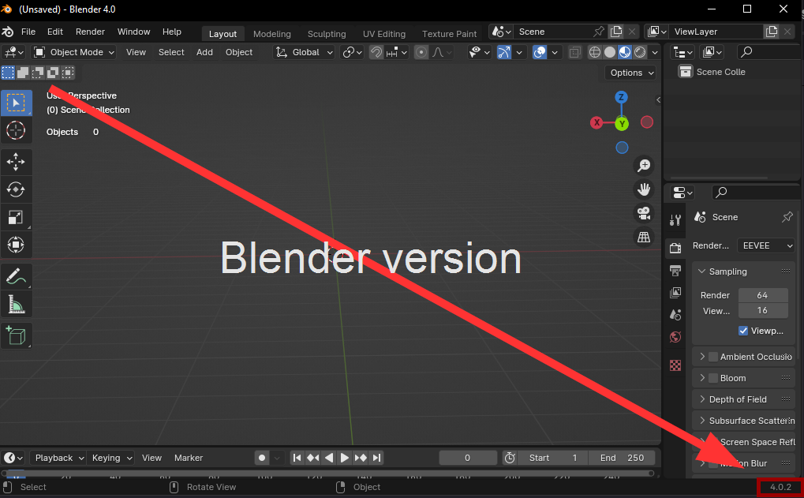
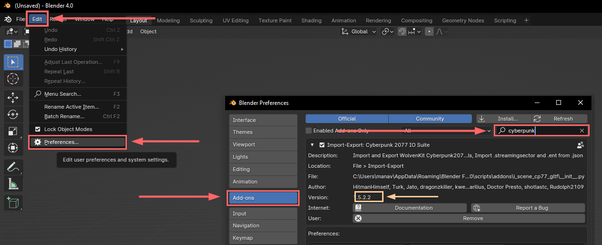

# WKit Blender Plugin: Troubleshooting

#### Summary

**Published:** Jan 20 2024 by [manavortex](https://app.gitbook.com/u/NfZBoxGegfUqB33J9HXuCs6PVaC3 "mention")\
**Last documented update:** Apr 19 2024 by [manavortex](https://app.gitbook.com/u/NfZBoxGegfUqB33J9HXuCs6PVaC3 "mention")

This page contains troubleshooting options for the [.](./ "mention").&#x20;

If the plugin gives you error messages on export, please check [wkit-blender-plugin-error-messages.md](wkit-blender-plugin-error-messages.md "mention") instead.

If you can't solve your problem with these steps, feel free to reach out on [Discord](http://discord.gg/redmodding) in the `#blender-add-on` channel.


The first thing people on Discord will tell you is to read this page, so you might as well get it out of the way.



Blender errors will show up in the system console window (View -> Toggle System Console).


## General Troubleshooting

### 0. Steam

If you installed Blender via Steam, stay on the **stable stream** and make sure to keep Blender up-to-date.

### 1. Make sure that you are on the correct Blender version

As of [1.5.5.1](https://github.com/WolvenKit/Cyberpunk-Blender-add-on/releases/tag/1.5.5.1), the plugin **supports 4.1.0** and requires **>= 4.0.2.** This information might be outdated by the time you read it.

You can see the exact Blender version in the lower right corner of the program:

<figure><figcaption></figcaption></figure>

### 2. Make sure that you are on the latest plugin version

1. Open the preferences from the menu (Edit -> Preferences)
2. Switch to the `AddOns` tab in the bar on the left
3. In the filter field at the top right of the list, search for `cyberpunk`
4. Expand the entry and find the `Version` field

<figure><figcaption></figcaption></figure>

5. Check on [**github**](https://github.com/WolvenKit/Cyberpunk-Blender-add-on/releases) that this is the last available version of the plugin.&#x20;
6. If it's not, you need to update. [Uninstall ](installing-the-wolvenkit-blender-plugin.md#step-0-uninstall-the-old-version)the old version, then [install](installing-the-wolvenkit-blender-plugin.md#step-1-install-the-plugin) the most recent plugin


You need to restart Blender after updating the plugin!


### Check the console output

See if Blender encountered any errors by checking the **console output**. From the menu, select `View` -> `Toggle System Console`.


Our technical experts will want to see this. If you can't make sense of it via Google or ChatGPT, hit up the `#blender-add-on` channel on [Discord](http://discord.gg/redmodding).


## Failed to import materials


Please complete the steps in [#general-troubleshooting](wkit-blender-plugin-troubleshooting.md#general-troubleshooting "mention") first!


### Make sure that your Wolvenkit is up-to-date

You need the [latest stable release](https://github.com/WolvenKit/Wolvenkit/releases) ([install guide](https://app.gitbook.com/s/-MP\_ozZVx2gRZUPXkd4r/getting-started/download#downloading-wolvenkit)).

If that doesn't help, you can also give the [Nightly version](https://github.com/WolvenKit/WolvenKit-nightly-releases/releases) a try.


After updating Wolvenkit, make sure to re-export your .mesh with materials!


### Make sure that your Depot is not outdated

The plugin needs your Wolvenkit Depot to a) exist and b) be more or less recent.&#x20;

If you aren't sure how old your depot is or if you have one at all, it might be time to regenerate:

1. In the [Wolvenkit Settings](https://app.gitbook.com/s/-MP\_ozZVx2gRZUPXkd4r/wolvenkit-app/settings), find the [Depot Path](https://app.gitbook.com/s/-MP\_ozZVx2gRZUPXkd4r/wolvenkit-app/settings#depot-path)
   1. If it's not set, set it now
   2. If it's set: Open the folder in Windows Explorer and delete everything there.
2. Follow the instructions on the Wolvenkit wiki to [create a partial depot](https://app.gitbook.com/s/-MP\_ozZVx2gRZUPXkd4r/wolvenkit-app/usage/create-depot#steps-partial-depot).


After regenerating your depot, make sure to re-export your .mesh with materials!

