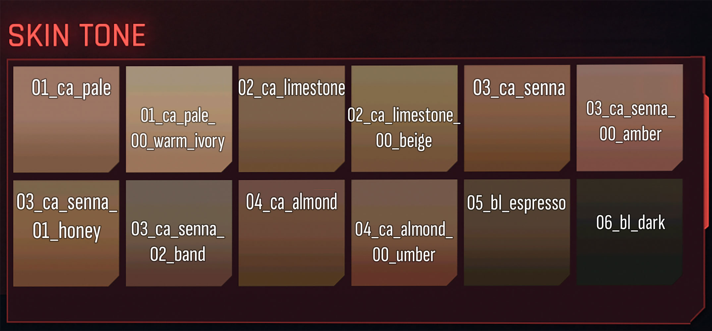
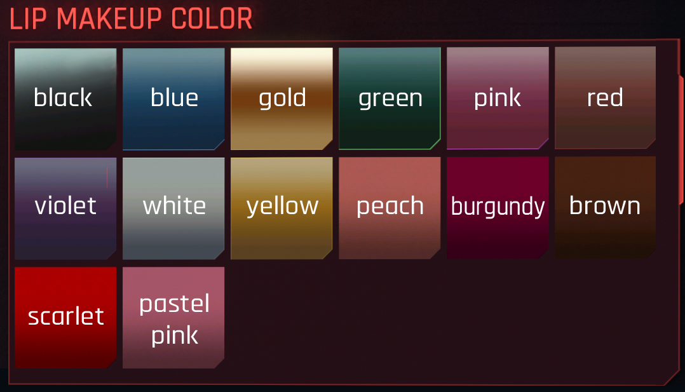
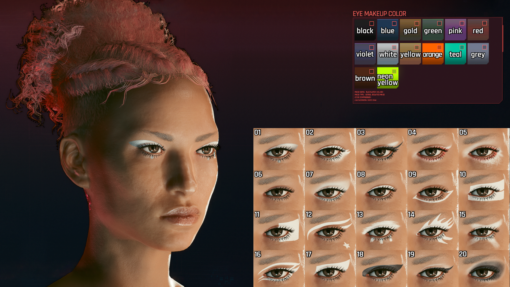
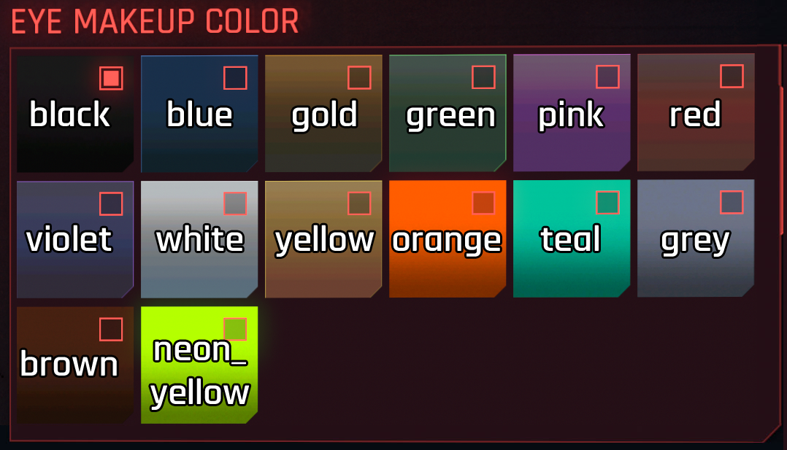
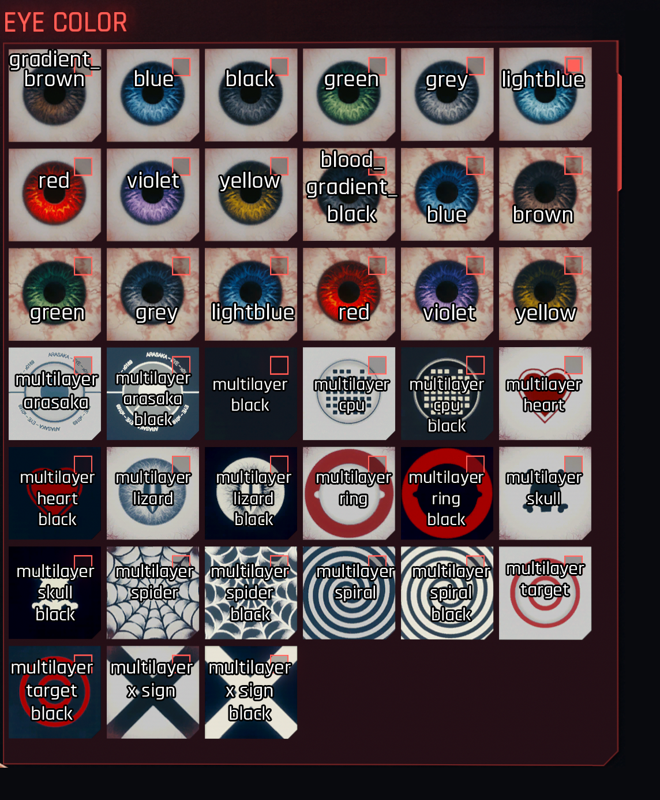
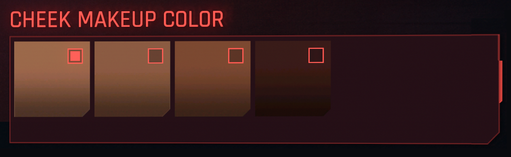
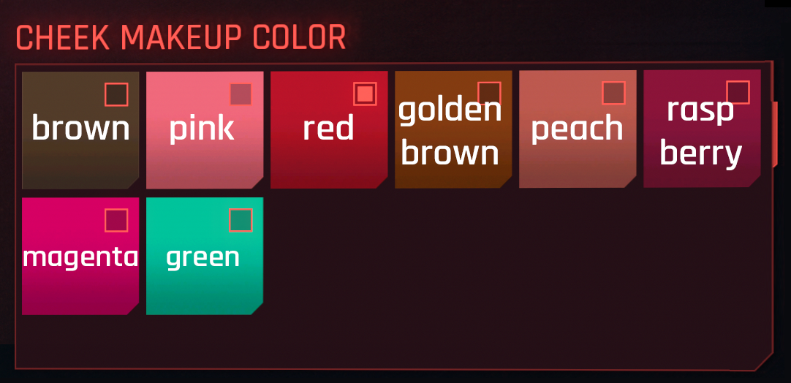
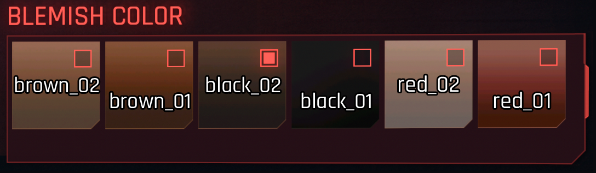
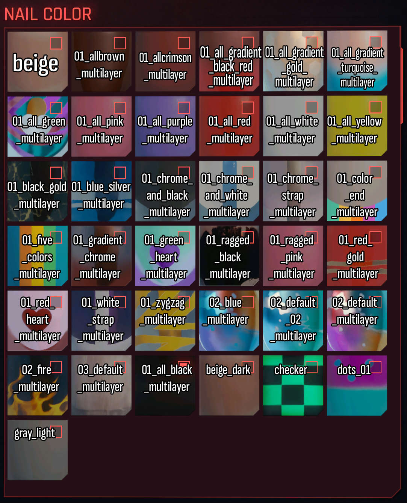
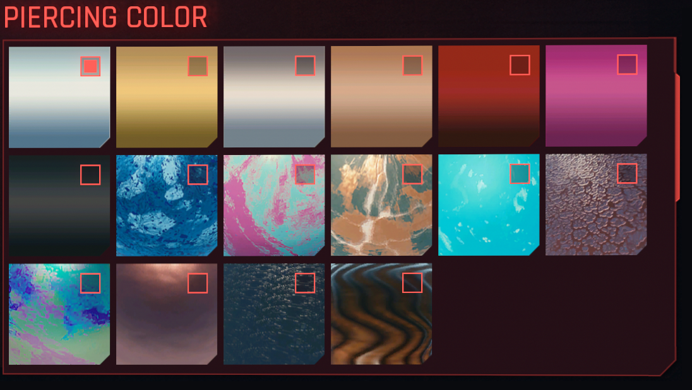

# Cheat Sheet: Character Creator

## Summary

**Created:** Sep 01 2024 by [manavortex](https://app.gitbook.com/u/NfZBoxGegfUqB33J9HXuCs6PVaC3 "mention")\
**Last documented update:** Sep 01 2024 by [manavortex](https://app.gitbook.com/u/NfZBoxGegfUqB33J9HXuCs6PVaC3 "mention")

This page lists various properties of the character creator. Use the Table of Contents or your browser's search (Hotkey: `Ctrl+F`) to quickly find what you're looking for.&#x20;

Please note that this page lists **appearances** and **colours**. For **mesh paths**, please check [cheat-sheet-head](cheat-sheet-head/ "mention")


You can use [NoraLee's NPV part picker](https://noraleedoes.neocities.org/npv/npv\_part\_picker) to find the correct appearances.&#x20;


## List of CC options in order

| Option                                                            | Value            | Option (continued)                                                        |                             |
| ----------------------------------------------------------------- | ---------------- | ------------------------------------------------------------------------- | --------------------------- |
| [Skin tone](cheat-sheet-character-creator.md#skin-tones)          | 1-12             | [Eye Makeup Color](cheat-sheet-character-creator.md#eye-make-up)          |                             |
| Skin type                                                         | Compexion: 01-04 | [Lip Makeup Style](cheat-sheet-character-creator.md#lip-makeup)           | off, default, glossy, matte |
| [Hairstyle](cheat-sheet-character-creator.md#hairstyle)           | 1-51             | [Lip Makeup](cheat-sheet-character-creator.md#lip-makeup)                 | 01-20                       |
| [Hair color](cheat-sheet-character-creator.md#hair-colour)        |                  | [Lip Makeup Color](cheat-sheet-character-creator.md#lip-makeup)           |                             |
| Eyes                                                              | 1-22             | [Cheek Makeup ](cheat-sheet-character-creator.md#cheek-makeup-style)      | off, 1-14                   |
| [Eye color](cheat-sheet-character-creator.md#eye-colour)          |                  | [Cheek Makeup Color](cheat-sheet-character-creator.md#cheek-makeup-color) |                             |
| Eyebrows                                                          | off, 1-11        | Blemishes                                                                 | off, 01-03                  |
| [Eyelash color](cheat-sheet-character-creator.md#hair-colour)     |                  | [Blemish Color](cheat-sheet-character-creator.md#blemish-color)           |                             |
| Nose                                                              | 1-22             | Nails                                                                     | long, short                 |
| Mouth                                                             | 1-22             | [Nail Color](cheat-sheet-character-creator.md#nail-color)                 |                             |
| Jaw                                                               | 1-22             | Chest (f only)                                                            | default, small, big         |
| Ears                                                              | 1-22             | Nipples                                                                   | off, 1-3                    |
| Cyberware                                                         | off, 1-8         | Body Tattoos                                                              | off, 1-5                    |
| Facial Scars                                                      | off, 1-9         | Body Scars                                                                | off, 1-2                    |
| Facial Tattoos                                                    | off, 1-11        | Genitals                                                                  | off, vagina, penis1, penis2 |
| Piercings                                                         | off, 1-14        | Penis Size                                                                | default, small, big         |
| [Piercing Color](cheat-sheet-character-creator.md#piercing-color) |                  | Public Hair Style                                                         | off, 1-5                    |
| Teeth                                                             | 0-4              | [Pubic Hair Color](cheat-sheet-character-creator.md#hair-colour)          |                             |
| [Eye Makeup](cheat-sheet-character-creator.md#eye-make-up)        | off, 1-20        |                                                                           |                             |

## Skin tones&#x20;


See [cheat-sheet-head](cheat-sheet-head/ "mention")-> [#head-material-instances](cheat-sheet-head/#head-material-instances "mention") for the corresponding files


<figure><figcaption>
Keep reading for a textual list (compiled by <strong>wolv)</strong>
</figcaption></figure>

**Bold** options are unique to V and not shared with NPCs

<table><thead><tr><th width="85"></th><th></th><th width="83"></th><th></th></tr></thead><tbody><tr><td>1</td><td>01_ca_pale</td><td>7</td><td><strong>03_ca_senna_01_honey</strong></td></tr><tr><td>2</td><td><strong>01_ca_pale_00_warm_ivory</strong></td><td>8</td><td><strong>03_ca_senna_02_band</strong></td></tr><tr><td>3</td><td>02_ca_limestone</td><td>9</td><td>04_ca_almond</td></tr><tr><td>4</td><td><strong>02_ca_limestone_00_beige</strong></td><td>10</td><td><strong>04_ca_almond_00_umber</strong></td></tr><tr><td>5</td><td>03_ca_senna</td><td>11</td><td>05_bl_espresso</td></tr><tr><td>6</td><td><strong>03_ca_senna_00_amber</strong></td><td>12</td><td>06_bl_dark</td></tr></tbody></table>

## Lip Makeup


For a mod fixing various mix-ups in the character creator, see [here](https://www.nexusmods.com/cyberpunk2077/mods/6788).


Lipstick colours and styles are sorted in (more or less) ascending order in the appearance list in the mesh.&#x20;

Style order is Default - Glossy - Matte (no suffix, \_02_, \__03)

Link: [Reference images on imgur](https://imgur.com/a/NlbCHYK)

<figure><figcaption></figcaption></figure>

## Lip Makeup Color

<figure><figcaption></figcaption></figure>

## Eye Make-up

<figure><figcaption></figcaption></figure>

## Eye Make-Up Color

<figure><figcaption></figcaption></figure>

## Hairstyle

<figure><figcaption>
credit to this <a href="https://www.reddit.com/r/cyberpunkgame/comments/t4nsi9/my_written_guide_on_how_to_make_hairstyles_in/">Reddit</a> post.
</figcaption></figure>

<figure><figcaption>
credit to this <a href="https://www.reddit.com/r/cyberpunkgame/comments/t4nsi9/my_written_guide_on_how_to_make_hairstyles_in/">Reddit</a> post.
</figcaption></figure>

## Hair Colour

<figure><figcaption>
Hair Colours in CC - Visual Guide by LadyLea
</figcaption></figure>

## Eye Colour

<figure><figcaption></figcaption></figure>

## Cheek Makeup Style

<figure><figcaption></figcaption></figure>

<table><thead><tr><th width="158"></th><th></th></tr></thead><tbody><tr><td>01</td><td>frecles (brown_01, brown_02, brown_03, black_01)</td></tr><tr><td>02</td><td>frecles (brown_04, brown_05, brown_06, black_02)</td></tr><tr><td>03</td><td>frecles (brown_07, brown_08, brown_09, black_03)</td></tr><tr><td>04</td><td>frecles (brown_10, brown_11, brown_12, black_04)</td></tr><tr><td>05</td><td>cheeks (_color_01)</td></tr><tr><td>06</td><td>cheeks (_color_02)</td></tr><tr><td>07</td><td>cheeks (_color_03)</td></tr><tr><td>08</td><td>cheeks (_color_04)</td></tr><tr><td>09</td><td>cheeks (_color_05)</td></tr><tr><td>10</td><td>cheeks (_color_06)</td></tr><tr><td>11</td><td>cheeks (_color_07)</td></tr><tr><td>12</td><td>cheeks (_color_08)</td></tr><tr><td>13</td><td>cheeks (_color_09)</td></tr><tr><td>14</td><td>cheeks (_color_10)</td></tr></tbody></table>

## Cheek Makeup Color

<figure><figcaption></figcaption></figure>

<figure><figcaption></figcaption></figure>

## Blemish Color

<figure><figcaption></figcaption></figure>

## Nail Color

<figure><figcaption></figcaption></figure>

## Piercing Color

<figure><figcaption></figcaption></figure>

## Piercings and submeshes

Chunkmasks for different piercing meshes (for custom NPCs etc), thanks to [xbae's NPV part picker](https://noraleedoes.neocities.org/npv/npv\_part\_picker)

<table><thead><tr><th width="115">Piercing</th><th width="382">file names</th><th>chunkmask</th></tr></thead><tbody><tr><td>01</td><td>i1_000_pXa_c__basehead_earring_01.mesh i1_000_pXa_c__basehead_earring_02.mesh i1_000_pXa_c__basehead_earring_03.mesh</td><td>4 1 2</td></tr><tr><td>02</td><td>i1_000_pXa_c__basehead_earring_01.mesh i1_000_pXa_c__basehead_earring_02.mesh</td><td>15 2048</td></tr><tr><td>03</td><td>i1_000_pXa_c__basehead_earring_01.mesh i1_000_pXa_c__basehead_earring_02.mesh</td><td>520 7200</td></tr><tr><td>04</td><td>i1_000_pXa_c__basehead_earring_01.mesh i1_000_pXa_c__basehead_earring_02.mesh i1_000_pXa_c__basehead_earring_03.mesh</td><td>4 2268 1</td></tr><tr><td>05</td><td>i1_000_pXa_c__basehead_earring_01.mesh i1_000_pXa_c__basehead_earring_02.mesh i1_000_pXa_c__basehead_earring_03.mesh</td><td>536 2873 2</td></tr><tr><td>06</td><td>i1_000_pXa_c__basehead_earring_02.mesh</td><td>5153</td></tr><tr><td>07</td><td>i1_000_pXa_c__basehead_earring_01.mesh i1_000_pXa_c__basehead_earring_02.mesh i1_000_pXa_c__basehead_earring_03.mesh</td><td>514 2 2</td></tr><tr><td>08</td><td>i1_000_pXa_c__basehead_earring_01.mesh i1_000_pXa_c__basehead_earring_02.mesh i1_000_pXa_c__basehead_earring_03.mesh</td><td>520 8064 1</td></tr><tr><td>09</td><td>i1_000_pXa_c__basehead_earring_01.mesh i1_000_pXa_c__basehead_earring_02.mesh</td><td>4 4131</td></tr><tr><td>10</td><td>i1_000_pXa_c__basehead_earring_01.mesh i1_000_pXa_c__basehead_earring_02.mesh i1_000_pXa_c__basehead_earring_03.mesh</td><td>1548 6143 3</td></tr><tr><td>11</td><td>i1_000_pXa_c__basehead_earring_01.mesh</td><td>2047</td></tr><tr><td>12 (fV)</td><td>1_000_pwa_c__basehead_earring_04.mesh</td><td>4</td></tr><tr><td>12 (mV)</td><td>1_000_pma_c__basehead_earring_01.mesh</td><td>512</td></tr><tr><td>13 (fV)</td><td>1_000_pwa_c__basehead_earring_04.mesh</td><td>1</td></tr><tr><td>13 (mV)</td><td>1_000_pma_c__basehead_earring_01.mesh</td><td>8</td></tr><tr><td>14 (fV)</td><td>1_000_pwa_c__basehead_earring_04.mesh</td><td>2</td></tr><tr><td>14 (mV)</td><td>1_000_pma_c__basehead_earring_04.mesh</td><td>4</td></tr><tr><td>15 (mV)</td><td>i1_000_pma_c__basehead_earring_04.mesh</td><td>1</td></tr><tr><td>16 (mV)</td><td>i1_000_pma_c__basehead_earring_04.mesh</td><td>2</td></tr></tbody></table>

