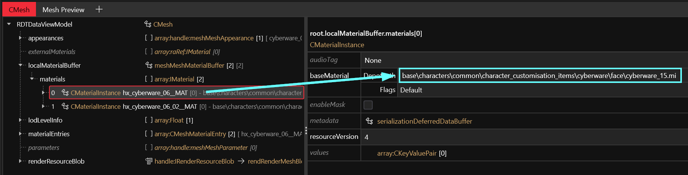

# Cheat Sheet: Head

## Summary

This page lists various properties of the player head. Use the Table of Contents or your browser's search (Hotkey: `Ctrl+F`) to quickly find what you're looking for.

### More head-related cheat sheets

* For character creator stuff (colors, appearance names), check [cheat-sheet-character-creator.md](../cheat-sheet-character-creator.md "mention")
* For [hair](hair.md), [facial expressions](cheat-sheet-facial-expressions.md), or[ info on the E3 heads](cheat-sheet-e3-heads.md), check the child pages in the navigation tree on the left

### Wait, this isn't what I'm looking for!

* If you want to [edit the player's head](../../../modding-guides/npcs/a-new-head-for-v.md), you need [meshes](../../files-and-what-they-do/3d-objects-.mesh-files) and [morphtargets](../../3d-modelling/morphtargets.md).
* If you want to make a custom NPC, check [npv-v-as-custom-npc](../../../modding-guides/npcs/npv-v-as-custom-npc/ "mention")
* You can find additional information about the player head under [npv-preparing-the-head-in-blender.md](../../../modding-guides/npcs/npv-v-as-custom-npc/npv-preparing-the-head-in-blender.md "mention")

***

## Head file paths

<table data-header-hidden><thead><tr><th width="166.33333333333331">Body gender</th><th>file path</th></tr></thead><tbody><tr><td>p<strong>w</strong>a mesh</td><td><br><code>base\characters\head\player_base_heads\player_female_average\h0_000_pwa_c__basehead\</code></td></tr><tr><td>p<strong>w</strong>a morphtarget</td><td><code>base\characters\head\player_base_heads\player_female_average > .morphtarget</code></td></tr><tr><td>p<strong>m</strong>a mesh</td><td><code>base\characters\head\player_base_heads\player_man_average\h0_000_pma_c__basehead</code></td></tr><tr><td>p<strong>m</strong>a morphtarget</td><td><code>base\characters\head\player_base_heads\player_man_average > .morphtarget</code></td></tr></tbody></table>


The folders contain the entire player head. The minimum amount of meshes rendered is 3 (head, teeth, eyes), and can go up to 13 (fem V)/14 (masc V).


### Head file prefixes

<table><thead><tr><th width="117.333251953125"></th><th></th></tr></thead><tbody><tr><td>h0_</td><td>head (with ears)</td></tr><tr><td>hb_</td><td>male V only: <a href="../cheat-sheet-character-creator.md#beard">beard</a></td></tr><tr><td>heb_</td><td>eyebrows</td></tr><tr><td>he_</td><td><a href="../cheat-sheet-character-creator.md#eye-colour">eyes</a></td></tr><tr><td>ht_</td><td>teeth</td></tr><tr><td>hx_<br></td><td><ul><li><a href="../cheat-sheet-character-creator.md#cyberware">cyberware</a></li><li><a href="../cheat-sheet-character-creator.md#lip-makeup">lip </a><a href="../cheat-sheet-character-creator.md#lip-makeup">makeup</a> / <a href="../cheat-sheet-character-creator.md#eye-make-up">eye makeup</a></li><li><a href="../cheat-sheet-character-creator.md#cheek-makeup-style">freckles / cheek makeup</a></li><li><a href="../cheat-sheet-character-creator.md#blemishes">pimples (blemishes)</a></li><li>tattoos</li><li><a href="../cheat-sheet-character-creator.md#facial-scars-and-submeshes">scars</a></li></ul></td></tr><tr><td>l1_</td><td>earrings/piercings (01-04)</td></tr></tbody></table>

## Complexions

Every complexion has its own associated texture file. These are sorted by body gender under

```
base\characters\head\wa\h0_001_wa_c__basehead\textures\h0_000_wa_c__basehead_d0X.xbm
base\characters\head\ma\h0_001_ma_c__basehead\textures\h0_000_ma_c__basehead_d0X.xbm
```

The files are ending in `01..05`. Each complexion has its own appearance in the head mesh, e.g.:

```
03_ca_senna
03_ca_senna_d02
03_ca_senna_d03
03_ca_senna_d04
03_ca_senna_d05
```

## Skin definitions

Skin materials are defined in the base head `.mesh` file (while the shape comes from the .morphtarget):

<table><thead><tr><th width="130.333251953125">body gender</th><th></th></tr></thead><tbody><tr><td>female</td><td><code>base\characters\head\player_base_heads\player_female_average\h0_000_pwa_c__basehead\h0_000_pwa_c__basehead.mesh</code></td></tr><tr><td>male</td><td><code>base\characters\head\player_base_heads\player_man_average\h0_000_pma_c__basehead\h0_000_pma_c__basehead.mesh</code></td></tr></tbody></table>

You can find the [definitions](../../files-and-what-they-do/3d-objects-.mesh-files#step-3-material-definition) in the localMaterialBuffer. Each material overrides the following [properties](../../materials/configuring-materials/#checking-material-properties) locally:

* Normal (bump/height map)
* Albedo (diffuse/complexion)

All other properties are pulled from a [.mi file](../../files-and-what-they-do/file-formats/materials/re-using-materials-.mi.md) in the following folder:

<table><thead><tr><th width="128">body gender</th><th></th></tr></thead><tbody><tr><td>female</td><td><code>base\characters\head\player_base_heads\player_female_average\h0_000_pwa_c__basehead\textures</code></td></tr><tr><td>male</td><td><code>base\characters\head\player_base_heads\player_man_average\h0_000_pma_c__basehead\textures</code></td></tr></tbody></table>

### Head: material instances

This section only lists [.mi files](../../files-and-what-they-do/file-formats/materials/re-using-materials-.mi.md) used by the player head. To see which skin is which, check [cheat-sheet-character-creator.md](../cheat-sheet-character-creator.md "mention") -> [#skin-tones](../cheat-sheet-character-creator.md#skin-tones "mention")


About half of these files are shared by NPCs. Editing or replacing these will affect all of Night City!


<table><thead><tr><th width="550">File name (use male_head for masc)</th><th>Shared with NPCs</th></tr></thead><tbody><tr><td><code>female_head_01_ca_pale_00_warm_ivory.mi</code></td><td>❌</td></tr><tr><td><code>female_head_01_ca_pale.mi</code></td><td>✔</td></tr><tr><td><code>female_head_02_ca_limestone_00_beige.mi</code></td><td>❌</td></tr><tr><td><code>female_head_02_ca_limestone.mi</code></td><td>✔</td></tr><tr><td><code>female_head_03_ca_senna_00_amber.mi</code></td><td>❌</td></tr><tr><td><code>female_head_03_ca_senna_01_honey.mi</code></td><td>❌</td></tr><tr><td><code>female_head_03_ca_senna_02_band.mi</code></td><td>❌</td></tr><tr><td><code>female_head_03_ca_senna.mi</code></td><td>✔</td></tr><tr><td><code>female_head_04_ca_almond_00_umber.mi</code></td><td>❌</td></tr><tr><td><code>female_head_04_ca_almond.mi</code></td><td>✔</td></tr><tr><td><code>female_head_05_bl_espresso.mi</code></td><td>✔</td></tr><tr><td><code>female_head_06_bl_dark.mi</code></td><td>✔</td></tr></tbody></table>

## **Freckles / cheek make-up**

For a list of freckles and make-up sorted by colour and skin type, see [cheat-sheet-character-creator.md](../cheat-sheet-character-creator.md "mention") -> [#cheek-makeup-style](../cheat-sheet-character-creator.md#cheek-makeup-style "mention")

## Eyebrows

Ev~~e~~ry eyebrow option has an associated texture file, normal map, and alpha map.

These files can be found in the following folder:

```
base/characters/common/character_customisation_items/eyebrows/textures/
```

Provided below is a table with the eyebrows and their associated texture files.

<table><thead><tr><th width="157">Eyebrow</th><th>Diffuse Texture</th><th>Alpha Mask</th></tr></thead><tbody><tr><td>01</td><td>heb__base_d01.xbm</td><td>heb_wa__base_ds01.xbm</td></tr><tr><td>02</td><td>heb__base_d02.xbm</td><td>heb_wa__base_ds02.xbm</td></tr><tr><td>03</td><td>heb__base_d03.xbm</td><td>heb_wa__base_ds03.xbm</td></tr><tr><td>04</td><td>heb__base_d04.xbm</td><td>heb_wa__base_ds04.xbm</td></tr><tr><td>05</td><td>heb__base_d05.xbm</td><td>heb_wa__base_ds05.xbm</td></tr><tr><td>06</td><td>heb__base_d06.xbm</td><td>heb_wa__base_ds06.xbm</td></tr><tr><td>07</td><td>heb__base_d07.xbm</td><td>heb_wa__base_ds07.xbm</td></tr><tr><td>08</td><td>heb__base_d08.xbm</td><td>heb_wa__base_ds08.xbm</td></tr></tbody></table>

## Eye make-up

Eye make-up [.mi files](../../files-and-what-they-do/file-formats/materials/re-using-materials-.mi.md) can be found in the following folder:&#x20;

```
base\characters\common\character_customisation_items\makeup\eyes
```

The individual make-up styles are black and white **masks** stored in the `textures` subfolder.

## Cyberware

Player cyberware [.mi files](../../files-and-what-they-do/file-formats/materials/re-using-materials-.mi.md) can be found in the following folder:

```
base\characters\common\character_customisation_items\cyberware\face
```

In the `textures` subfolder you can find the individual texture files used by the [.mi file](../../files-and-what-they-do/file-formats/materials/re-using-materials-.mi.md).

### 2.2 Cyberware

Cyberware added with patch 2.2 is distributed across preexisting files:


These appearances do not exist in the .mesh! Read below the table for how to make them work!


<table><thead><tr><th width="95.73333740234375">CC index</th><th width="415.4666748046875">file</th><th>appearance</th></tr></thead><tbody><tr><td>8</td><td><code>makeup_eyes_01.mesh</code></td><td><code>cyberware_01</code></td></tr><tr><td>9</td><td><code>cyberware_04.mesh</code></td><td><code>cyberware_08</code></td></tr><tr><td>10</td><td><code>makeup_freckles_01.mesh</code></td><td><code>cyberware_09</code></td></tr><tr><td>11</td><td><code>tattoo_02.mesh</code></td><td><code>cyberware_10</code></td></tr><tr><td>12</td><td><code>makeup_freckles_01.mesh</code></td><td><code>cyberware_11</code></td></tr><tr><td>13</td><td><code>cyberware_04.mesh</code></td><td><code>cyberware_12</code></td></tr><tr><td>14</td><td><code>makeup_freckles_01.mesh</code></td><td><code>cyberware_13</code></td></tr><tr><td>15</td><td><code>cyberware_06.mesh</code></td><td><code>cyberware_14</code></td></tr><tr><td>16</td><td><code>makeup_freckles_01.mesh</code></td><td><code>cyberware_15</code></td></tr></tbody></table>

You can find the cyberware [material instances](../../files-and-what-they-do/file-formats/materials/re-using-materials-.mi.md) with the following [search query](https://app.gitbook.com/s/-MP_ozZVx2gRZUPXkd4r/wolvenkit-app/usage/wolvenkit-search-finding-files):

```
base\characters\common\character_customisation_items\cyberware\face\cyberware > .mi
```

To change the appearance (e.g. for your custom NPC), edit the `baseMaterial` properties of your local material:

<figure><figcaption></figcaption></figure>
