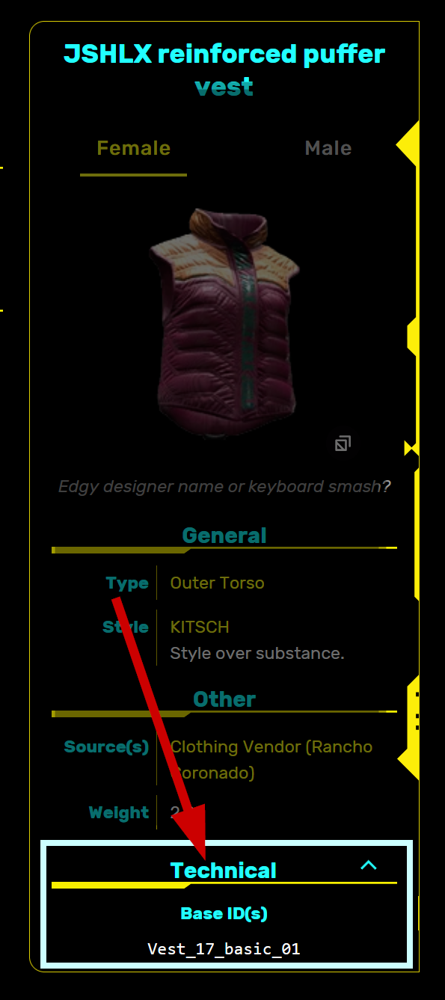
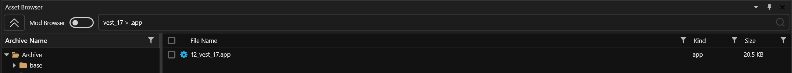
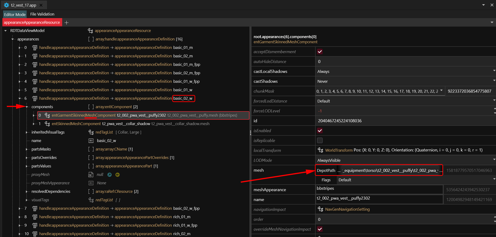
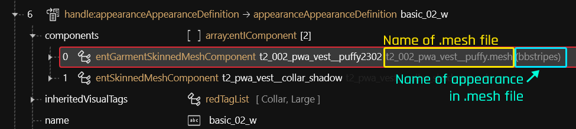
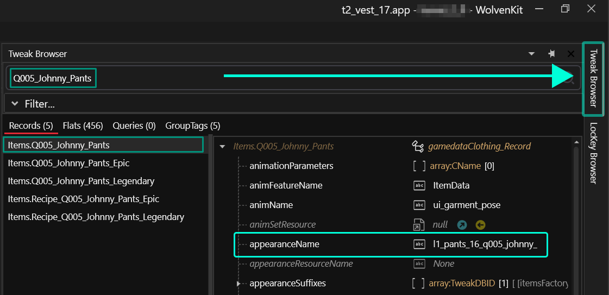

# Spawn Codes (BaseIDs/Hashes)

## What's a BaseID?

Each item is **uniquely identified** by this string[^1]. You can use it to spawn items via [Cyber Engine Tweaks](https://app.gitbook.com/s/-MP5jWcLZLbbbzO-\_ua1-887967055/console/console#console-ui) with the following command:&#x20;

```
Game.AddToInventory("Items.money", 5000)
```

`Items.money` is the baseID for eddies, and the 5000 will stuff 5 grand into your pocket.

## Lists of Base IDs


You can usually find any BaseID on the [fandom](https://cyberpunk.fandom.com/wiki/Cyberpunk\_2077\_Clothing) wiki. Search for a game item, then expand the section "technical details" in the box to the right.


A selection of lists for looking up item codes. Alternatively, you can browse through the game's files, or search the web.

## Step by step

### Step 1: Finding the right item


We're finding the item **by name**. If you don't even know that much, check the [equipment-databases.md](equipment-databases.md "mention") and see if you can find the name from a picture.


1. Head to the [fandom wiki](https://cyberpunk.fandom.com/wiki) and search for your item. For this guide, we'll be using the `Reinforced Puffer Vest`.
2. In the box on the left, find the Technical section. This will list your base ID:

<figure><figcaption></figcaption></figure>


You can use the base ID to spawn the item via Cyber Engine Tweaks:

`Game.AddToInventory("Items.Vest_17_basic_01")`


#### The naming scheme

Usually, the base ID consists of two parts: the item name, and the item's appearance.

* `Vest_17` is the name of the item. You can use this to find its control files (see Step 2 below).
* `basic_01` is the variant name. This is used inside the control files to load a specific appearance.

### Step 2: Finding the .app file


If you can't find any files with the method below, scroll to [#alternative-methods-of-finding-an-item](spawn-codes-baseids-hashes.md#alternative-methods-of-finding-an-item "mention") at the bottom of this guide before proceeding.


1. Open WolvenKit and use the Asset Browser to search for the item's app file:\
   `vest_17 > .app`

<figure><figcaption><p>Search WolvenKit for the first part of the BaseID</p></figcaption></figure>

2. You should now have at least one .app file, where the item's appearances are defined..\
   _To learn more about this, check_ [appearance-.app-files](../../files-and-what-they-do/appearance-.app-files/ "mention")_. This is not necessary for this guide._
   * If you have more than one file, hover over them to view their file paths, and pick the one that's inside a `player` folder.&#x20;
   * If you can't find any files, check [#alternative-methods-of-finding-an-item](spawn-codes-baseids-hashes.md#alternative-methods-of-finding-an-item "mention") below.
3. Open the .app file (right-click, "Open without adding to project")

### Step 3: Finding the mesh

1. Inside the .app file, open the `appearances` array
2. You will see something like this:

<figure><figcaption></figcaption></figure>

3. Ignore camera mode and open the appearance that you want (`basic_02_w`)
4. Open the `components` array and find the component that has `mesh` in its name:

<figure><figcaption></figcaption></figure>

5. You want mesh file's `DepotPath`. This is where Wolvenkit stores the 3d object, which contains the materials.

<figure><figcaption><p>While basic_01 uses the default appearance, this one uses <strong>bbstripes</strong></p></figcaption></figure>

## You found the item, what now?

Now that you've found your mesh, you can **edit** it.&#x20;

* To use it for the base of a new in-game item, check the [adding-new-items](../../../modding-guides/items-equipment/adding-new-items/ "mention") guide
* To change its materials, check the [changing-materials-colors-and-textures.md](../../../for-mod-creators/modding-guides/items-equipment/editing-existing-items/changing-materials-colors-and-textures.md "mention") guide

## Alternative methods of finding an item

Some items don't obey [#the-naming-scheme](spawn-codes-baseids-hashes.md#the-naming-scheme "mention"), for example `Q005_Johnny_Pants`. So how can you find these kinds of items?

### The Tweak Browser

1. Find and open the [Tweak Browser](https://app.gitbook.com/s/-MP\_ozZVx2gRZUPXkd4r/wolvenkit-app/editor/tweak-browser) and wait for it to initialize. \
   _As of Wolvenkit 8.14, it is pinned to the right side of the viewport_
2. Search for your item, e.g. `Q005_Johnny_Pants`
3. Select one of the entries from the list on the left
4. In the detail panel with the item's properties, find the `appearanceName`.
   * If you don't have a detail panel, make the Tweak Browser window wider

<figure><figcaption></figcaption></figure>

5. The appearance name will be something like `l1_pants_16_q005_johnny_`. Does this look familiar?
6. Time to proceed with [#step-2-finding-the-.app-file](spawn-codes-baseids-hashes.md#step-2-finding-the-.app-file "mention")

### The Wolvenkit Search

Depending on what you are looking for, you can check [Wolvenkit Search: Finding files](https://app.gitbook.com/s/-MP\_ozZVx2gRZUPXkd4r/wolvenkit-app/usage/wolvenkit-search-finding-files "mention") and dig directly for the mesh file. This might be tedious, but you'll also discover a lot of things on the way, so it's definitely worth a try!


[^1]: Netrunner-ese for "text"

