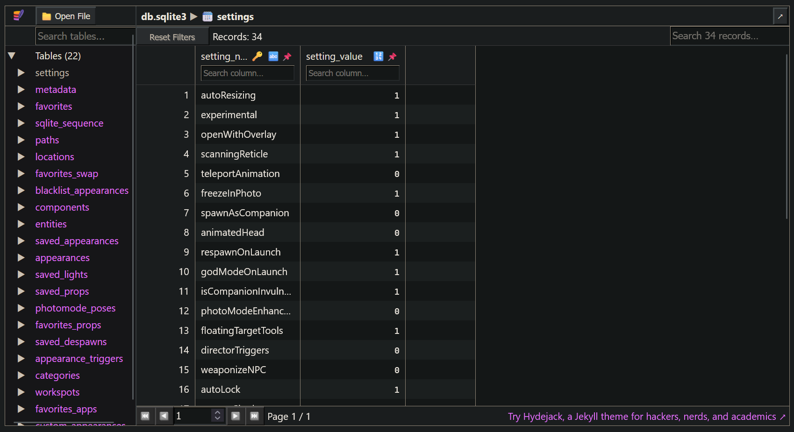
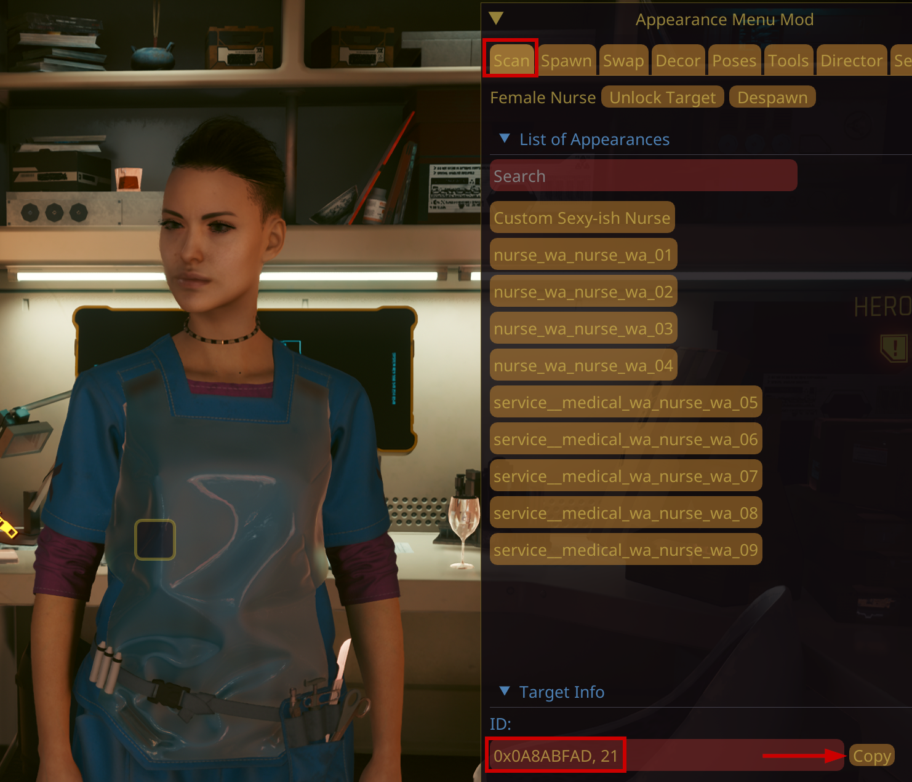
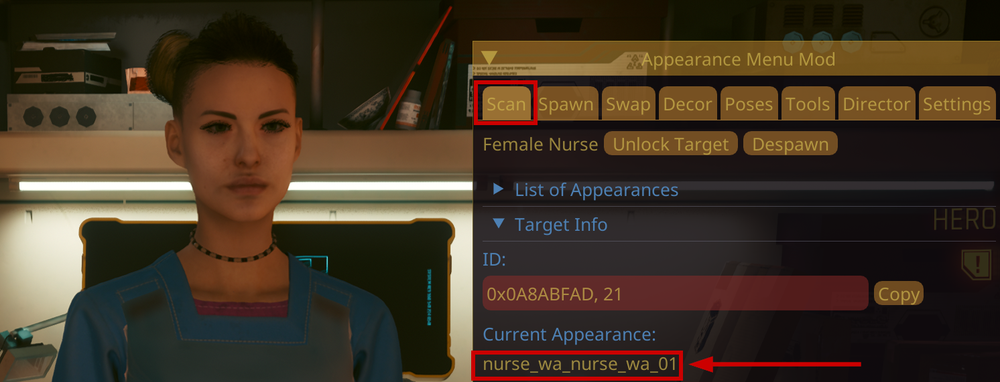
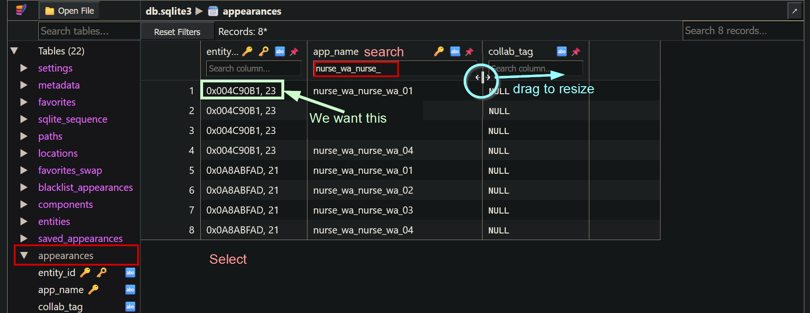
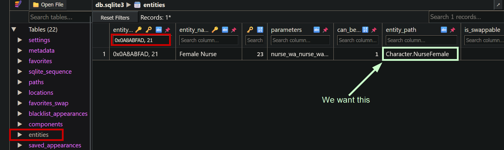

# Finding files: AMM NPCs

## Summary

**Published**: Dec 31 2024 by [manavortex](https://app.gitbook.com/u/NfZBoxGegfUqB33J9HXuCs6PVaC3 "mention")\
**Last documented update**: Dec 31 2024 by [manavortex](https://app.gitbook.com/u/NfZBoxGegfUqB33J9HXuCs6PVaC3 "mention")

This page will show you how to find an AMM NPC's files.

**Difficulty**: You know how to read

### Wait, this isn't what I want!

* To change NPC appearances, see [appearances-change-the-looks](../../../modding-guides/npcs/appearances-change-the-looks/ "mention")
* To create custom NPCs, see [amm-custom-npcs](../../../modding-guides/npcs/amm-custom-npcs/ "mention")
* To create V as an NPC, see [npv-v-as-custom-npc](../../../modding-guides/npcs/npv-v-as-custom-npc/ "mention")

In this guide, we'll go looking for `nurse_wa_nurse_wa_01`.

We do that by tracking her through AMM's **database** — an `sqlite3` file. Don't worry, this guide will help you navigate it.

## Step 1: Find and open the database file

1. Open [https://sqliteviewer.app/](https://sqliteviewer.app/) in a webbrowser
2. Head to [the-cyberpunk-2077-game-directory](../../../for-mod-users/users-modding-cyberpunk-2077/the-cyberpunk-2077-game-directory/ "mention")
3. Navigate to the subfolder `bin\x64\plugins\cyber_engine_tweaks\mods\AppearanceMenuMod`
4. Find the file `db.sqlite3`
5. Drag and drop it on the [sqliteviewer](https://sqliteviewer.app/) website

You will now see something like this:

<figure><figcaption></figcaption></figure>

## Step 2: Find the entity ID

### Variant 1: Copy it from AMM

1. Open AMM's **Scan** tab
2. Find the Target Info section at the bottom
3. Find the **ID** field
4. Click the `Copy` button

<figure><figcaption></figcaption></figure>

### Variant 2: Finding it in the database

#### Find the current appearance

1. Open AMM's **Scan** tab
2. Find the **Target Info** section at the bottom
3. Find the **Current Appearance** under the **ID** field and write it down:

<figure><figcaption></figcaption></figure>

#### Find the ID in the database

1. Switch to the [sqliteviewer](https://sqliteviewer.app/) website.
2. In the left column, `Tables`, click on `appearances` to select the table
3. Optional: Resize the `app_name` column
4. Type the name into the search field at the top of the column
5. Find the entity ID in the first column, and write it down (green box in the screenshot below)

<figure><figcaption></figcaption></figure>

### Step 3: Find the .ent file

Complete the following steps on the sqliteviewer website.

1. In the left column, `Tables`, click on `entities` to select the table.
2. Type the entity ID from step 2 into the search field at the top of the first column, `entity_id`. This should give you one (1) row of data.
3. Optional: Resize fields until you can see the entire `entity_path` column
4. Find the entity path, and write it down (green box in the screenshot below)

<figure><figcaption></figcaption></figure>

## Step 4: Finding the NPC's file

In the entity path column, you will either find a file name (for modded NPCs), or a TweakDB ID (for base game characters). Read the section below as for how to proceed from here.

### A file path

Contgratulations, you have found the character's [root entity](../../files-and-what-they-do/entity-.ent-files/#root-entity). Go to [spawn-codes-baseids-hashes.md](../equipment/spawn-codes-baseids-hashes.md "mention") and follow the steps after [#step-2-finding-the-.app-file](../equipment/spawn-codes-baseids-hashes.md#step-2-finding-the-.app-file "mention").


If the NPC was added by a mod, you have to use the [Mod Browser](https://app.gitbook.com/s/-MP_ozZVx2gRZUPXkd4r/wolvenkit-app/editor/asset-browser#mod-browser) for this.


### A TweakDB Id (e.g. `Character.NurseFemale`)

Go to [spawn-codes-baseids-hashes.md](../equipment/spawn-codes-baseids-hashes.md "mention") and follow the steps after [#the-tweak-browser](../equipment/spawn-codes-baseids-hashes.md#the-tweak-browser "mention") to find your character's files.
