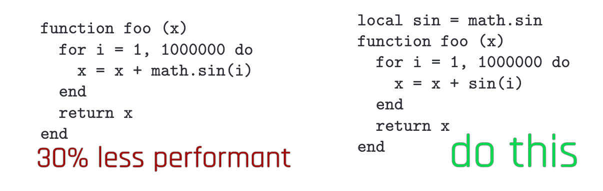

# Best practices / pitfalls

## LUA

### Gain performance: Early Return

You're probably used to coding like this:

<pre class="language-lua"><code class="lang-lua"><strong>local function myMethod()
</strong><strong>  if condition then 
</strong><strong>    -- do a little dance, make a little love…
</strong><strong>  end
</strong><strong>end
</strong></code></pre>

In LUA, you can save a few processing cycles by using the early return style:

<pre class="language-lua"><code class="lang-lua"><strong>local function myMethod()
</strong><strong>  if not condition then return end
</strong><strong>  -- do a little dance, make a little love…
</strong><strong>end
</strong></code></pre>

You can gain a **significant** amount of performance this way, especially where loops are concerned.

### Fixing/preventing nil access

LUA throws an exception if it encounters `nil` in unexpected places. The corresponding error will look like this:

<pre><code><strong>attempt to access local '&#x3C;variable name>' (a nil value)
</strong>stack traceback: 
  my_example.lua:1234 in function 'MyFunctionName'
</code></pre>

Open the corresponding file, find the correct line, and check what is being accessed there. It will look like `variable.property`, or perhaps something will be concatenated to a string (`"something something text" .. variable`).

You can assign a **default value** to the property in question:

```lua
local myString = my_potentially_unset_string or ""
local myNumber = my_potentially_unset_number or 0
local myObject = my_potentially_unset_object or {}
```


While that won't solve any other problems, it will at least make the error go away.


### Switch in LUA: Lookup Tables

Who doesn't know the problem? You want to know if your string is A, B, or C, but not D — and LUA doesn't have a switch statement.

Fortunately, there is a built-in and performant way to do that:&#x20;

```lua
myTable = {
  A = true,
  B = true,
  C = true
}

myTable.A            # true
myTable.B            # true
myTable.C            # true
myTable.D            # nil => false
myTable.WHATEVER     # nil => false

```

### Performance killers: strings

String concatenation and comparison can be the difference between a brief stutter and a complete freeze or even crash to desktop. This is not a joke — see [here](https://www.lua.org/gems/sample.pdf) for more detail.

#### Comparing/Searching

Lua internalizes strings. That means these two strings will share a single representation in memory:

```lua
local string1 = "This is the same object!"
local string2 = "This is the same object!"
```

The comparison between those two strings will be almost-instant.

This becomes a problem when comparing strings in a loop (see [Scopes](scripting-best-practices-pitfalls.md#scopes)):

```lua
for (_, mystring) in ipairs(mytable) do
    if mystring == "This is the same object!" then
        -- do something
    end
end
```

Every single pass of the loop will create a memory representation of "This is the same object!" and then discard it again.

<pre class="language-lua"><code class="lang-lua"><strong>local myCompareString = "This is the same object!"
</strong><strong>for (_, mystring) in ipairs(mytable) do
</strong>    if mystring == myCompareString then
        -- do something
    end
end
</code></pre>


Takeaway:

If at all possible, define things outside the scope of loops!


#### Search in strings


TL;DR:

* Avoid regex and patterns if possible
* prefer `String.find()` over `String.match()`


Lua's regex implementation is very limited, even more so for the pipe `|` character. For example, the following example will **actually iterate twice** after creating internal string representations:

```lua
if string.find("catastrophe",  "dog|cat") then 
  -- do something
end
```

It is faster to just do this:

```lua
if string.find("catastrophe",  "dog") or string.find("catastrophe",  "cat") then 
  -- do something
end
```

**Bad**

On top of that, `string.match` will return the entire string if no match is found:

```lua
local match = string.match("catastrophe",  "dog")
if match ~= "catastrophe" then
  -- do something
end
```

**Good**:

The alternative:

```lua
if string.find("catastrophe",  "dog")
  -- do something
end
```

#### Concatenation


For a performance analysis of different kinds of string concatenation, check [here](https://dannyguo.medium.com/how-to-concatenate-strings-in-lua-d2164cc5922f).


### Scopes

It is cheaper to access local variables than to access nested scopes:

<figure><figcaption></figcaption></figure>

(If you overdo this, your code will become unreadable. Use responsibly.)
