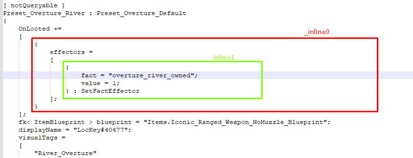
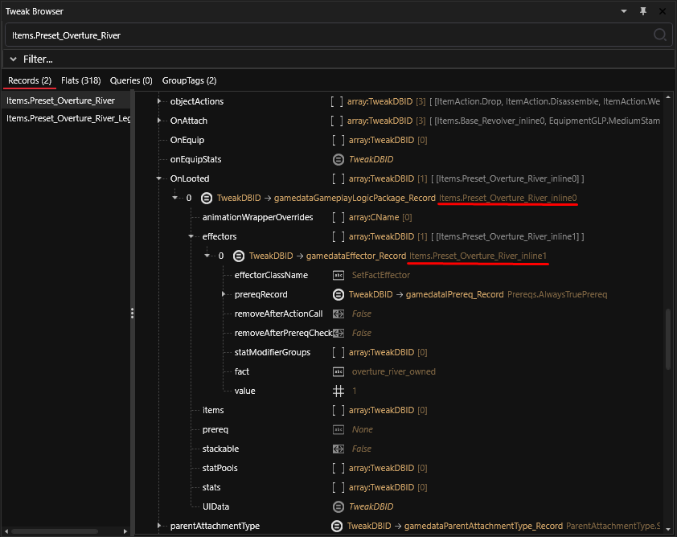
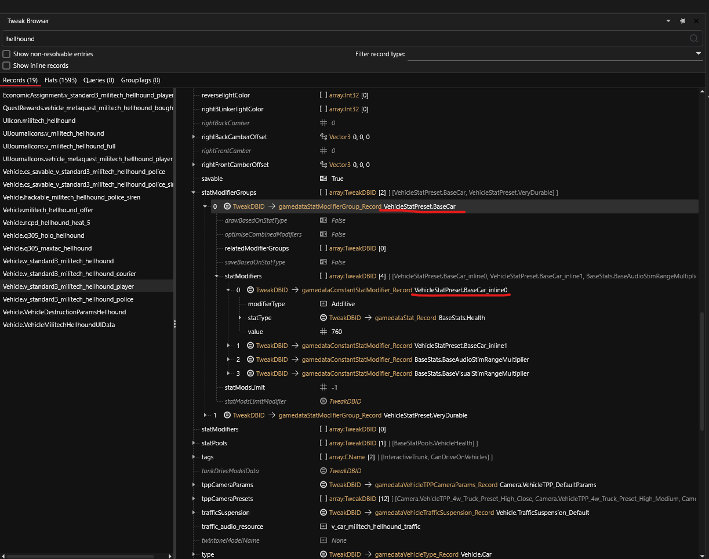

# Tweak Inline Records

## Summary

**Created:** 22 May 2024 by [manavortex](https://app.gitbook.com/u/NfZBoxGegfUqB33J9HXuCs6PVaC3 "mention")\
**Last documented update:** 22 May 2024 by [manavortex](https://app.gitbook.com/u/NfZBoxGegfUqB33J9HXuCs6PVaC3 "mention")

## What are inline records?


**TL;DR:** The names are generated at compile-time with every patch, so the order may change. Don't use them, rather create a full copy.


Sometimes, you will come across records with names like `Items.Preset_Overture_River_inline0`. That tells us exactly nothing, so what are they?

As we have learned in [how-to-yaml-tweak-modding-basics.md](../core-mods-explained/tweakxl/tweakxl-changing-game-records/how-to-yaml-tweak-modding-basics.md "mention") -> [#records](../core-mods-explained/tweakxl/tweakxl-changing-game-records/how-to-yaml-tweak-modding-basics.md#records "mention"), it is possible to nest records like Russian dolls. Inline records are exactly that: nested records, which are not defined anywhere but in the context that uses them.


[browsing-the-tweak-database.md](tweaks/browsing-the-tweak-database.md "mention")contains the full intel on how to find your way around.&#x20;


Let's take a quick look. This is the tweak as read from the Tweak DB:

<figure><figcaption><p>The record's properties in <a data-mention href="tweaks/browsing-the-tweak-database.md#the-wolvenkit-tweak-browser">#the-wolvenkit-tweak-browser</a>. Screenshot kindly provided by Seberoth</p></figcaption></figure>

You can use Wolvenkit's [Tweak Browser](https://app.gitbook.com/s/-MP_ozZVx2gRZUPXkd4r/wolvenkit-app/editor/tweak-browser "mention") to take a look at the properties:

<figure><figcaption></figcaption></figure>

If you want to use these effectors, you should define a copy in your yaml.


## **Safely modifying inline records**


If you modify a record (e.g. `VehicleStatPreset.BaseCar`) or one of its properties, then all records **inheriting** from it will be affected.

To learn how to avoid that, just keep reading.


Let's assume that we want to tweak the Hellhound's vehicle health. Here is the record:

<figure><figcaption></figcaption></figure>

As you can see, its health is based on the **shared record** `VehicleStatPreset.BaseCar_inline0`.&#x20;

If you modify it directly, it will change the health of all vehicles. Therefore, to make changes, a new record must be created. You can see `VehicleStatPreset.BaseCar` in the statmodifierGroups, and `VehicleStatPreset.BaseCar_inline0 in its statModifiers:`

```yaml
Vehicle.v_standard3_militech_hellhound:
  statModifierGroups:
    - VehicleStatPreset.BaseCar
```

To make the change, create a new `VehicleStatPreset.Octant` to replace `VehicleStatPreset.BaseCar`:

```yaml
Vehicle.av_zetatech_octant_dav_dummy:
  statModifierGroups:
    - VehicleStatPreset.Octant
    - VehicleStatPreset.Strong 
```

Next, **define** `VehicleStatPreset.Octant`.  This record will have `VehicleStatPreset.Octant_inline0` in its stat modifiers:



When inheriting a new base, you only need to include the information that is actually different:

```yaml
VehicleStatPreset.Octant:
  $base: VehicleStatPreset.BaseCar
  statModifiers:
    - !append-once VehicleStatPreset.Octant_inline0
```



When defining a new type, you need to include all information:

```yaml
VehicleStatPreset.Octant:
  $type: gamedataStatModifierGroup_Record
  drawBasedOnStatType: False
  optimiseCombinedModifiers: False
  saveBasedOnStatType: False
  statModsLimit: -1
  relatedModifierGroups: []
  statModifiers:
    - VehicleStatPreset.Octant_inline0         # this is the change
    - VehicleStatPreset.BaseCar_inline1
    - BaseStats.BaseAudioStimRangeMultiplier
    - BaseStats.BaseVisualStimRangeMultiplier 
```



Finally, modify the value itself:

```yaml
VehicleStatPreset.Octant_inline0.value: 7600
```

This way, it won't affect other vehicles and you can still modify it.

