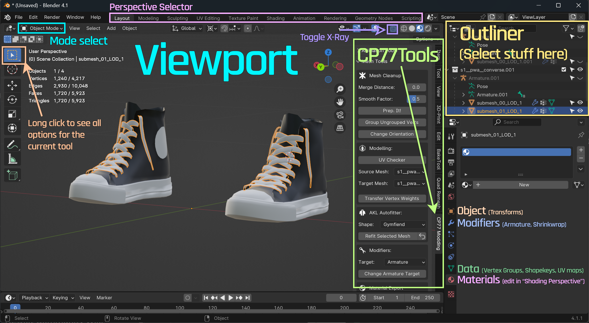
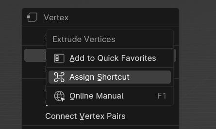
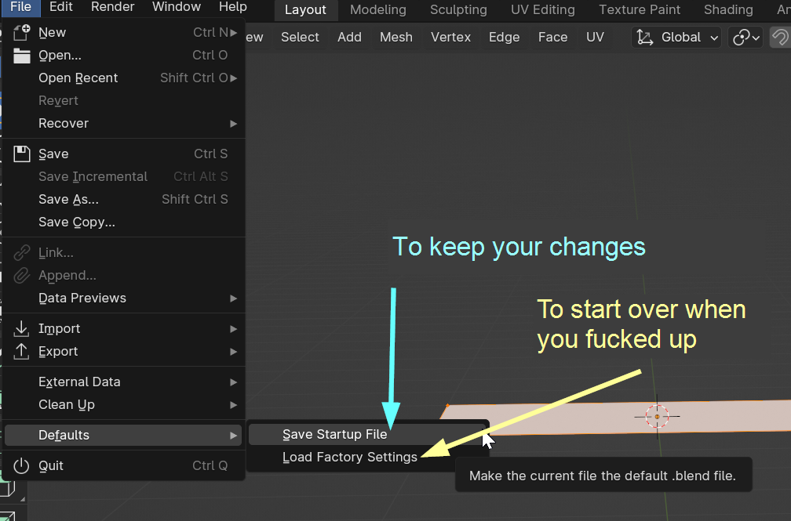
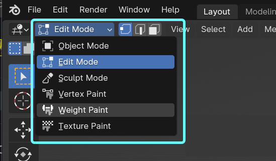
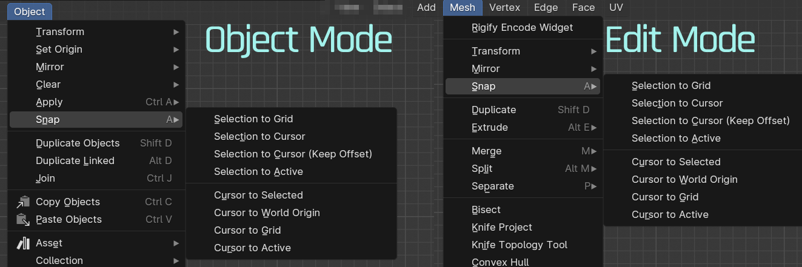
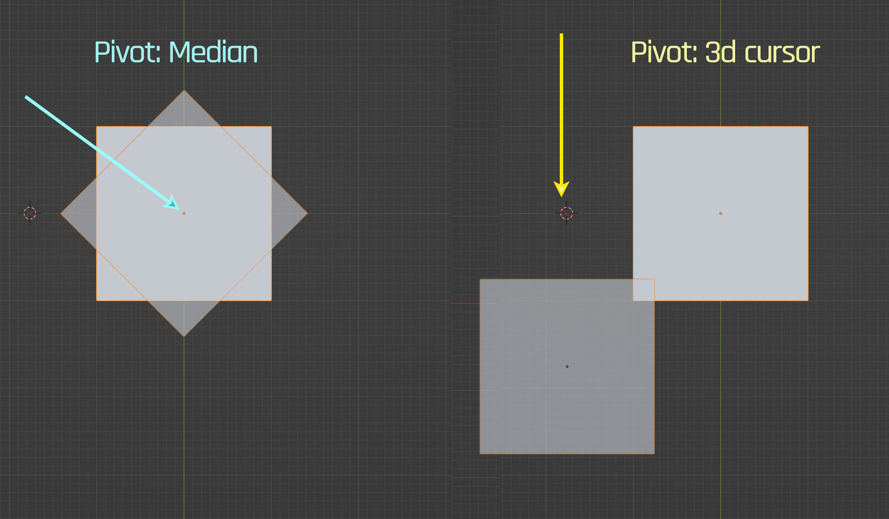
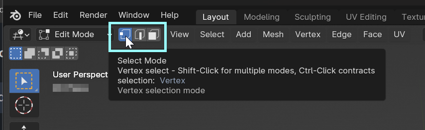
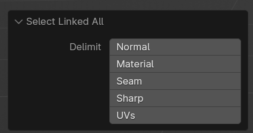
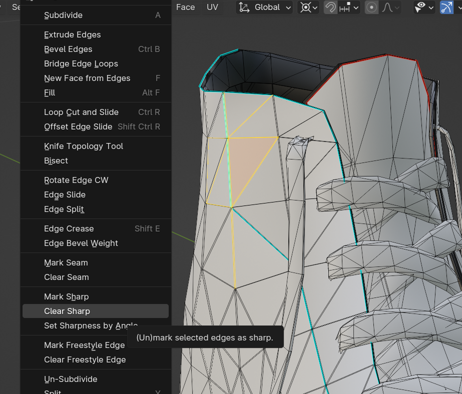
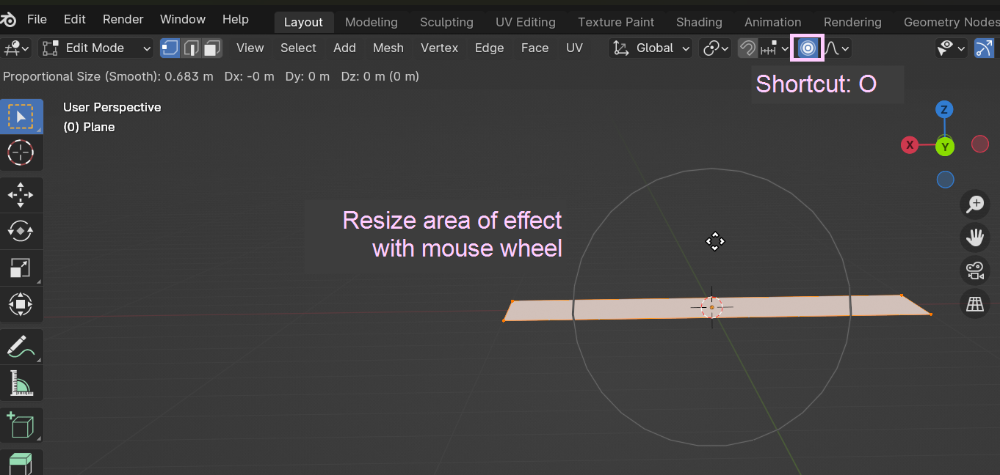

# Blender: Getting Started

## Summary

**Published:** May 11 2024 by [manavortex](https://app.gitbook.com/u/NfZBoxGegfUqB33J9HXuCs6PVaC3 "mention")\
**Last documented update:** May 20 2024 by [manavortex](https://app.gitbook.com/u/NfZBoxGegfUqB33J9HXuCs6PVaC3 "mention")


**TL;DR:** Blender hard, but Blender free and Thog will make 3d object.&#x20;

Do yourself a favour and read at least [#general-tips](blender-getting-started.md#general-tips "mention")!


The open source software [Blender](https://www.blender.org/download/) is huge and intimidating — it is a tool for professionals, and many people consider it as good or even better than paid alternatives.

While it has a steep learning curve, **everyone** can dabble in Blender (even you! Even your mom!). This page will give you tips that'll make it easier for you.


Blender is **not intuitive** to use (perhaps if your knees bend backwards). Our guides usually tell you what to click and teach you keyboard shortcuts. On top of that, [#customizing-the-interface](blender-getting-started.md#customizing-the-interface "mention") is easy and you should definitely do it!


## Interface

### Overview

This is Blender's interface. The main action happens in the **Viewport**. In the default perspective (**Layout**), it is on the left — you can switch **perspectives** (workspace layouts) by using the perspective selector (purple) on the file bar.

Read [#navigating-the-viewport](blender-getting-started.md#navigating-the-viewport "mention") for how to move around in it.

<figure><figcaption></figcaption></figure>

### General tips

1. **Use keyboard shortcuts** - they will speed things up by at least 70%. Put a post-it on your monitor and only remove it when you know them by heart.
   * See [#keyboard-shortcuts-global](blender-getting-started.md#keyboard-shortcuts-global "mention") below for a list
   * See [#customizing-the-interface](blender-getting-started.md#customizing-the-interface "mention") for how to create custom shortcuts (it's easy and you should do it)
2. That being said, **use the** [**Search Menu**](https://blender.stackexchange.com/questions/141118/how-to-access-the-search-menu-2-8-used-to-be-spacebar-in-2-79) (Hotkey: `F3` or `Space`, depending on your settings) . \
   It gives you access to all of Blender's functions! Click on the link to see it in action
3. The main action happens in your `Viewport` (the big one on the left).&#x20;
   * You can use the Perspective Selector (pink) to swap around custom-defined workspaces.
   * Check [#customizing-the-interface](blender-getting-started.md#customizing-the-interface "mention") for more detes.
4. Understand when to use **Object Mode** and when to use **Edit** or **Pose** Mode.  Read [#view-port-modes](blender-getting-started.md#view-port-modes "mention") for more detes.
   * You can switch between Edit Mode and Object Mode with `Tab` (turquoise dropdown on screenshot 1)
5. You can switch the current selection tool with a long click on the tool's surface (shortcut to cycle: `W`)
6. You can (de)select multiple things by ctrl-clicking on them.&#x20;
7. The most recently selected thing is called **`Active`** (this shows up in many context menus)
   * The **Select Circle** tool does not set an **Active** selection.
8. You can toggle **X-Ray mode** (Shortcut: `Alt+Z`) by clicking the purple icon in the screenshot above

### Navigating the viewport

* **Spin** the viewport by pressing the `middle mouse button` and moving the mouse
* Zoom with the `mouse wheel`
* With `/` (Numpad Divide), you activate `Local Mode`, which will show you only your selection
* Press `Numpad 5` to toggle between `perspective` and `orthographic` mode. Try around with them

### Customizing the interface


Don't be shy to do this! If you fuck up, you can always restore the default settings!


You can easily customize the interface — for example, you can **set custom keyboard shortcuts** by simply right-clicking on something!

<figure><figcaption>
When you use something a lot, give it a shortcut.
</figcaption></figure>

#### Save Startup File

To make your changes persistent, save your current .blend under `File -> Defaults -> Save Startup File`.

<figure><figcaption></figcaption></figure>

### View port modes

You switch the View Mode in the **dropdown on the topleft**. Depending on your **perspective**, there are multiple options:

<figure><figcaption></figcaption></figure>


You can switch between the most commonly used modes, **Object** and **Edit,** with `Tab`.


Here's what they do:

<table><thead><tr><th width="201"></th><th></th></tr></thead><tbody><tr><td>Object Mode</td><td>This is where you switch the active 3d object. The other modes only work on the current selection. Read <a data-mention href="blender-getting-started.md#the-object-mode">#the-object-mode</a> below for more detes.</td></tr><tr><td>Edit Mode</td><td>Lets you alter the objects 3d data by moving pixels around. Read <a data-mention href="blender-getting-started.md#the-edit-mode">#the-edit-mode</a>below for more detes.</td></tr><tr><td>Pose Mode</td><td>Only available when you have an <strong>armature</strong> (rig, skeleton) selected. This is where you <a href="../modding-guides/animations/poses-animations-make-your-own.md">make poses</a>.</td></tr><tr><td>Sculpt Mode</td><td><strong>You usually don't need this!</strong> Sculpt the mesh as if it's clay. Requires you to <strong>delete shapekeys</strong>, and leads to bad topologies. Proportional Editing is much better. <em>See =></em> <a data-mention href="mesh-sculpting-techniques.md">mesh-sculpting-techniques.md</a><em>.</em></td></tr><tr><td>Vertex Paint</td><td>Lets you create Vertex Paint Data. You only need this for <a href="garment-support-how-does-it-work/#painting-your-parameters">custom garment support</a> (so as a beginner, stay away from it)</td></tr><tr><td>Weight Paint</td><td>Weights determine how an object moves with the armature. Everyone hates it, but you can usually get around weight painting by simply <a href="porting-3d-objects-to-cyberpunk.md#step-4-weight-transfer">stealing weights</a> from an in-game item.</td></tr><tr><td>Texture Paint</td><td>"We have <a href="https://www.adobe.com/products/substance3d/apps/painter.html">Adobe Substance Painter</a> at home!" It's free, it's 3d, but using it sucks. Before switching to Substance Painter, I painted in photoshop and used it just for positioning/rough guidelines.</td></tr></tbody></table>

### Keyboard Shortcuts (global)

The shortcuts below are shared between Object and Edit mode:

<table><thead><tr><th width="192"></th><th></th></tr></thead><tbody><tr><td><code>H</code></td><td>Hide selected elements</td></tr><tr><td><code>Shift+H</code></td><td>Hide everything <strong>except for</strong> the selected elements</td></tr><tr><td><code>Alt+H</code></td><td>Un-hide everything</td></tr><tr><td><code>X</code></td><td>Delete selection</td></tr><tr><td><code>Ctrl+I</code></td><td>Invert selection</td></tr><tr><td><code>Shift+D</code>, <code>Click</code></td><td>Duplicate selection</td></tr></tbody></table>

## The 3d Cursor

In **Object**, **Edit** and **Pose** Mode, you can use the 3d cursor (`Shift-Click` or `Shift-right click`, depending on your settings). You can use it as a [#pivot-point](blender-getting-started.md#pivot-point "mention") or just as an orientation mark.

This is especially handy in combination with Snap Selection:

<figure><figcaption>
Snap Selection - move things around via 3d cursor!
</figcaption></figure>

## Object Mode

Object mode is where you select stuff that you want to edit.


If you move anything in Object Mode, you need to Apply Transforms (Object -> Apply -> All Transforms), or Cyberpunk will ignore your changes.


## Edit Mode

Edit mode is where you actually **edit** the mesh.


You can only edit things that are selected in Object Mode.

Read [#selection-tricks](blender-getting-started.md#selection-tricks "mention") on how to make your way around this!


<figure><figcaption></figcaption></figure>

### Editing tricks


You only edit the current selection (read [#selection-tricks](blender-getting-started.md#selection-tricks "mention") on how to get one).

Check [#pivot-point](blender-getting-started.md#pivot-point "mention") to change your operation's origin.


With any active selection, you can toggle the following actions by hotkey, and then move the mouse:

* Scale (Hotkey: `S`): Grow or shrink something
* Rotate (Hotkey: `R`) What it says
* Move (Hotkey: `G`) Reposition something


**You can lock each of those operations on an axis!**&#x20;

For example, press `G` -> `Z` to move your selection up and down. Press Z again to remove the lock.


#### Pivot Point

By pressing `.`, you can change the current `Pivot Point:`

<figure><figcaption></figcaption></figure>

This is the **origin** for your transforms:

<figure><figcaption></figcaption></figure>

Read [#the-3d-cursor](blender-getting-started.md#the-3d-cursor "mention") on how to make use of the little dude.

### Selection tricks

#### Selection Mode

With the shortcuts `1`, `2` and `3`, you can switch the Selection Mode between [`Vertex`](#user-content-fn-1)[^1], [`Edge`](#user-content-fn-2)[^2], and [`Face`](#user-content-fn-3)[^3]:

<figure><figcaption></figcaption></figure>

#### **Select Linked**

With the shortcut `Ctrl+L`, Blender will select everything up to a certain boundary. By default, this boundary is the same piece of 3d geometry, but in the bottom left corner of the viewport, you can pick the delimiter:

<figure><figcaption></figcaption></figure>

See [#seams-and-sharps](blender-getting-started.md#seams-and-sharps "mention") how to make use of this!

Select Loops

Hold `Alt` and left click to instantly select an entire loop of edges, faces, ors vertices. this works in all selection modes but does not work well with triangulated meshes or very complex geometry. works great for boundry loops

Select Boundry loops

Select all or part of a mesh then navigate to :

<figure><figcaption></figcaption></figure>

this will instantly select all boundry loops for the given selection, great for marking seams

#### **Select shortest path**

Works in Edge, Vertex, or Face Selection Mode. Select at least one element, then `Ctrl+click` on **any other element** to select the shortest path of edges, vertices, or faces between them.&#x20;


Double-check that the shortest path is actually the path you want. If it's not, **un-do** (Hotkey: `Ctrl+Z`) and shift-click on an edge closer to your selection.


### Seams and Sharps

In Edge Selection Mode (Hotkey: `2`), you can (un)mark **edges** as **seams** or **sharps** via context menu:

<figure><figcaption>
Seams are orange, Sharps are blue
</figcaption></figure>

A **seam** (orange line in the viewport) is where the UV map will be split. A [full explanation on UV mapping](../materials/uv-mapping-texturing-a-3d-object.md) blows the scope of this guide, but you can read on if you're curious.\
**Unless you're UV unwrapping**, those won't do anything, and you can use them as selection delimiters to your heart's content!

A sharp (blue line in the viewport) **will cause a sharp crease/fold** in the material. This translates to Cyberpunk, so it's neat to highlight your edges!

### Proportional Editing


You can find a detailed guide on this under [r-and-r-refitting-step-by-step.md](../modding-guides/items-equipment/recolours-and-refits/r-and-r-refitting-step-by-step.md "mention") -> [#step-4-refitting](../modding-guides/items-equipment/recolours-and-refits/r-and-r-refitting-step-by-step.md#step-4-refitting "mention")


"I'm moving a single vertex, but my entire mesh is affected!"&#x20;

Sounds familiar? You've run into Proportional Editing.

<figure><figcaption></figcaption></figure>

* Click the button or press `O` to turn it off and on
* When it's active, **moving**, **scaling** or **rotating** will have an effect on anything **close to your selection**. This makes refitting super easy! No more jagged edges!
* When you move (`G`) or scale (`S`) your selection, you will see a circle for the area of  its effect.&#x20;
  * By default, that circle might be huge and outside your screen. You might wanna change this and then [#save-startup-file](blender-getting-started.md#save-startup-file "mention").
  * You can change the circle's size with your mouse wheel

[^1]: A "point" between two Edges and the corner of a Face

[^2]: The connecting line between two vertices and the boundary of a Face

[^3]: A plane. Its sides are Edges, its corners are Vertices.
