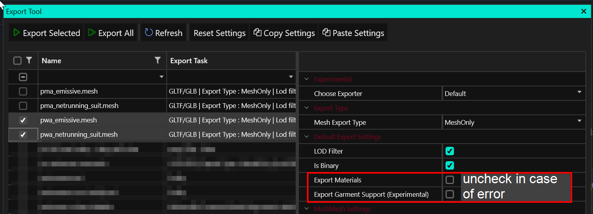

# Archived: Exporting and importing meshes

## Summary 

**Created by @manavortex**\
**Published November 05 2022**

This guide will show you how to\
\- export meshes from the game for use in other projects\
\- import those meshes back into WolvenKit

<figure><figcaption></figcaption></figure>


As of November 2023, the recommended workflow is using the [wolvenkit-blender-io-suite](../../modding-tools/wolvenkit-blender-io-suite/ "mention"). Check its import/export documentation under [wkit-blender-plugin-import-export.md](../../modding-tools/wolvenkit-blender-io-suite/wkit-blender-plugin-import-export.md "mention").


It will **not** show you anything else. For other use cases like **exporting characters,** please check [#wait-this-isnt-what-i-want](./#wait-this-isnt-what-i-want "mention")

Assumed skill level: You are able to read ;)

<table><thead><tr><th width="293">Tool</th><th>Tool version</th></tr></thead><tbody><tr><td><a href="https://github.com/WolvenKit/Wolvenkit/releases">WolvenKit</a></td><td>>= 8.8.0 <em>(8.7.0 works, but has a slightly different UI)</em></td></tr><tr><td><a href="https://www.blender.org/download/">Blender</a></td><td>>= 3.1 stable</td></tr><tr><td><a href="https://github.com/WolvenKit/Cyberpunk-Blender-add-on">WKit Blender AddOn</a></td><td>>= 1.1.0</td></tr></tbody></table>

### Wait, this isn't what I want!

Would you rather…

* Import/Export to fbx [with Noesis](autodesk-fbx-noesis.md)?
* Use the [Wolvenkit Blender Plugin](../../modding-tools/wolvenkit-blender-io-suite/wkit-blender-plugin-import-export.md)?
* Read more about [Wolvenkit's Import/Export tool](https://wiki.redmodding.org/wolvenkit/wolvenkit-app/usage/import-export/export-settings)?
* [Replace meshes](../../modding-guides/items-equipment/editing-existing-items/replace-a-player-item-with-an-npc-item/) without editing them?
* Export [a whole character](https://wiki.redmodding.org/wolvenkit/guides/modding-community/exporting-to-blender) or [an animated character](https://wiki.redmodding.org/wolvenkit/guides/modding-community/exporting-to-blender/exporting-rigs-and-anims)?

#### Legacy: Noesis

In the dawn of modding, Wolvenkit just plain couldn't import or export .mesh files and you had to use [Noesis](autodesk-fbx-noesis.md). In 2023, you won't need that anymore. We're keeping the documentation for the sake of completeness and downward compatibility, but in general, **you don't need it anymore**.

## Exporting the mesh


This page is archived. Please scroll to the top for links to more recent information.



**Before you start editing, a warning:**

It is easy to [break a mesh](./#troubleshooting-i-cant-import-my-mesh) beyond the point of repair. Make frequent back-ups, and continuously test if your altered mesh still imports and displays in WolvenKit, **especially when editing vertices!**


### glTF Binary (\*.glb)

Select your mesh in Wolvenkit: [Tools: Import/Export UI](https://app.gitbook.com/s/-MP\_ozZVx2gRZUPXkd4r/wolvenkit-app/tools/tools-import-export "mention") and click `Export/Process Selected`, or simply use `Export/Process All.`

If the export fails, try unchecking the following properties in the export settings (you have to do this for each individual mesh)

* Export Materials
*   Export Garment Support

    <figure><figcaption>
You have to do this for each mesh individually, or you can copy and paste the settings with the buttons
</figcaption></figure>

You should now have`meshName.glb` in your WKit project's [`raw` directory.](./#path-example)

<figure><figcaption></figcaption></figure>


Wolvenkit > 8.8 will by default export with materials for the [wolvenkit-blender-io-suite](../../modding-tools/wolvenkit-blender-io-suite/ "mention").


#### Path example&#x20;

Assuming you are exporting `t2_002_pwa_vest__puffy.mesh`, WolvenKit will do the following:

Path of mesh: `<yourModDir>\source\`**`archive`**`\base\characters\garment\player_equipment\torso\t2_002_vest__puffy\t2_002_pwa_vest__puffy.mesh`

Path of glb: `<yourModDir>\source\`**`raw`**`\base\characters\garment\player_equipment\torso\t2_002_vest__puffy\t2_002_pwa_vest__puffy.glb`

## Blender: Saving the mesh


Some meshes (such as eyelashes and hair) are two-sided. See [here](./#import-export-\_doubled) for details on how Wolvenkit handles that.


### glTF Binary  (\*.glb)

Please follow the [wolvenkit-blender-io-suite](../../modding-tools/wolvenkit-blender-io-suite/ "mention")'s instructions for[#exporting-from-blender](../../modding-tools/wolvenkit-blender-io-suite/wkit-blender-plugin-import-export.md#exporting-from-blender "mention").&#x20;

For historical reasons, the box below holds the minimum steps to export via the vanilla Blender plugin. You shouldn't want to do that.

Exporting via vanilla Blender Plugin

If you have touched the topology, make sure to **triangulate** your mesh before exporting (Select all in Edit Mode, `Ctrl+T`)

Make sure to check the box under Data > Mesh > Tangents, as Wolvenkit will not export without it.

## Importing to \*.mesh


This page is archived. Please scroll to the top for links to more recent information.



If you are following a guide with pre-made resources and it tells you to [import via Noesis,](autodesk-fbx-noesis.md) you'll want to follow the advice, as the elements in the exported structure will have different names.

Alternatively, you can run [this script](https://github.com/manavortex/code\_snippets/blob/master/py/blender/convert\_gltf\_fbx.py) on your blend file, which will automatically fix that for you.


### glTF Binary (\*.glb)

In Blender, you should have **overwritten** your previously exported glb. With WKit's [Import/Export tool](https://wiki.redmodding.org/wolvenkit/wolvenkit-app/usage/import-export), you can now simply **`Import`** it back in.


WolvenKit will map any \*.glb file under `raw` to the mesh with the same name under `source`.

Example:

`<yourModDir>\archive\raw\base\characters\garment\player_equipment\torso\t2_002_vest__puffy\t2_002_pwa_vest__puffy.glb`&#x20;

will be imported over

`<yourModDir>\archive\source\base\characters\garment\player_equipment\torso\t2_002_vest__puffy\t2_002_pwa_vest__puffy.mesh`



WolvenKit refuses to import if the target mesh doesn't support all bones in the glb or if your mesh's topology became corrupted. If that's the case, check the [troubleshooting page](../../modding-guides/textures-and-luts/self-made-normal-maps/troubleshooting-normal-maps.md).


## Import/Export: \_doubled

Normally, a mesh's **backfaces** are invisible/transparent - you aren't supposed to see a mesh from below, so it doesn't matter. But some, like hair and eyelashes, are different, and need to be doubled.

When importing via Noesis, you need to do this by hand: duplicate all the vertices in the mesh, and flip the normals.\
When importing via WolvenKit, it will automagically do that for you if a mesh name ends with **\_doubled**.&#x20;

The suffix also indicates that Wolvenkit de-duplicated a mesh on export!

<figure><figcaption>
Thanks to Na for the screenshot
</figcaption></figure>

## Troubleshooting

If your mesh won't export from Wolvenkit, try exporting it [without materials](./#exporting-with-materials) by unchecking the box.&#x20;

For a list of troubleshooting steps, check the [corresponding wiki page](../troubleshooting-your-mesh-edits.md).
