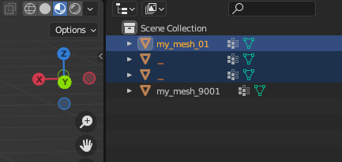
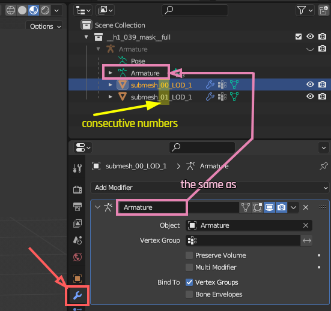
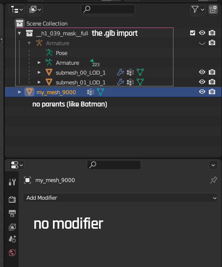
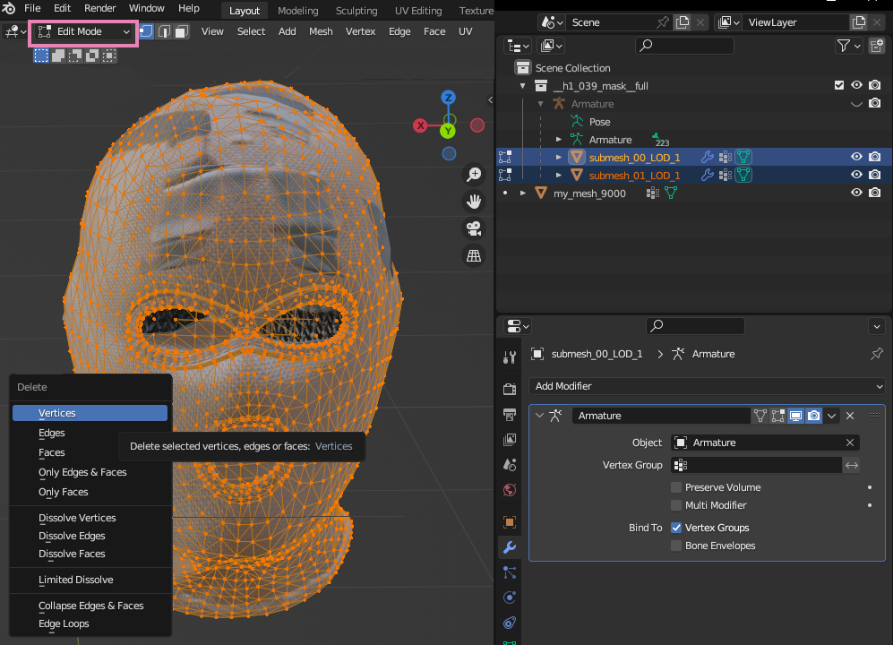
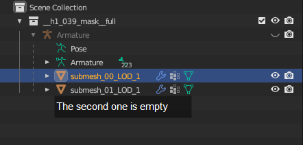
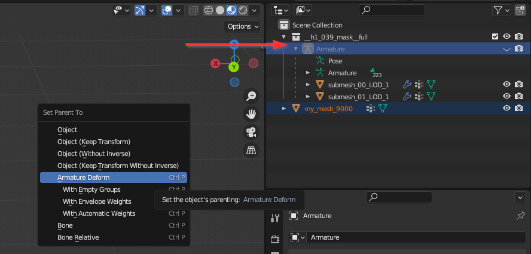
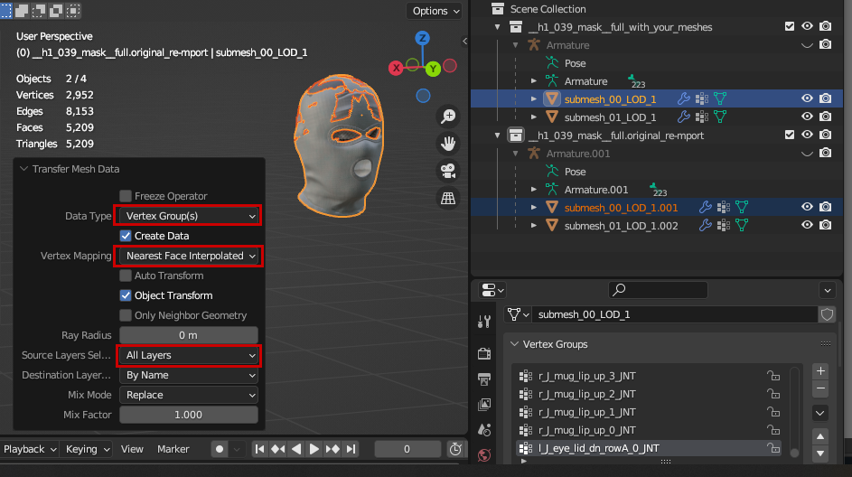

# Porting 3d objects to Cyberpunk

This page will give you information on how to get a 3d object into Cyberpunk.

#### Summary

written by [manavortex](http://127.0.0.1:5000/u/NfZBoxGegfUqB33J9HXuCs6PVaC3 "mention"), published on Oct. 14 2023

## Wait, that's not what I want!

You can find other relevant guides scattered across this wiki, for example

[adding-new-items](../../modding-guides/items-equipment/adding-new-items/ "mention")

[custom-props.md](../../modding-guides/everything-else/custom-props.md "mention")

[textured-items-and-cyberpunk-materials.md](../../modding-guides/everything-else/textured-items-and-cyberpunk-materials.md "mention")

## Prerequisites

Wolvenkit >= 8.11.1

[wolvenkit-blender-io-suite](../../modding-tools/wolvenkit-blender-io-suite/ "mention")>= 1.5.0

Blender >= 3.6 (or 4)

A [Wolvenkit project](http://127.0.0.1:5000/s/-MP\_ozZVx2gRZUPXkd4r/wolvenkit-app/usage/wolvenkit-projects), so that you can pack your mod

## Step 0: Finding the right base mesh

To bring 3d data into Cyberpunk, Wolvenkit needs a .mesh file to import into. [Read here why](http://127.0.0.1:5000/s/-MP\_ozZVx2gRZUPXkd4r/wolvenkit-app/usage/import-export#file-structure).&#x20;

For the purpose of this guide, it doesn't matter if you are trying to[replace-a-player-item-with-an-npc-item.md](../../modding-guides/items-equipment/editing-existing-items/replace-a-player-item-with-an-npc-item.md "mention"), creating [custom-props.md](../../modding-guides/everything-else/custom-props.md "mention") or [adding-new-items](../../modding-guides/items-equipment/adding-new-items/ "mention"). You will overwrite an existing in-game mesh, the file path doesn't matter.

### Static items

If you are [creating props](../../modding-guides/everything-else/custom-props.md), you use a mesh from the template project or grab any static mesh from the game.&#x20;


Do not take equipment item or weapon meshes — those include a bunch of extra data that you don't need (the [armature](../meshes-and-armatures-rigging.md)). You don't need it, and it can have side effects.


As this guide will focus on equipment items, you can skip Step 3 and 4 completely.

### Equipment items

If you want V to wear the item that you're currently porting, it needs to move with the player. For that, you need [an armature](../meshes-and-armatures-rigging.md). This guide will show you how to acquire one.&#x20;


You will delete fewer meshes if you read all of the sections below before starting.


<details>

<summary>Why are we doing this?</summary>

Items move because they are tied to the armature's bones. For that to work, the armature you're working needs to **have** those bones in the first place. Most shoe meshes won't include head bones, which means that they won't work for sunglasses.

The default fallback mesh that people use in this case is the [Netrunner Suit](../troubleshooting-your-mesh-edits.md#option-2-the-netrunner-suit).

</details>

You can use the [Wolvenkit search](http://127.0.0.1:5000/s/-MP\_ozZVx2gRZUPXkd4r/wolvenkit-app/usage/wolvenkit-search-finding-files) in the [Asset Browser](http://127.0.0.1:5000/s/-MP\_ozZVx2gRZUPXkd4r/wolvenkit-app/editor/asset-browser) to find meshes.

#### The right slot

Begin by picking a game mash from **the right slot**. If you're porting shoes, pick a shoe mesh, if you're porting glasses, pick a glasses mesh – you get it.

#### The right shape

For the sake of future you, pick an in-game item that is as close to your new garment as possible. If you're porting boots, take boots and not slippers. If you're using a baggy sweater, pick one of those or a jacket rather than a skin-tight t-shirt.&#x20;

#### The right body gender

Make sure to use an item with the correct armature. You can identify them by prefix in the path:&#x20;

<table><thead><tr><th width="194">body gender</th><th width="268">Player</th><th>NPC</th></tr></thead><tbody><tr><td>male rigged</td><td><code>_pma_</code></td><td><code>_ma_</code></td></tr><tr><td>female rigged</td><td><code>_pwa_</code></td><td><code>_wa_</code></td></tr></tbody></table>

#### Wolvenkit search query suggestions

Search for something like this:

```
namespace > slot > gender > .mesh

player: player > torso > pwa > .mesh 
npc:    common > torso > pwa > .mesh 
```

For torso items, you can add `t1` for inner torso items (tight-fitting) or `t2` for outer torso items (worn above t1).

## Step 1: Exporting your mesh from Wolvenkit

Check the [Wolvenkit wiki](http://127.0.0.1:5000/s/-MP\_ozZVx2gRZUPXkd4r/wolvenkit-app/usage/import-export/models#exporting-mesh-files) for how to export your mesh. Once you've done that, it will ends up in your project's `raw` folder. (TODO: put a link)

## Step 2: Importing your mesh into Blender

This part won't be documented here. If you don't have an entry in your import menu, hit up Google - get that thing into Blender somehow.

### Step 2.5: getting a grip on the submesh count

The mesh count in Blender corresponds to the submesh/chunk count in Wolvenkit. In Cyberpunk, we have one submesh per material that we want to use.&#x20;

If you don't know what that means, ignore the information for now - but few meshes use more than five. The current maximum is the player base body with a total count of ten submeshes per LOD[^1], so to be on the safe side, we need to stay below that.

If you want to get fancy, check out [Step 2](../../modding-guides/everything-else/textured-items-and-cyberpunk-materials.md#step-2-processing-the-downloaded-mesh) in the guide about ported items and Cyberpunk materials. Otherwise:

1. Select all meshes but one by shift-clicking them in the Outliner at the topright of your viewport

<figure><figcaption><p>9000 of these have to go</p></figcaption></figure>

2. Select the last mesh
3. Join the meshes together (Shortcut: `Ctrl+J`)

## Step 3: Parenting the mesh(es)

### The end result

This section will show you how to get the following end result:

* one or more mesh(es) with names from `submesh_00_LOD_1`, consecutively numbered
* parented to the right armature


<figure><figcaption></figcaption></figure>

There are two strategies that you can use. Personally, I use [#strategy-1-replacing-the-3d-data](porting-3d-objects-to-cyberpunk.md#strategy-1-replacing-the-3d-data "mention"), since it will retain most of the original mesh's properties.

### Preparation

By the end of your section, you should have something like this:

<figure><figcaption><p>Read on to find out how to get there</p></figcaption></figure>

No matter which strategy you use, we need to get the prerequisites done first. We need an original Cyberpunk armature.

1. Import the result of Step 1 into Blender (see the [wolvenkit-blender-io-suite](../../modding-tools/wolvenkit-blender-io-suite/ "mention")'s documentation about [#importing-into-blender](../../modding-tools/wolvenkit-blender-io-suite/wkit-blender-plugin-import-export.md#importing-into-blender "mention"))

Clean up any residual modifiers and transforms (we don't want them):

1. **If your mesh has an armature modifier** with a non-Cyberpunk armature, delete it
   1. (click on the `x` in the modifier panel)
2. **If your mesh is parented** to anything that is not a Cyberpunk armature, unparent it:
   1. Select the mesh(es)
   2. Select **Unparent** (Hotkey: `Alt+P`)
   3. Select the second option "**Clear Parent and Keep Transforms**"

### Strategy 1: Replacing the 3d data


If you are doing this, you can skip[#strategy-2-parenting-the-meshes](porting-3d-objects-to-cyberpunk.md#strategy-2-parenting-the-meshes "mention").


We start by deleting the original's vertex data.

1. In [Object Mode](#user-content-fn-2)[^2], select all of the original meshes.
2. Switch to Edit Mode (Hotkey: `Tab`)
3. Make sure that all vertices are selected (Hotkey: `A`)
4. Delete all vertices (Hotkey: `x`, option: **Vertices**)

<figure><figcaption></figcaption></figure>

5. Switch back to Object Mode (Hotkey: `Tab`)

We'll merge our new meshes into the empty containers now:

1. Click on your new mesh
2. Click on the empty original mesh in the Outliner (yes, order matters)
3. Join them (Hotkey: `Ctrl+J`)

<figure><figcaption><p>The new mesh should be  from the Outliner and its data should be in one of the original meshes. If it's the other way around, <strong>Undo</strong> (Hotkey: <code>Ctrl+Z</code>) and select them in the right order. (You could've listened!)</p></figcaption></figure>

Repeat the same for all meshes that you want to import to Cyberpunk.&#x20;


If you need more submeshes, simply duplicate an existing one (Hotkey: `Ctrl+D`, `ESC`) and change its name by incrementing the number. Make sure it still ends in `LOD_1`,  not in `LOD_2` — that will tell the game it's low-poly, and cause it to be hidden until you're further away.


That's it. All your meshes are parented to the armature now.

### Strategy 2: Parenting the meshes


If you are doing this, you can skip [#strategy-1-replacing-the-3d-data](porting-3d-objects-to-cyberpunk.md#strategy-1-replacing-the-3d-data "mention").


We can simply parent the meshes to our existing armature:

1. Click on your mesh
2. Click on the Armature object in the Outliner
3. Select Parent (Hotkey: `Ctrl+P`)
4. Select "Armature Deform"

<figure><figcaption></figcaption></figure>

5. Make sure to rename your mesh: Wolvenkit doesn't know what to do with meshes that aren't part of the sequence starting at `submesh_00_LOD_1`. (Blender's .000 suffixes will be ignored)\
   You can delete the original meshes, or you keep them for Step 4.

## Step 4: Weight Transfer


If you deleted or overwrote the armature's original meshes during [#step-3-parenting-the-mesh-es](porting-3d-objects-to-cyberpunk.md#step-3-parenting-the-mesh-es "mention"), you can simply import it again for a second copy.


The [wolvenkit-blender-io-suite](../../modding-tools/wolvenkit-blender-io-suite/ "mention") has a function to[ do this for you](../../modding-tools/wolvenkit-blender-io-suite/#modelling). If that doesn't, here's how to do it by hand:

1. Select your mesh
2. Select the original mesh
3. Select "Link Mesh Data" (Hotkey: Ctrl+L)
4. Select "Transfer Mesh Data" (second from the bottom)
5. Open the little popup at the bottom left of your viewport. Select the following options:
   * **Data Type:** Vertex Group(s)
   * **Vertex Mapping:** Nearest Face Interpolated
   * **Source Layers Selection:** All Layers

<figure><figcaption></figcaption></figure>

6. Repeat that process for all of your meshes.&#x20;

### Step 4.5: Weight Painting


Nobody likes weight painting.


This is where you pray that you don't have to do this (and I pray that nobody will have to actually write this section), because weight painting sucks. you can find some general information on [meshes-and-armatures-rigging.md](../meshes-and-armatures-rigging.md "mention").

This is what you need to do if your mesh moves unevenly or if parts of it are clipping through the body although things are fitting correctly.

## Step 5: Exporting from Blender

See the [wolvenkit-blender-io-suite](../../modding-tools/wolvenkit-blender-io-suite/ "mention")'s documentation about [#exporting-from-blender](../../modding-tools/wolvenkit-blender-io-suite/wkit-blender-plugin-import-export.md#exporting-from-blender "mention")

## Step 6: Importing into Wolvenkit

See the [WolvenKit](http://127.0.0.1:5000/o/-MP5ijqI11FeeX7c8-N8/s/-MP\_ozZVx2gRZUPXkd4r/ "mention") wiki about [Importing mesh files](http://127.0.0.1:5000/s/-MP\_ozZVx2gRZUPXkd4r/wolvenkit-app/usage/import-export/models#importing-mesh-files "mention")

## Step 7: Success!

… or maybe not. Maybe you should try [troubleshooting-your-mesh-edits.md](../troubleshooting-your-mesh-edits.md "mention") now.

[^1]: Level of Detail

[^2]: You can see the mode in the topleft corner of the viewport.
