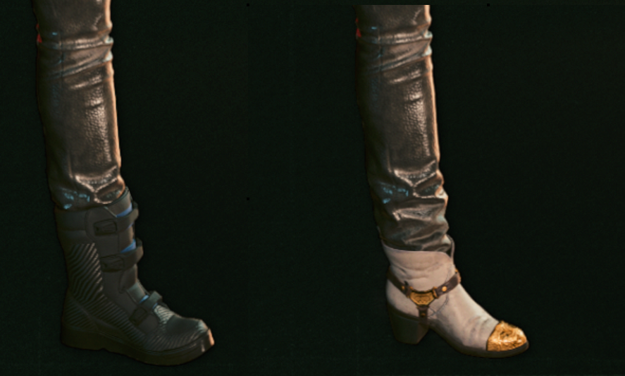
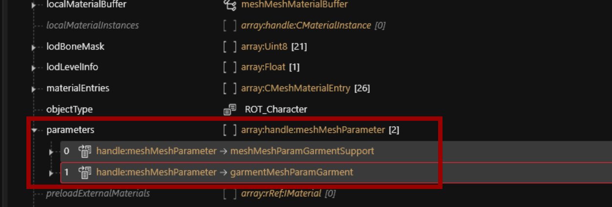

# Garment Support: How does it work?


If garment supports are causing trouble for you, your easiest option is to delete the parameters from your mesh. For detail, see [here](troubleshooting-your-mesh-edits.md#my-mesh-is-string-cheese-exploding-vertices).

If you want to include garment supports, check [this](https://docs.google.com/document/d/10dXta2Vicm\_1iZeFy5U07\_PBCwxa1AhqFvVIMZnezPk/edit) guide by engres.


_Credit goes to psiberx (_[_discord post_](https://discord.com/channels/717692382849663036/955663052903178270/1059406562277470240) _with initial explanation of the algorithm) and IslandDancer for providing screenshots and know-how_

The engine morphs garments to avoid clipping — for example, if you equip a pair of boots and V's jeans no longer cover the shoes, but get tucked under.

<figure><figcaption><p>Garment Support in action</p></figcaption></figure>

This process is accomplished via 'parameters' on the mesh:

<figure><figcaption><p>These will show up as shape keys in your Blender export</p></figcaption></figure>

## How it looks if it's broken


<figure><figcaption><p>Often, you can salvage things by deleting the parameters in WolvenKit</p></figcaption></figure>

## The algorithm

The game calculates the garment score by checking the prefix of component names, where the one with the lowest prefix is the innermost:

```
s0 = 0    // no prefix will also be 0
l0 = 10
a0 = 20
t0 = 30
h0 = 40
s1 = 50
l1 = 60
t1 = 70
i1 = 80
hh = 90
h1 = 100
h2 = 110
t2 = 120
```

After considering the component name, the game will consider the tags in the .ent's `visualTagSchema`:

```
PlayerBodyPart = -2000
Tight = -1000
Normal = 0
Large = +1000
XLarge = +2000
```

An example for `t0_000_pma_base__full` (the default body component, torso+legs):

```
+30          prefix: t0_
-2000        visualTag: PlayerBodyPart

—————————————————————————
-1970
```

