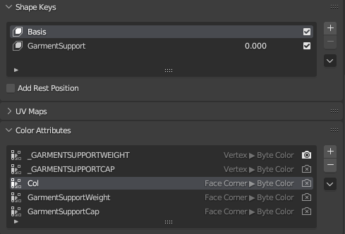

# Garment Support: How does it work?

## Summary

This page will teach you how garmentSupport works – the system that Cyberpunk2077 uses to tuck pants into boots and shirts under jackets. It contains theory, which you don't need to understand to use the system.

_Credit goes to psiberx (_[_discord post_](https://discord.com/channels/717692382849663036/955663052903178270/1059406562277470240) _with initial explanation of the algorithm), island dancer for providing screenshots and know-how, and Auska for making morphtarget/garmentSupport import able in Wolvenkit._

### Wait, that's not what I want!

#### Using garment support

If you want to **create** garment support, check [garment-support-from-scratch.md](garment-support-from-scratch.md "mention")

If you want to **use** garment support in an existing mod, you only need to use [#component-prefixes](./#component-prefixes "mention")

#### Troubleshooting garment support

If your garment support isn't working as expected, you can&#x20;

Option 1 (advised): re-create [garment-support-from-scratch.md](garment-support-from-scratch.md "mention") in Blender. Then, import it again — as of 2.13, you don't even have to [tick the box](https://wiki.redmodding.org/wolvenkit/wolvenkit-app/usage/import-export/models#import-settings) anymore.

If you're fed up with this shit and just want your item to stop cosplaying as exploding pixel cloud, you can use [#option-2-guaranteed-to-work-delete-garmentsupport-from-the-mesh](../troubleshooting-your-mesh-edits.md#option-2-guaranteed-to-work-delete-garmentsupport-from-the-mesh "mention") (not advised)

## What is garment support?

The engine morphs garments to avoid clipping — for example, if you equip a pair of boots and V's jeans no longer cover the shoes, but get tucked under.

<figure><figcaption><p>Garment Support in action</p></figcaption></figure>

This process is accomplished via 'parameters' on the mesh:

<figure><figcaption><p>These will show up as shape keys in your Blender export</p></figcaption></figure>

## Component prefixes

Garment support will be applied based on garmentScore. For this, the **prefix** of the component name will be considered (components are named in your .app or .ent file's component array).

A high garment score means that the item is "on top", squishing anything worn "below". (See [#the-algorithm](./#the-algorithm "mention") for details.)

The prefixes are as follows:


<table><thead><tr><th width="130"></th><th></th></tr></thead><tbody><tr><td><p>h0_</p><p>t0_</p><p>s0_</p><p>l0_<br>...</p></td><td>Any component with a 0 in its prefix will be treated like a body mesh (no deform/squishing)</td></tr><tr><td>h1_</td><td>Head inner (mask, sunglasses)</td></tr><tr><td>h2_</td><td>Head outer (helmet, bandana)</td></tr><tr><td>t1_</td><td>Torso inner (shirts)</td></tr><tr><td>t2_</td><td>Torso outer (jackets, coats...)</td></tr><tr><td>s1_</td><td>Shoes</td></tr><tr><td>l1_</td><td>legs (pants that aren't leggins)</td></tr></tbody></table>

## How it looks if it's broken


<figure><figcaption><p>Often, you can salvage things by deleting the parameters in WolvenKit</p></figcaption></figure>

## The algorithm


TL;DR: High garment score means "on top", items below will get squished.


The game calculates the garment score by checking the prefix of component names, where the one with the lowest prefix is the innermost:

```
s0 = 0    // no prefix will also be 0
l0 = 10
a0 = 20
t0 = 30
h0 = 40
s1 = 50
l1 = 60
t1 = 70
i1 = 80
hh = 90
h1 = 100
h2 = 110
t2 = 120
```

After considering the component name, the game will consider the tags in the .ent's `visualTagSchema`:

```
PlayerBodyPart = -2000
Tight = -1000
Normal = 0
Large = +1000
XLarge = +2000
```

An example for `t0_000_pma_base__full` (the default body component, torso+legs):

```
+30          prefix: t0_
-2000        visualTag: PlayerBodyPart

—————————————————————————
-1970
```


## Editing Garment Support Parameters In Blender

_based on experimental research by revenantFun_

In a given mesh, garment support is handled by two color attributes: `_GarmentSupportWeight and` `_GarmentSupportCap`. In Blender, these are found in the Data panel under Color Attributes. Each submesh in your mesh will have to have these two attributes plus a third attribute, `Col`, which will be plain black (empty) in almost all cases. All three of these color attributes must also be in the format `Face Corner > Byte Color` in order for the exporter to write them correctly.

<figure><figcaption><p>Always make sure all three are Face Corner > Byte Color format before exporting. You can convert back and forth between formats with the down arrow button on the right.</p></figcaption></figure>

If you are working with a mesh that already has garment support - such as when editing vanilla items - your initial parameters will look a little different. This is because the above parameters are your "working" state; Blender turns these into a different format on export. If you pop open a vanilla mesh in Blender for the first time, you're actually looking at a "finalized" state for garment support, and your color attributes will look like this:

<figure><figcaption><p>Note that there are two extra attributes compared to the first image shown! You don't want these.</p></figcaption></figure>

This is normal and expected, but it's also not the right state for you to start playing around with. Simply remove the top two attributes (the two Vertex Color attributes labelled in all caps) by clicking each one and then clicking the small 'minus' button on the right hand side. Then rename the bottom two attributes by adding an underscore to the front of their label.

<figure><figcaption><p>Repeat for every submesh in your mesh, until they all match the required format.</p></figcaption></figure>

This will make them match the appropriate format that the export function will expect. It's crucial to repeat this process for every submesh in your garment, or your attributes will not get written correctly on export and nothing will behave the way you expect or want it to.

If all you're doing is trying to preserve existing garment support before doing some light editing or refits on vanilla garments, you can stop right here! You can get to work and, when you're ready to export, the initial functionality will be preserved.

If you're making a brand new item and making your garment support from scratch, however, you'll need to keep reading to find out how these parameters should look.

### Painting Your Parameters

Garment support color attributes are edited in `Vertex Paint` mode in the viewport.

#### `_GarmentSupportWeight`

`_GarmentSupportWeight`is the color attribute that affects how the mesh will behave when it is layered with other garments. The only two colors in use for these attributes in the vanilla files are pure red `(0,1,1)` and pure black `(0,0,0)`. If a garment has a very simple weighting, it will often be completely red; otherwise, it may be largely red towards the outer edges, with black towards the center of mass. Black appears to correspond to areas that will "crumple" more, or be more deformed when necessary, but you can experiment with this; if you're making a simple top, for example, a flat red layer will work perfectly fine. A flat black layer _may_ work, but will sometimes clip or deform more than you might want.

<figure><figcaption><p>Two examples of correctly-formatted vanilla garment weights. If in doubt, just paint it red.</p></figcaption></figure>

#### `_GarmentSupportCap`

`_GarmentSupportCap` determines stopping points for the deformation effects of garment support. Like `_GarmentSupportWeight`, it is painted only with red and black. However, for your caps, you are only painting red those areas of the mesh that will either

a) directly intersect with the body, such as the ends of sleeves, legs, the bottom of a shirt, the opening of a turtleneck, etc

or

b) sit right next to the skin, or next to some other garment layer that should _not_ be deformed or morphed, such as in the case of a tight-fitting shirt, or the lapels of an open jacket where it will visibly overlap a garment beneath.

The function of the cap is to provide limits, so if nothing is painted on the cap attribute (e.g. it is left flat black) every part of your mesh will exert a clipping/tucking/etc force on things beneath it. This is fine for simple garments! If there are no particularly important stopping points on your mesh, such as a simple tank-top that doesn't have a solid mesh face closing off the bottom/top of the garment, your `_GarmentSupportCap` layer can be flat black. Otherwise, you need to paint red those parts which either cut straight through the body or butt right up against other items.

<figure><figcaption><p>The inside layer of this jacket is red because it will sit right next to either the body or to a tight-fitting shirt beneath. The ends of the sleeves are red where they will intersect with the arms. If it looks like a pair of Louboutins, you've painted it correctly.</p></figcaption></figure>

If this step is skipped, you can have unexpected clipping, but nothing will break. If your mesh seems like it's being too aggressive when you layer it over other things, and leaving holes in whatever you're trying to layer under it, try painting more of the inside faces red.

### That all seems like a lot of work? Can I make this less worse somehow?

The simplest way to add functioning garment support to your custom item is to have a flat red `_GarmentSupportWeight` attribute, a flat black `_GarmentSupportCap` attribute, and a flat black `Col` attribute. Your mesh will export and, assuming you have the proper shapekeys, will morph in (more or less) the way you'd expect! The next page will outline this process step-by-step.


**Every** submesh of your garment _must_ have these three attributes in order for garment support to function correctly - even submeshes that contain non-deformable things like accessories, buckles, chains, belts, etc.


