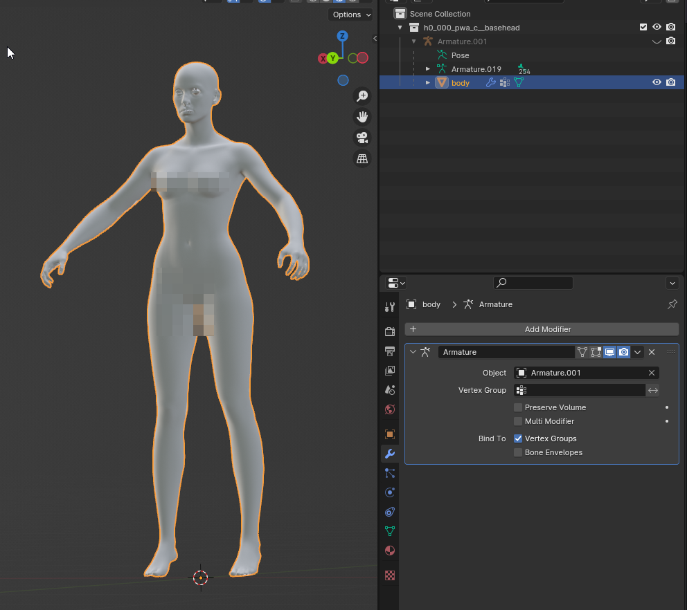
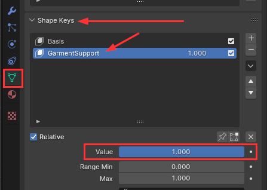
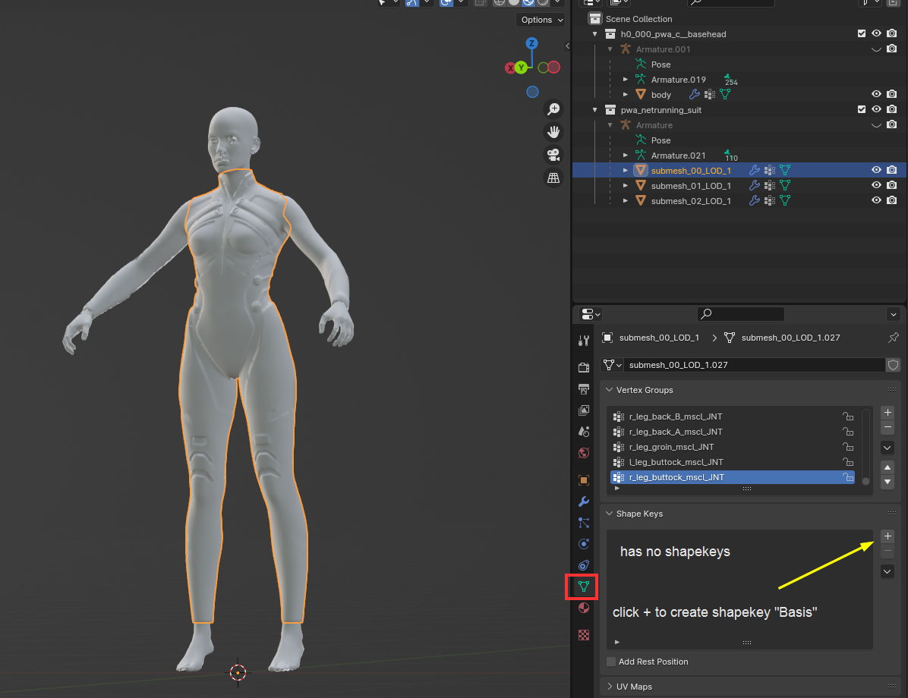
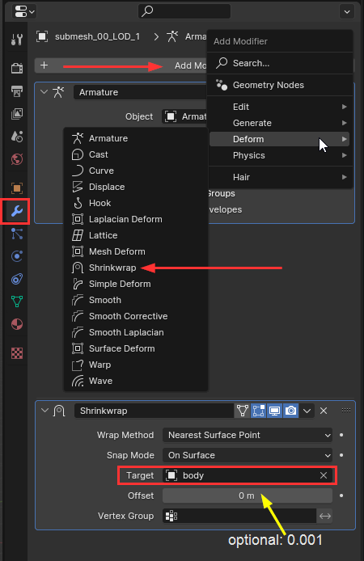
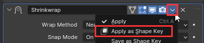
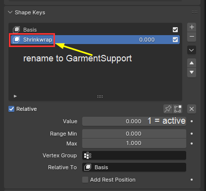

# Garment support from scratch

#### Summary

Created on: 29. 12. 2023 by [manavortex](https://app.gitbook.com/u/NfZBoxGegfUqB33J9HXuCs6PVaC3 "mention")

This guide uses the following versions:

* Wolvenkit >= 8.11.2 ([Nightly](https://github.com/WolvenKit/WolvenKit-nightly-releases/releases) | [Stable](https://github.com/WolvenKit/Wolvenkit/releases))
* Wolvenkit Blender IO Suite >= [1.5.1](https://github.com/WolvenKit/Cyberpunk-Blender-add-on/releases)
* Blender [4.0](https://www.blender.org/download/releases/4-0/) (3.6 should work as well)

#### Difficulty

You should know what [garment support does](./), because it won't be explained here.

This guide assumes that you know your way around in Wolvenkit. If you don't and you want to mess with this, kudos — I salute your frustration tolerance. In this case, the wiki's search function will be your new best friend.

## Prerequisites

* [ ] a [Wolvenkit project](https://app.gitbook.com/s/-MP\_ozZVx2gRZUPXkd4r/wolvenkit-app/usage/wolvenkit-projects)
* [ ] one or more [meshes as .glb](../../modding-tools/wolvenkit-blender-io-suite/wkit-blender-plugin-import-export.md#meshes)

## Step 0: export and join the base

As a preparation for our garment support, we need a base that we'll shrinkwrap to. For this guide, we'll be using **the full player body in a single mesh**.&#x20;

You need the following files:

#### Female body gender

```
# default head
base\characters\head\player_base_heads\player_female_average\h0_000_pwa_c__basehead\h0_000_pwa_c__basehead.mesh
# arms
base\characters\common\player_base_bodies\player_female_average\arms_hq\a0_000_pwa_base_hq__full.mesh
# base body
base\characters\common\player_base_bodies\player_female_average\t0_000_pwa_base__full.mesh
```

#### Male body gender

```
# default head
base\characters\head\player_base_heads\player_man_average\h0_000_pma_c__basehead\h0_000_pwa_c__basehead.mesh
# arms
base\characters\common\player_base_bodies\player_man_average\arms_hq\a0_000_pma_base_hq__full.mesh
# base body
base\characters\common\player_base_bodies\player_man_average\t0_000_pma_base__full.mesh
```

[Import](../../modding-tools/wolvenkit-blender-io-suite/wkit-blender-plugin-import-export.md#importing-into-blender) all those meshes to Blender, then join them all into a single mesh:

1. in the viewport, click anywhere to deselect everything
2. press `A` to select everything visible again
3. Shift-click on something (e.g. the head) to deselect it
4. shift-click again to re-select it (you need a most recent selection)
5. press `Ctrl+J` to join all those meshes together

Optional: Clean up

* In the outliner on the right, delete all empty collections
* Double-click on your mesh and rename it to something, e.g. `body`

You should be looking at something like this:

<figure><figcaption></figcaption></figure>

This is the base that your items will shrink to, thus not-clipping. Neat, isn't it?

### Step 0.5 (optional): activate garment support


You only need this if you're layering garment support — for example, shrinking a custom-made decal under a jacket. Don't do this with the base body, it will shrink on its own to stay underneath the clothes!


If you're using a custom mesh as the base, you need two prerequisites:&#x20;

1. Join everything, so that you have only **one** mesh. This mesh must cover everything that yours can potentially shrink to - if you fit the Netrunnner suit without the head mesh as part of the body, the collar will clip into the neck when you're wearing a coat
2.  You need to **activate** garment support on the mesh. You do this by switching to the Data tab and setting its `Value` to 1:

    <figure><figcaption></figcaption></figure>

## Step 1: Add garment support

Import a mesh that needs garment support. In Object mode, **select** it by clicking on it so that it has a yellow outline like the body in the picture above, and switch to the `Data` tab on the right:

<figure><figcaption></figcaption></figure>

The `Shape Keys` dropdown should be empty. (Otherwise, hit the `-` button until it is).

1. Click on the `+` button to create a shape key with the name `Basis`. This is the garment's original shape and will tell Cyberpunk how it looks when it's _not_ squished.
2. Repeat this process for every submesh (`submesh_01_LOD_1` and `submesh_02_LOD_1` on the screenshot above)
3. Switch to the `Modifiers` tab (the blue wrench icon, it's active in the first screenshot)
4. Add a `shrinkwrap` modifier
5. Target it to the mesh from the previous step (e.g. `body`):

<figure><figcaption></figcaption></figure>

6. **optional**: Add a small `offset` (e.g. `0.001`) to make it not-clip. If the mesh you're shrinking to has garment support and you haven't enabled it, this isn't necessary.
7. You will now see that the garment has shrunk down to the body's dimensions — this is how the game avoids clipping.
8. Apply the modifier as shapekey:

<figure><figcaption></figcaption></figure>

9. You will now see that the garment un-shrinks itself: that is because the shapekey isn't active.&#x20;
10. Switch to the `Data` tab again (the green triangle). There is a new shapekey now; it's called `Shrinkwrap`.
11. If you want to see it in action, set its `Value` to 1.&#x20;
12. Rename it to `GarmentSupport` (capital G and S, no spaces — double-click on the name):

<figure><figcaption></figcaption></figure>

That's it, your mesh has now garment support. Rinse and repeat the process with the other submeshes, then export everything back.


## Troubleshooting

### My garment support isn't working!

You still need to use [component name prefixes](./#component-prefixes) for garmentSupport to become active. If that wasn't it, check your shapekey names for typos or trailing spaces.

### My garment support is clipping into the body!

Try re-doing the shrinkwrap, but with a higher offset instead. Try something like 0.002 or so, whatever works for you.
