# Mesh sculpting techniques

## Summary 

**Created by @manavortex | Edited by Na**\
**Published January 29 2023**

This guide will give you a number of techniques when it comes to editing meshes in Blender (displayed version: 3.4.1)

Assumed skill level: \
\- You have [exported a mesh and imported it into Blender](exporting-and-importing-meshes/)\
\- You are able to read and comprehend instructions.

## Prerequisite: Deleting shapekeys

Before you start editing your mesh, you should delete its shapekeys. This is necessary for the Sculpt Mode to show your changes in real time, and you don't need them anymore after editing your mesh.

<figure>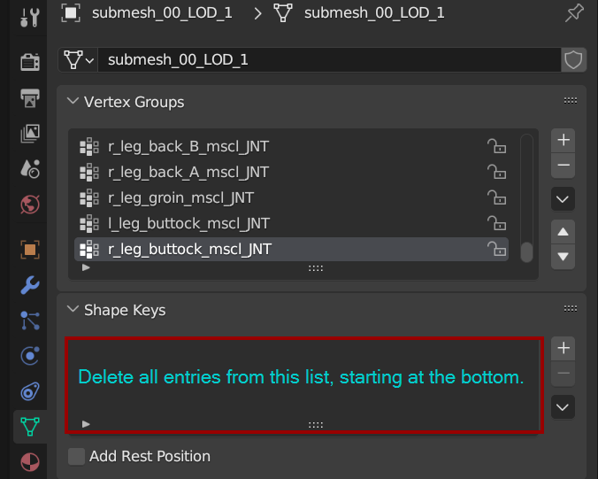<figcaption>
Order matters, because deleting a shapekey will apply it. Start at the bottom!
</figcaption></figure>


Some people have been told to delete the Armature modifier before sculpting. **That's not necessary**!


## Sculpting

The obvious approach is to change your mesh by moving vertices. However, this will take **a very long time** and probably be frustrating. A faster way is to use Blender's Sculpt Mode.


The downside of the sculpt mode is that it can edit **only the selected mesh**. \
For a workaround, see [here](mesh-sculpting-techniques.md#affecting-several-meshes).


The Sculpt Mode is pretty much What You See Is What You Get.&#x20;

The easiest tools for beginners are **Grab,** **Elastic Deform,** and **Smooth**&#x20;


In the "Tool" panel (Toggle shortcut: N), you can optionally enable symmetry (blue on the picture below).


<figure>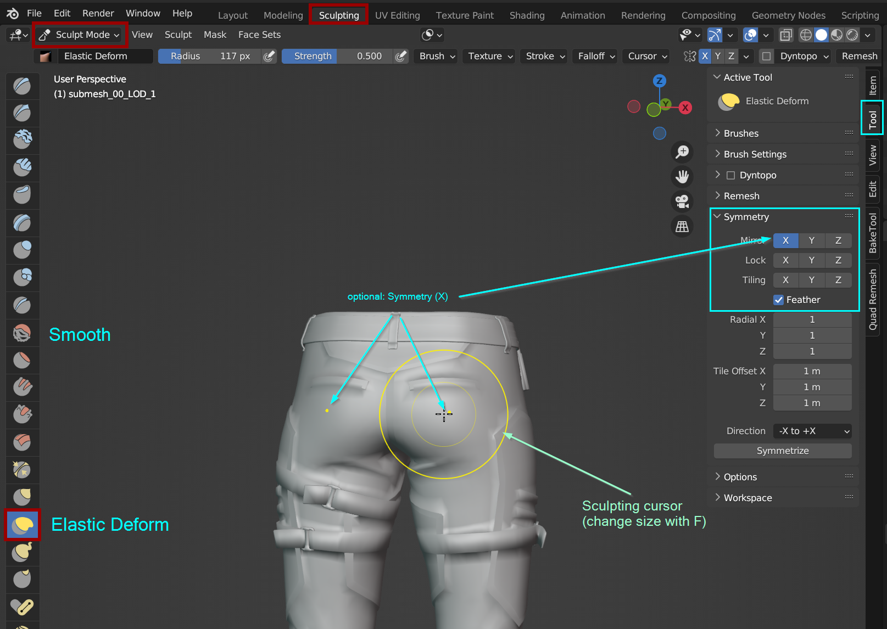<figcaption>
Elastic Deform and x-symmetry are your friends!
</figcaption></figure>

A useful shortcut to keep in mind is **F**, which will let you change the cursor size.


You can import a body mesh as a reference.&#x20;

You will find the player's body under\
`base\characters\common\player_base_bodies\player_female_average\`\
`base\characters\common\player_base_bodies\player_male_average\`


## Affecting only parts of the mesh

#### Method 1

You can **hide** those parts that you don't want to sculpt.

Use the Edit Mode (Shortcut: Tab) to make a selection. Then, leave only those parts visible that you want to affect before switching back to Sculpt Mode.


Useful hotkeys:

* H: Hide selection
* Shift+H: Hide everything **but** selected
* Alt+H: Unhide everything


#### Method 2 

You can also use the [Lattice Deform Method](mesh-sculpting-techniques.md#lattice-modifier-method) below to selectively edit only part of the mesh.&#x20;

#### Method 3

You can use Blender's [mask brush and function](https://docs.blender.org/manual/en/2.80/sculpt\_paint/sculpting/hide\_mask.html) in Sculpt Mode to mask the parts that you do not want to sculpt.

## Affecting Several Meshes

### Material Separation Method

This method is a workaround that you can use when you have only 2-3 meshes. You can fuse all meshes together, then split them apart after you're done.

Pros:

* Relatively simple, and good to make small, simple changes to 2-3 meshes.
* Allows symmetrical sculpting.

Cons:

* Destructive editing
* Can be a little time-consuming because you have to join, separate, and rename meshes every time you want to import it back to WolvenKit.

Let's assume that we're sculpting Rogue's pants. For surface material assignment, the seams are an own submesh — the pants (submesh\_00) are coloured via [`multilayered`](../materials/multilayered.md) material, while the seams have a variation of `metal_base` with coloured stitches.

We don't want to edit those separately, so we'll fuse them into one mesh, sculpt everything in one go, and then split them apart again.

To allow splitting, we need to make sure that every submesh has its own unique material. Select the mesh, switch to the "Material Properties tab on the right", and duplicate the assigned material:

<figure>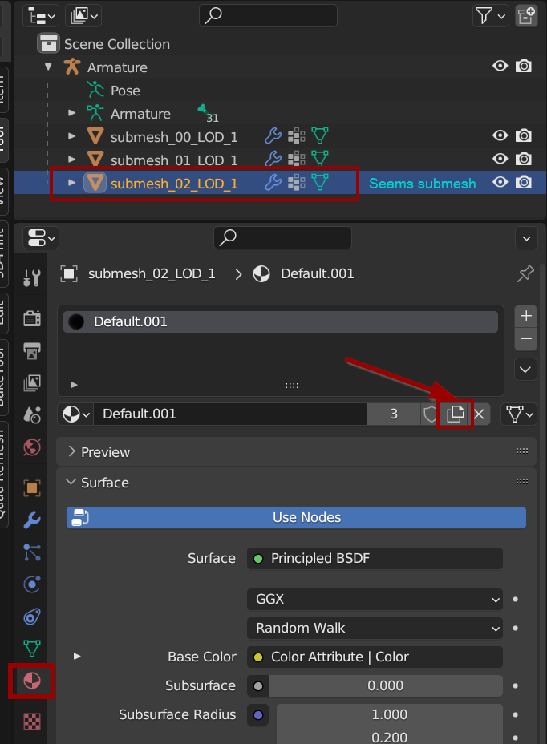<figcaption>
You can rename the material to e.g. "seams", but it's not necessary.
</figcaption></figure>


Before the next step, make sure to remember the submesh numbers, because you need to restore them later. Changes in the submesh order will mess up material assignment in WolvenKit.

You can create a copy by **duplicating** the meshes (shortcut: Shift+D)


Now, join the meshes together — hold CTRL, select the main mesh, and join the meshes together (shortcut: Ctrl+J)

<figure>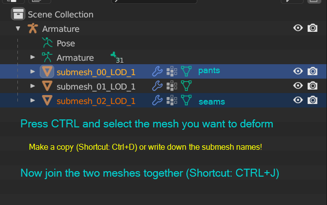<figcaption></figcaption></figure>


You now have a single mesh which you can sculpt to your heart's content.


Once you're done, you can separate the meshes again. Switch to **Edit Mode**, then select something that belongs to the former submesh. From the menu, pick the following entry:\
`Select -> Select Similar (Hotkey: Shift+G) -> Material`

<figure>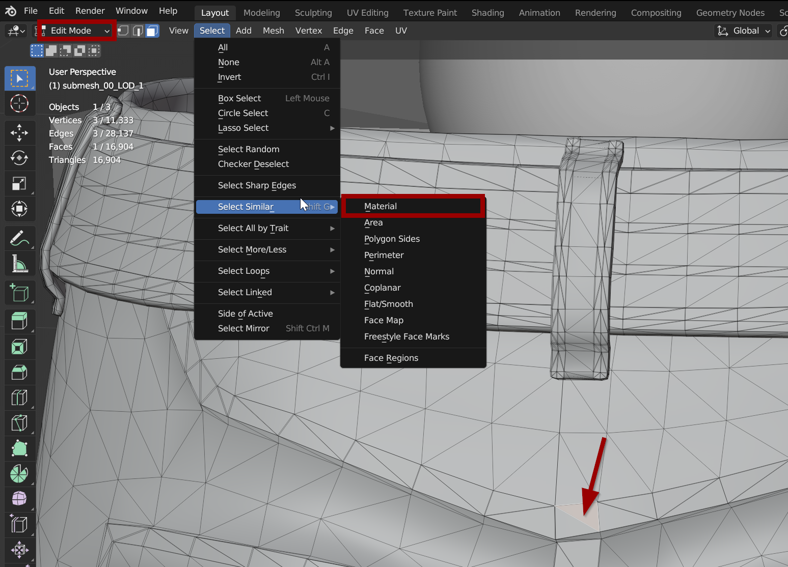<figcaption>
Split your submesh by material
</figcaption></figure>

Then, split off the selection into its own submesh again: \
`Right-Click -> Separate (Hotkey: P) -> Selection`


Make sure to restore the original mesh names before [exporting your mesh from Blender](exporting-and-importing-meshes/#blender-saving-the-mesh).



After importing back into WolvenKit, remember to [delete the GarmentSupport](garment-support-how-does-it-work.md) parameters from your mesh, as they will now [produce string cheese](troubleshooting-your-mesh-edits.md#my-mesh-is-string-cheese-exploding-vertices).


### Lattice Modifier Method

The Lattice modifier deforms the base object according to the shape of a Lattice object.&#x20;

Pros:

* Can edit as many meshes at once as you want, no matter what armature they are parented to.
* 100% Non-destructive sculpting.&#x20;
* No need to separate, rejoin, and rename meshes after sculpting is done.
* Good for making small, local changes to multiple meshes.
* Edits can be stacked on top of each other by stacking modifiers.
* Does not have to go through all the steps like Material Separation Method each time you want to import to WolvenKit.

Cons:

* Trying to select desired vertices of the lattice can be difficult.
* Can be hard to restrict edits to areas not covered by the lattice, thus possibly making unwanted edits.
* Does not allow symmetrical sculpting.

Begins by adding a Lattice to the scene. In Object mode, go to the menu `Add > Lattice`. Reshape the lattice so that it covers the part of the base meshes that you want to edit or all the meshes that you want to edit.

Go to the Object Data Properties panel, and increase the resolution as you wish. for most edits, 6-10 levels are fine.

<figure>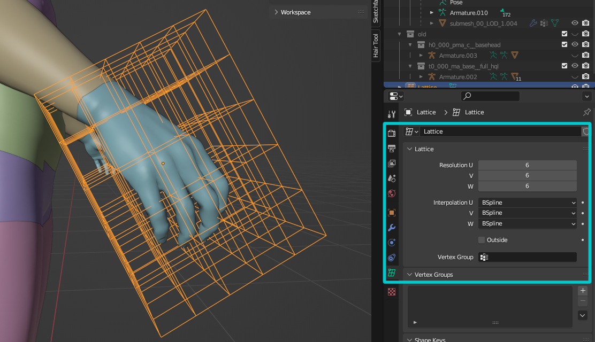<figcaption>
A lattice I made to do some edits to the hand only.
</figcaption></figure>

Now select your base mesh(es). Add the Lattice modifier to the mesh then choose your Lattice in the Object option.

To apply this modifier to all base meshes, while still selecting this mesh, hold `Ctrl` then select all the meshes that you want to edit, or hold `Shift` then drag to select all the meshes that you want to edit. Click the drop-down menu arrow in the modifier, then click `Copy to Selected`.

<figure>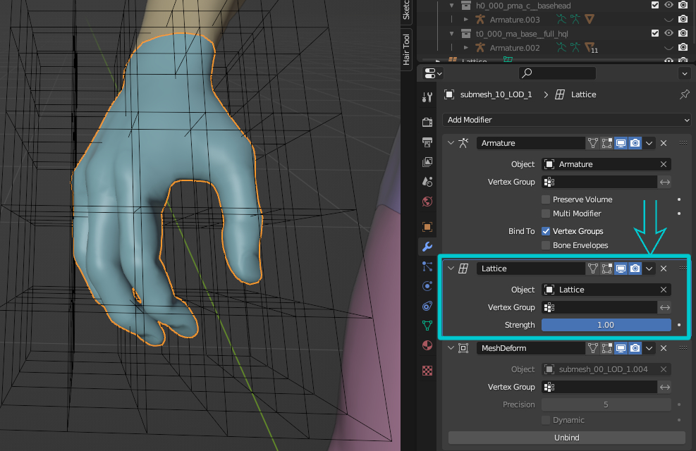<figcaption></figcaption></figure>

Go to edit mode, select vertices and start moving them around to edit your base mesh(es).

When you are done, you do not have to apply this modifier. As long as your export settings are correct, and you remember to delete all Shape keys, the changes will be applied automatically upon export. That's why this method will make all the changes non-destructive and you can revert to vanilla by toggling the modifier.


You can stack modifiers to make desired changes to your mesh(es).


### Mesh Deform Modifier Method

The Mesh Deform modifier allows an arbitrary mesh (of any closed shape) to act as a deformation cage around another mesh. This method resolves many problems of the previous methods.

Pros:

* Can edit as many meshes at once as you want, no matter what armature they are parented to.
* 100% Non-destructive sculpting.&#x20;
* No need to separate, rejoin, and rename meshes after sculpting is done.
* Easier control than editing vertices of a lattice.
* Allow symmetrical sculpting.
* Edits can be stacked on top of each other by stacking modifiers.

Cons:

* If you have a lot of meshes and the vertex count is relatively high, the waiting time to bind can be just a little long.

In this example, I will work with the head mesh (1 submesh) and the body mesh (10 submeshes).

<figure>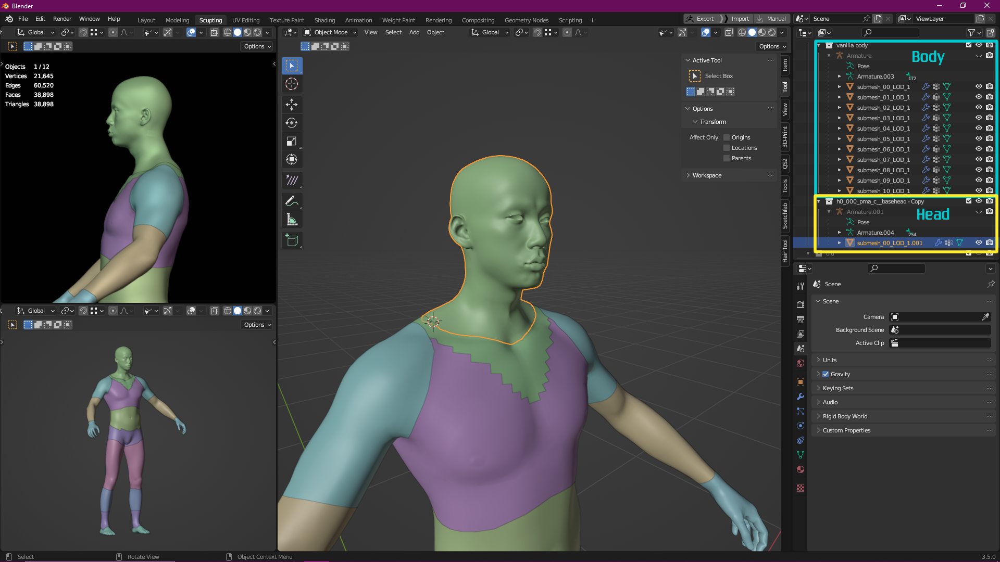<figcaption></figcaption></figure>

In Object Mode, duplicate everything by right-clicking on the collections and hit `Duplicate Collection` .

Still in Object Mode, select all the newly duplicated meshes and join them together by using hotkey `Ctrl + J` or navigate to the menu `> Object > Join` .

<figure><figcaption>
Now you should have an unified, joined mesh along side the vanilla meshes.
</figcaption></figure>

This mesh will be our cage mesh, we will use it as a proxy to make edits to the main meshes. Now we have to prepare it so that it works well as a cage.

Add a Remesh modifier to this mesh, use Voxel setting. Decrease the Voxel Size until the human shape is fairly recognizable but the mesh is not too high poly. Also, enable the Smooth Shading option. Below is my setting for this model.

<figure>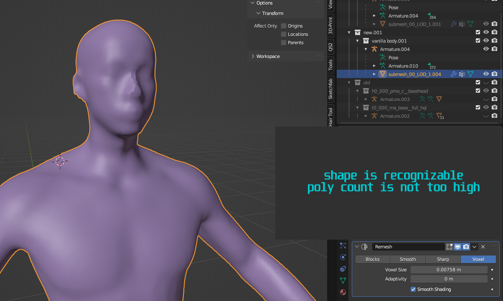<figcaption></figcaption></figure>

Now, apply the modifier by hovering the mouse above it and using the hotkey `Ctrl + A`, or click on the drop-down menu arrow and hit Apply.

Now we need to "bloat" the cage mesh so that it covers the whole base meshes. We will make use of the Shrink/Fatten function. You should toggle visible the base meshes along with this cage so it's easier to see. Switch to Edit Mode, and select all vertices by using the hotkey `Ctrl + A`. Hold `Alt + S`, then drag `Left Mouse button` to fatten the whole mesh. For finer control, also hold `Shift` while dragging it. Make sure that it completely engulfs the base meshes.

<figure>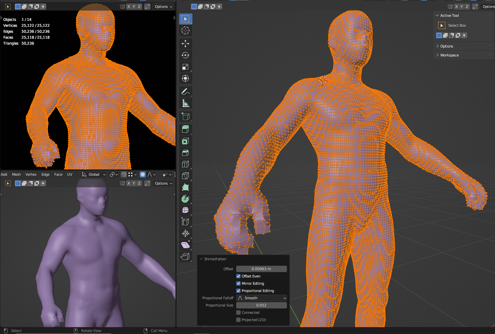<figcaption>
Your bloated meshes should look something like this, it should completely cover the base meshes.
</figcaption></figure>

Switch back to Object Mode, select all the base meshes instead. Add a Mesh Deform modifier, then select the cage mesh in the Object option. Then select the drop-down menu arrow, click Copy to Selected to apply the same modifier to all base meshes. Then go to each meshes and click the button Bind to bind them to the cage. Depending on the complexity and vertices count, it can take anywhere from 1 to 30 seconds to finish binding.

<figure>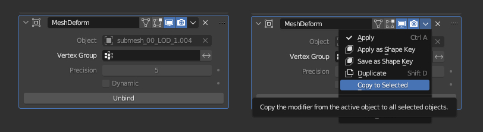<figcaption></figcaption></figure>

You have finished binding all meshes to the base meshes. Now, all the editing you made to the cage mesh in Sculpting and Editing Mode will be reflected on the base meshes.

To see the edits easier, select the cage mesh, then go to Object properties. Scroll down to the Viewport Display setting menu, in the Display As option, chose Wire. This will render the cage as wire and you can see the vanilla meshes below as you edit.

<figure>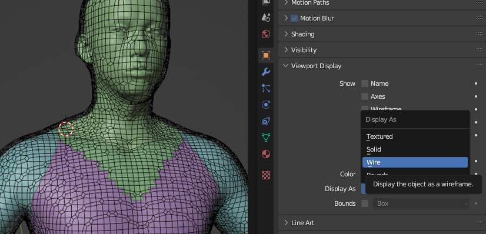<figcaption></figcaption></figure>


Hint: to make symmetrical changes, enable the symmetrical editing in Sculpt Mode. If your cage doesn't cover the whole base meshes, you can add a [Mirror Modifier](https://docs.blender.org/manual/en/latest/modeling/modifiers/generate/mirror.html) to the cage mesh. It will be reflected on your base meshes as well.


After finishing sculpting, you don't have to apply the modifier to the base meshes. As long as your export settings are correct, and you remember to delete all Shape keys, the changes will be applied automatically upon export. That's why this method will make all the changes non-destructive and you can revert to vanilla by toggling the modifier.


You can cleverly combine these methods to make changes to your mesh as you desire.


## Troubleshooting


If your problem isn't listed here, check [Troubleshooting your mesh edits](troubleshooting-your-mesh-edits.md).


### Sculpt changes don't show before I enter and leave Sculpt Mode

You need to [delete the shapekeys](mesh-sculpting-techniques.md#perquisite-deleting-shapekeys).
