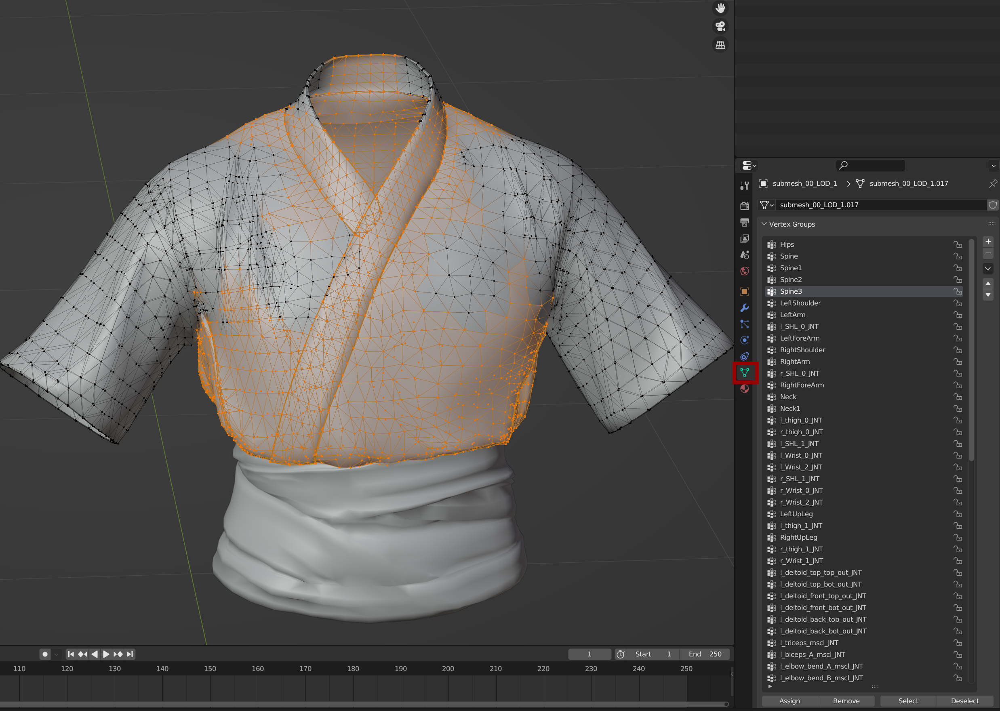

# Meshes and Armatures: Rigging


For a documentation of the import/export options in Wolvenkit, check [here](https://wiki.redmodding.org/wolvenkit/wolvenkit-app/editor/import-export/models#choosing-rigs-correctly).&#x20;

For Simarillius's Blender script to merge several armatures, check [here](https://github.com/Simarilius-uk/CP2077\_BlenderScripts/blob/main/Merge\_rigs.py).

For a youtube video how to transfer weights between rigs, see [here](https://www.youtube.com/watch?v=bR\_Vke\_\_voU).&#x20;


The connection between a mesh and a rig is made via **vertex groups**. Any number of vertices can be assigned to a group, which is then matched to a rig's bone via **name**.

<figure><figcaption>
These vertices move with the bone "Spine3"
</figcaption></figure>

How much every bone influences the vertices is determined by vertex weight, which can be altered in Blender's Weight Paint perspective:

<figure><figcaption>
Weight painting
</figcaption></figure>

Vertex weights are assigned for every vertex group, and each vertex will move on the basis of the sum of all its weights.&#x20;


To preview the deform in Blender, you can select the mesh's parent armature and enter the "Pose Mode". There, you can either apply an [exported animation](https://wiki.redmodding.org/wolvenkit/guides/modding-community/exporting-to-blender/exporting-rigs-and-anims), or select individual bones and rotate/move them. The **Armature modifier** will morph your mesh according to the pose, letting you spot errors much faster than trying to debug them in-game.



You can see a video of the process [here](../modding-guides/npcs/) (courtesy of Vesna).&#x20;

