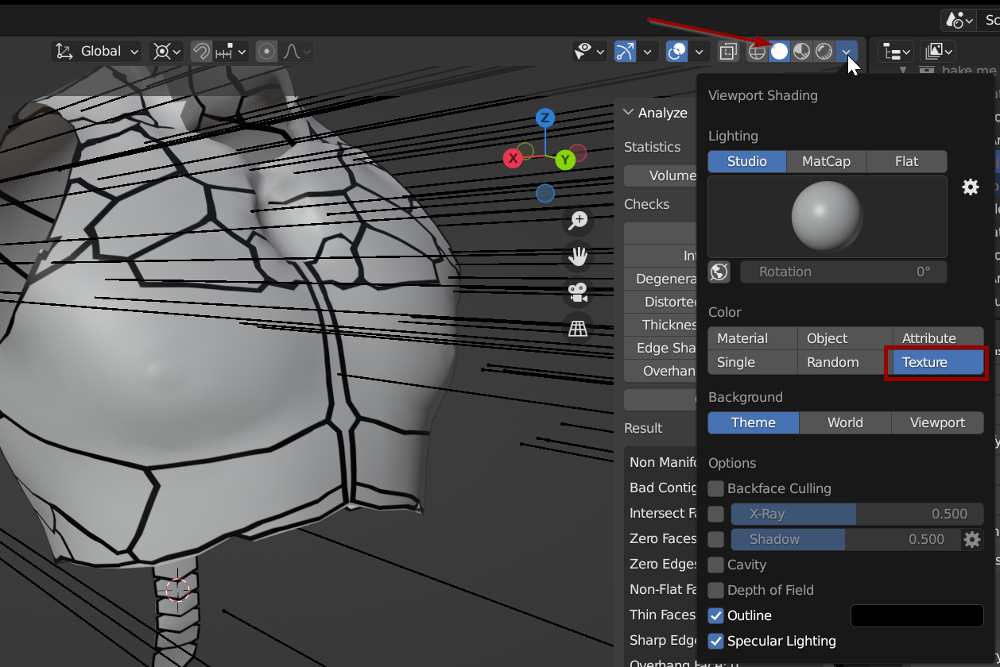
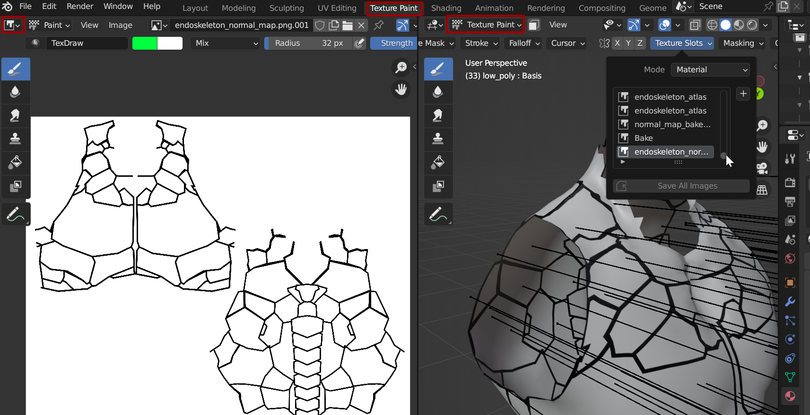
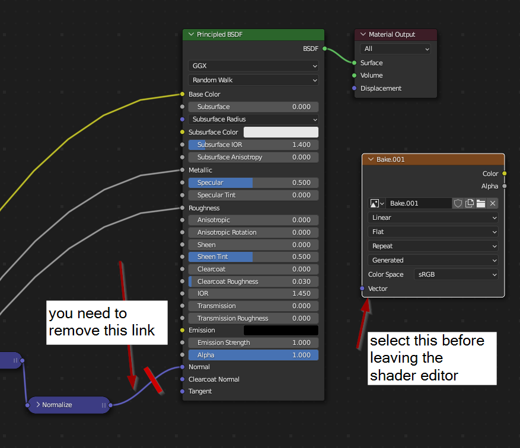
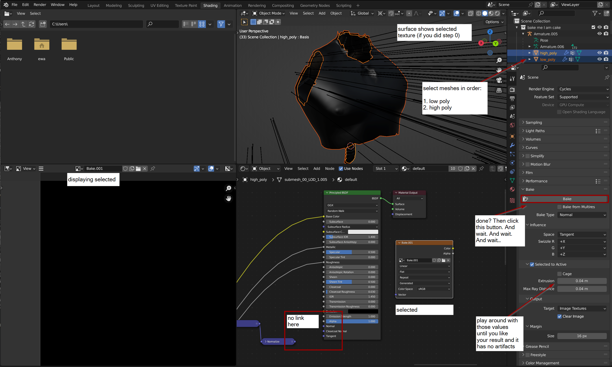

# Self-made normal maps

### Other guides about this:&#x20;

[Google Doc](https://drive.google.com/file/d/11Z-SYF28nVpF\_ZbkIJ\_KHCetJK7EcT\_X/view) by Тима (Teem)#3118&#x20;

## Summary 

**Created by @manavortex**\
**Published January 06 2023**

|                     |                                                                                                                                                                                                                          |
| ------------------- | ------------------------------------------------------------------------------------------------------------------------------------------------------------------------------------------------------------------------ |
| Version             | [Blender](https://www.blender.org/download/)>= 3.3                                                                                                                                                                       |
| Assumed skill level | <ul><li>You know what a <a href="https://en.wikipedia.org/wiki/Normal_mapping">normal map</a> is</li><li>You're able to draw stick figures</li><li>You are not afraid of Blender</li><li>You know how to read.</li></ul> |


If you don't have Photoshop, Photopea offers almost the same thing online for free.



For a free tool for faster normal baking, check out [xnormal](https://xnormal.net/).


## Step 0: Preparing the viewport

1. [Export your mesh](../exporting-and-importing-meshes/) from WolvenKit
2. Import it into Blender
3. Select the object
4. Pick a material:\
   
5. Switch to the "Shading" perspective and add an "Image Texture". Select your image by clicking the corresponding button:\
   
6. The viewport should already be set to "Solid". Click on the dropdown arrow next to the options and select "Texture" from the list.&#x20;

<figure><figcaption>
You will now get the selected texture directly as an overlay.
</figcaption></figure>

## Step 1: The Displacement Map

As the first step, we create a [**Displacement Map**](https://de.wikipedia.org/wiki/Displacement\_Mapping) for our 3d object. This black and white image will turn your mesh into an object with actual (simulated) depth, which we will then "bake" into a normal map.&#x20;

<figure><figcaption>
image source: <a href="https://de.wikipedia.org/wiki/Displacement_Mapping">Wikipedia</a>
</figcaption></figure>


This tutorial won't cover the process of how to draw such a map in-depth, but there will be a few tips how to do that in Blender.



The displacement image should be saved in 32 bit image depth rather than the usual 8. This will yield better results with the normal maps.


### Texture Paint Mode

The Texture Paint perspective lets you draw directly on your mesh's surface:&#x20;

<figure><figcaption>
You will probably want to fix this up in Photoshop (Photopea).
</figcaption></figure>

### UV edit mode

To see how the mesh is projected on your image, you can check out the UV edit mode.&#x20;

Switch to "Edit" (shortcut: Tab) and select all vertices (shortcut: ctrl+A). You will now see them projected on the texture:&#x20;

<figure><figcaption></figcaption></figure>


Feel free to change the UV mapping. You can [export](../exporting-and-importing-meshes/#wolvenkit-.gdb-1) this back into Cyberpunk!


## Step 2: High Poly and Low Poly meshes

Once you are done with your displacement map and the UV mapping looks like you want it to, it's time for the next step: projecting!


Take your displacement map and create a **slightly blurry version** of it. This will prevent artifacts on the normal map, as the algorithm doesn't like perfectly straight edges.



I create a duplicate of my entire armature, just to make certain that I don't accidentally overwrite anything I want to keep. Only work on the new object, since we're getting destructive here.


1. Make sure that your viewport is in Object Mode&#x20;
2. Select all objects that you want to go on the same normal map, then **join** them together (shortcut: Ctrl+J).&#x20;
3. Create a duplicate of this mesh (Ctrl+D, ESC to stop moving), then rename that to "Low Poly".&#x20;
4. Select the mesh you duplicated and rename it to "High Poly".
5. Open the "Modifiers" tab and assign the following modifiers **after** the armature modifier (check screenshot in Step 6)
   1. **Generate -> Subdivision Surface**\
      _**Levels Viewport:** 2 or so_\
      _**Render:** As many as Blender lets you get away with without crashing, I used 7_\
      _**Advanced:**_\
      _**UV Smooth:** Keep Corners, Junctions_\
      _**Boundary Smoothing**: Keep Corners_
   2. **Deform -> Displace**\
      _**Coordinates**: UV_\
      _**UV Map:** UVMap_\
      _**Direction**: Normal_\
      _**Strength:** -0.002 (you can play around with this)_\
      _**Midlevel:** 0.000_
6. For the "Displace" Modifier, create a new picture, then click on the two sliders to show this texture in the textures tab\
   
7. Load your blurred texture:\
   


If you hide your "Low Poly" mesh, the modifiers should now let you see creases on your high poly object! Exciting!!



The normal map will only care for relative depth, so keep the creases on your mesh shallow. If you make them too sharp, this can lead to artifacts on the baked normal map.


## Step 3: Prepare the material

Switch to the "Shading" perspective again. Add another image texture and create an image with your target resolution. Call it "Bake" or whatever.

**Remove the link to your material's normal input** - otherwise, it'll bake your normal map into your normal map, and the results won't be pretty.

<figure><figcaption></figcaption></figure>

## Step 4: Prepare the low poly mesh

The high poly mesh needs to be completely covered by the low poly one, like plastic wrap. If that isn't yet the case, you can inflate your low poly mesh:&#x20;

1. Set the viewport to Object Mode
2. Select the Low Poly mesh&#x20;
3. Switch into Edit Mode (tab)
4. Select all vertices (ctrl+A)
5. **Fatten** (Alt+S, adjust amount of fattening via mouse)
6. Fix up whatever parts didn't fatten correctly by hand.

### If your mesh inflates asymmetrically

1. Undo your action and select all vertices again.&#x20;
2. Put the 3d cursor in the center of the selected vertices: \
   `Right-Click -> Snap Vertices -> Cursor To Selected`
3.  Set the Pivot Point to 3D cursor (Shortcut: `.` (dot), `Numpad 6`)

    <figure><figcaption>
Set it to "3D Cursor"
</figcaption></figure>
4. Fatten again!

## Step 5: Baking


In Blender, the "active" object is the "previously selected" one. Select your meshes in the following order:

1. Low Poly
2. 2\. High Poly


Find the "Render Properties" tab.

1. At the very top, set "Device" to "GPU Compute" (unless you'd rather bake on your CPU)
2. Scroll down all the way to "Bake". Configure it like this:
   1. **Bake Type:** Normal
   2. **Influence / Space:** Tangent
   3. **Selected to Active:** Checked
   4. **Extrusion:** 0.04 m \
      _If your generated normal map shows artifacts, try tweaking this._
   5. **Max Ray Distance:** 0.04 m\
      _If your generated normal map shows artifacts, try tweaking this._
   6. **Output / Target:** Image Textures
   7. Clear Image: Checked
   8. **Margin / Size:** 16px (or whatever suits you)
3. **Save. Your. File.**

<figure><figcaption>
Things are looking like this now? Great, then click "Bake"!
</figcaption></figure>


Baking takes time (several minutes) and most of your PC's free resources. This is normal.&#x20;


If everything went well, the image editor on the bottom left will change and display your normal map.

<figure><figcaption>
A normal map with no artifacts or distortions: this is the kind of result we want.
</figcaption></figure>

You can export the image via the hamburger menu in the image editor (bottom left panel of the screenshot).

## Troubleshooting


This troubleshooting section is for the baking process — the one for normal map textures is [here.](troubleshooting-normal-maps.md)


### My normal map has yellow stripes!

Make sure to [remove the normal mapping](./#step-3-prepare-the-material) from your material.

### My normal map has yellow spots!


First of all, make sure that all your normals are pointing the right way. In the viewport editor, click the "Show Overlays" button and select "Geometry -> Face Orientation" near the bottomn. Blue means outside, red means inside.


The baking process works by capturing the rays of light that bounce between the high poly mesh and the low poly mesh. If you have artifacts, then some of those rays bounced off something else first, which makes them register as inverted. That's the reason why steep creases are a problem — a ray of light might get caught in there and be flipped around.&#x20;

Check the [troubleshooting step for artifacts](./#my-normal-map-has-artifacts).

### My normal map has artifacts!

* Make sure your displacement map (the one used by the modifier) is **blurred**.
* Try lowering the strength of the **Displace** modifier on the High Poly mesh, making the creases more shallow.
* Try changing **Extrusion** and **Max Ray Distance** in the **Bake** settings.
* If that doesn't help, you could try a [cage](https://www.reddit.com/r/blender/comments/nu7ysh/comment/itym8vw/?utm\_source=share\&utm\_medium=web2x\&context=3), or otherwise hit Google.

### Blender complains about my meshes

Restart [Step 4](./#step-4-prepare-the-low-poly-mesh) and make sure that you haven't deleted or altered any vertices, other than scaling/inflating the low poly mesh.

