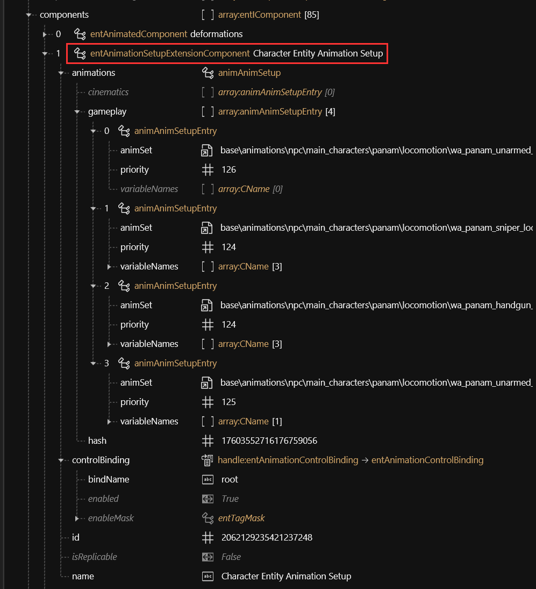

# 👤 Animations

## Summary

This page contains t**heoretical knowledge** about animations and poses (static animations) in Cyberpunk 2077. &#x20;

If you want to look up what is where, please refer to the [Cheat Sheet](references-lists-and-overviews/cheat-sheet-rigs-and-animations.md).

## What is an animation?

An animation is a collection of **static poses** played as a sequence.

If you want to **make** poses (replacer, [photo mode](modding-guides/animations/archivexl-adding-photo-mode-poses.md) or [AMM](modding-guides/animations/amm-collab-anims-poses.md)) instead, see [Modding Guides](modding-guides/) -> [Animations](modding-guides/animations/).

## What is a rig?

Also called `armature` or `skeleton`, a rig is the thing that makes a character move.&#x20;


For a list of rigs by path, see the [cheat sheet](references-lists-and-overviews/cheat-sheet-rigs-and-animations.md#.rigs).


## Animation sets

### Body

You can find body animation sets with the following [Wolvenkit search query](http://127.0.0.1:5000/s/-MP\_ozZVx2gRZUPXkd4r/wolvenkit-app/usage/wolvenkit-search-finding-files):

```
base\animations > locomotion > .anims
```

Which animation set a character uses is defined by `entAnimationSetupExtensionComponent`(s) in the root entity:

<figure><figcaption></figcaption></figure>

### Face

You can find facial animation sets with the following Wolvenkit search query:&#x20;

```
base\animations\facial > .anims
```

They are referenced from an entAnimationSetupExtensionComponent inside the .app file:


