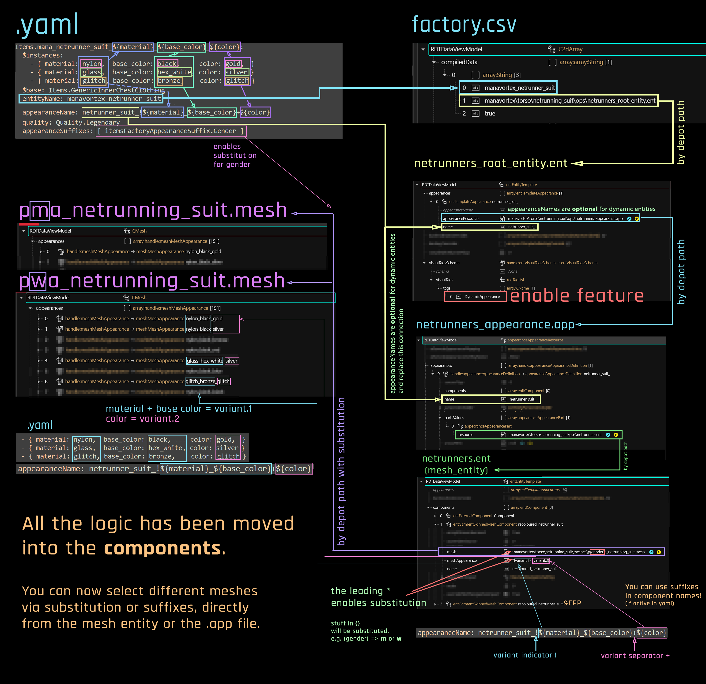

# ArchiveXL

## Summary

Published in August 23 by [manavortex](http://127.0.0.1:5000/u/NfZBoxGegfUqB33J9HXuCs6PVaC3 "mention")

## OK, so what is this?

ArchiveXL ([nexus](https://www.nexusmods.com/cyberpunk2077/mods/4198) | [github](https://github.com/psiberx/cp2077-archive-xl/)) is one of the [core frameworks](./) of Cyberpunk 2077 modding. Together with TweakXL, It allows you to add things to the game, such as

* [equipment](../modding-guides/items-equipment/adding-new-items/) and [weapons](../modding-guides/items-equipment/adding-new-items/weapons.md)
* [photo mode poses](../modding-guides/photo-mode/archivexl-adding-photo-mode-poses.md)
* world sectors
* custom lipsync maps

This page will document how to **set item properties** via **tags & suffixes** (the vanilla way)**,** or via **dynamic switching** (new, cool, version >= 1.5).

Let's dive right in.

## Variants and suffixes

### What are variants, what do I need them for?

When adding items, you will normally offer multiple [**mesh appearances**](../files-and-what-they-do/3d-objects-.mesh-files.md#step-1-appearances) (variants), for example, the same shirt in black, white, and red. This is what you're modding for, after all: making cool things.

### And what are suffixes?

Sometimes, you want to load different meshes/appearances under different circumstances. Until ArchiveXL 1.5, the process was extremely tedious, but thanks to psiberx, the integration of [**suffixes**](../files-and-what-they-do/entity-.ent-files.md#what-are-suffixes) has mostly stopped hurting (read up on [dynamic variants](archivexl.md#dynamic-variants) to learn how to do it).

Here are some use cases:

#### Body genders

There are two body genders with different proportions, and you can't make them wear the same shirt (at least not without clipping). To solve that, you can do what CDPR did and have one variant per rig.

#### Body types

On top of that, you can add **body mods** (mostly chest size, but occasionally full refits). Starting with 1.5, these will be [supported by ArchiveXL](https://github.com/psiberx/cp2077-archive-xl/wiki/Dynamic-Appearances#conditions)! That means, no more compatibility archives, since AXL can simply load different meshes for you…

#### Camera modes

Sometimes, you need to hide parts of the item in first person. – for example helmets, since you don't want to have half a helmet floating in front of your face (unless you consider that immersive; most people don't).

## Tags

Tags are a way to tell Cyberpunk that an item has certain properties and should behave in a certain way. Thanks to ArchiveXL's extended tag system, you can for example force flat feet for female V, or un-hide hair from a head item.


You can find a list of tags in [ArchiveXL's](https://github.com/psiberx/cp2077-archive-xl/wiki/Dynamic-Appearances)[ readme](https://github.com/psiberx/cp2077-archive-xl#adding-visual-tags).


## Dynamic variants

If you have ever tried to make ten colour variants of an item for two body genders with four different states of feet, then you're familiar with the struggle. Version 1.5.0 of ArchiveXL solves this problem by introducing dynamic variants, allowing you to define **rules** to hook up your yaml straight to the mesh entity. picking components and even appearances dynamically.&#x20;


You can find the technical (usage) documentation for dynamic variants on [ArchiveXL's github](https://github.com/psiberx/cp2077-archive-xl/wiki/Dynamic-Appearances).


Here's an overview of how the dynamic variants work. By comparison, [this](../modding-guides/items-equipment/adding-new-items/#diagram) is the old diagram. \
Especially for multiple items, the new way is much faster.

<figure><figcaption></figcaption></figure>
