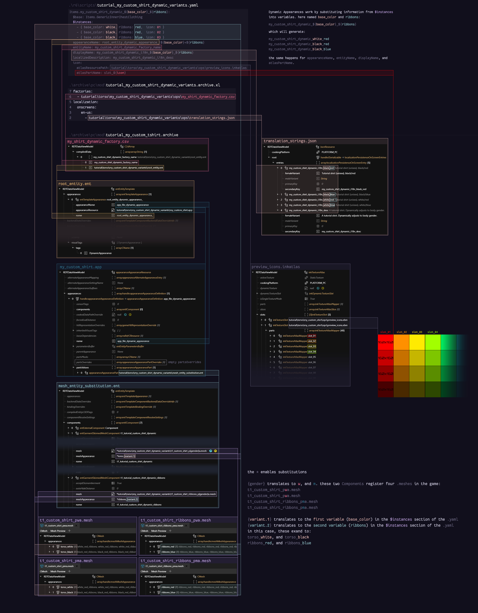

# 💹 ArchiveXL

## Summary

Published in August 23 by [manavortex](https://app.gitbook.com/u/NfZBoxGegfUqB33J9HXuCs6PVaC3 "mention")


As suggested by psiberx, the general usage documentation for ArchiveXL will be kept in this wiki for ease of use. You can find the [readme](https://github.com/psiberx/cp2077-archive-xl) on github or check the repository's [wiki section](https://github.com/psiberx/cp2077-archive-xl/wiki).


## OK, so what is this?

ArchiveXL ([nexus](https://www.nexusmods.com/cyberpunk2077/mods/4198) | [github](https://github.com/psiberx/cp2077-archive-xl/)) is one of the [core frameworks](../) of Cyberpunk 2077 modding. Together with **TweakXL**, It allows you to add things to the game, such as

* [equipment](../../modding-guides/items-equipment/adding-new-items/) and [weapons](../../modding-guides/items-equipment/adding-new-items/weapons/)
* [photo mode poses](../../modding-guides/animations/archivexl-adding-photo-mode-poses.md)
* world sectors ([deletions](../../modding-guides/world-editing/world-editing-deleting-objects.md) and additions)
* custom lipsync maps
* Translations (check [#how-does-the-game-assign-display-names](../../modding-guides/items-equipment/adding-new-items/weapons/new-iconic-weapon-tutorial-for-dummies.md#how-does-the-game-assign-display-names "mention")for a guide)
* If you want to look up garment appearance slots: The princess is in another castle. Check [different-equipment-slots.md](../../modding-guides/items-equipment/adding-new-items/different-equipment-slots.md "mention") instead.

This page will document how to **set item properties** via **tags & suffixes** (the vanilla way)**,** or via **dynamic switching** (new, cool, version >= 1.5).

Let's dive right in.

## Variants and suffixes

### What are variants, what do I need them for?

When adding items, you will normally offer multiple [**mesh appearances**](../../files-and-what-they-do/3d-objects-.mesh-files/#step-1-appearances) (variants), for example, the same shirt in black, white, and red. This is what you're modding for, after all: making cool things.

### And what are suffixes?

On top of having different colours, you also have different **circumstances** – for example camera states: not even Johnny Silverhand wears his sunglasses in first person perspective.&#x20;

CDPR deals with this by using [suffixes](archivexl-suffixes-and-substitutions.md#why-are-suffixes), which are tedious to use. psiberx has since created a better system ([dynamic appearances](./#dynamic-appearances) or **conditions**), which are much easier to use.&#x20;

For more detail on this, please see the sub-page [archivexl-suffixes-and-substitutions.md](archivexl-suffixes-and-substitutions.md "mention")

## Tags

Tags are a way to add extra information to entities or appearances. They are defined on their own sub-page: [archivexl-tags.md](archivexl-tags.md "mention")

## Dynamic appearances

If you have ever tried to make ten colour variants of an item for two body genders with four different states of feet, then you're familiar with the struggle. Version 1.5.0 of ArchiveXL solves this problem by introducing dynamic variants, allowing you to define **rules** to hook up your yaml straight to the mesh entity. picking components and even appearances dynamically.&#x20;

You can find more detail about this on the sub-page [archivexl-suffixes-and-substitutions.md](archivexl-suffixes-and-substitutions.md "mention") -> [#which-substitutions-exist](archivexl-suffixes-and-substitutions.md#which-substitutions-exist "mention")

* For a tutorial about this, check [archivexl-dynamic-variants.md](../../modding-guides/items-equipment/adding-new-items/archivexl-dynamic-variants.md "mention")
* If you are a mod user and want to dynamically recolour an item, check the [recolours-and-refits](../../modding-guides/items-equipment/recolours-and-refits/ "mention") guide -> sub-page Emissive -> [#switching-existing-colours](../../modding-guides/items-equipment/recolours-and-refits/r-and-r-emissive.md#switching-existing-colours "mention")

### Dynamic Appearances: the diagram

Here's an overview of how the dynamic variants work. By comparison, [this](../../modding-guides/items-equipment/adding-new-items/#diagram) is the old diagram. \
Especially for items with many appearances, the new way is **much** faster.

<figure><figcaption></figcaption></figure>
