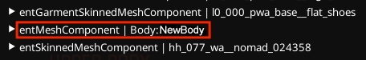

# ArchiveXL: body mods and refits

Starting with version 1.5, Archive XL supports **tags for body mods** ! That means, no more compatibility archives, since AXL can simply load different meshes for you…

Body type detection works with simple body replacements and with the character creator extensions (customization system).

## Checking the current body mod

Run the following code snippet in CET to see which body type you have installed:

```
print(Game.GetScriptableSystemsContainer():Get("PuppetStateSystem"):GetBodyTypeSuffix(ItemID.new(), GetPlayer(), nil))
```

## Body modders: Adding support

### Adding an .xl configuration file

1. Create an .xl file in your Wolvenkit Project's resources folder
2. Optional, but recommended: Give it the same name as your Wolvenkit project
3. Put the following file content:

```yaml
player:
  bodyTypes: [ NewBody ]  # this will be converted to snake case: new_body
```

### Register the body mod in the .archive

In any of the files you modded, check your `components`:

#### Does any of them have a type that's called something with `morphtargetComponent`?&#x20;

**Yes:** \
Add a **tag** with the exact name of your body in this component's tag array (for our example, `NewBody`)

**No:**\
Add a new component (of any type) and give it the following name: \
`Body:NewBody`


If you edit the leg component for female V, you must change both the regular and the flat feet component:\
`base\characters\common\player_base_bodies\appearances\l0_000_base__full.app`\
`base\characters\common\player_base_bodies\appearances\l0_000_base__cs_flat.app`


#### If you can't make it work

The files below have been confirmed to work — make the changes stated above to each of them:

```
base\characters\common\player_base_bodies\appearances\l0_000_base__cs_flat.app
base\characters\common\player_base_bodies\appearances\l0_000_base__full.app
base\characters\common\player_base_bodies\appearances\l0_000_base_fpp__cs_flat.app
base\characters\common\player_base_bodies\appearances\l0_000_base_fpp__full.app 
```

#### Test

After packing your project, [check if the body tag registers](archivexl-body-mods-and-refits.md#checking-the-current-body-mod) by running the CET command.&#x20;

If yes, you're good to go!

If not and you have used a **component**, you can check if the component is added to the playerPuppet by checking [RedHotTools](../../modding-tools/redhottools/):

<figure><figcaption></figcaption></figure>

## Clothing mods: Making use of the tags

### Dynamic Appearances

If you're using [dynamic appearances](./#dynamic-appearances), you don't need to register a suffix and can simply match or substitute for the body tag:

```
appearance name:
t0_recoloured_netrunner_suit&body=new_body

substitution:
*my\mod\meshes\p{gender}a_netrunning_suit_{body}.mesh
```


If no body mod is installed, the value will be `base_body`, so make sure to name your files and folders accordingly!


### Suffixes

If you're sticking to the classical approach, you need to add the following lines to your `.yaml`:

```yaml
  appearanceSuffixes:
    - !append itemsFactoryAppearanceSuffix.BodyType
```

Now, you can use the suffixes in your [root entity](../../files-and-what-they-do/entity-.ent-files/#root-entity) just like camera states or body genders:

```
appearanceName: my_custom_shirt&FPP&NewBody
```

## Supporting mods

The following body mods support dynamic body switching.


If you know something that should be on the list, please edit [the-wiki.md](../../modding-tools/the-wiki.md "mention")!



As of 16-Mar-2024 Gymfiend body does not work and returns `BaseBody` in CET.


| Mod                                                                                  | Tag name | substitution value |
| ------------------------------------------------------------------------------------ | -------- | ------------------ |
| [KS Lion's Lush Body](https://www.nexusmods.com/cyberpunk2077/mods/4901)             | Lush     | `&body=lush`       |
| [KS Lion's SoLush Body](https://www.nexusmods.com/cyberpunk2077/mods/8392)           | Lush     | `&body=lush`       |
| [KS Solo Ultimate](https://www.nexusmods.com/cyberpunk2077/mods/6944)                | Ult      | `&body=ult`        |
| [Hyst's Big Butt](https://www.nexusmods.com/cyberpunk2077/mods/4420)                 | RB       | `&body=ebb`        |
| [Hyst's Big Boobs](https://www.nexusmods.com/cyberpunk2077/mods/4654)                | EBB      | `&body=rb`         |
| [Hyst's Big Push Up Boobs](https://www.nexusmods.com/cyberpunk2077/mods/9083)        | EBBP     | `&body=ebbp`       |
| [Hyst's Big Boobs & Butt](https://www.nexusmods.com/cyberpunk2077/mods/4654)         | EBBRB    | `&body=ebbrb`      |
| [Hyst's Big Push Up Boobs & Butt](https://www.nexusmods.com/cyberpunk2077/mods/9083) | EBBPRB   | `&body=ebbprb`     |
| ~~[Gymfiend](https://www.nexusmods.com/cyberpunk2077/mods/6423)~~                    | Gymfiend | `&body=gymfiend`   |
