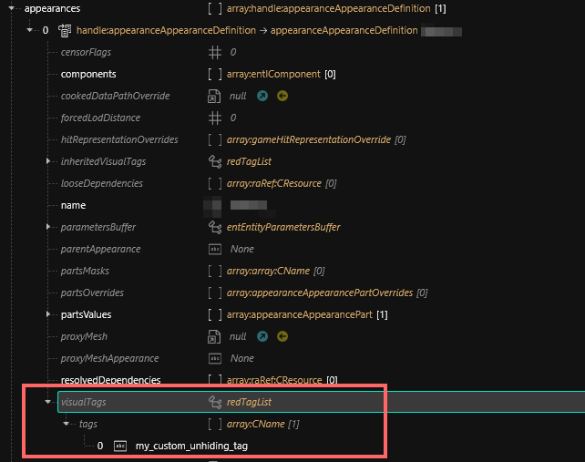

# ArchiveXL: Tags

## Summary

**Published:** ??? by [manavortex](https://app.gitbook.com/u/NfZBoxGegfUqB33J9HXuCs6PVaC3 "mention")\
**Last documented update:** February 04 2025 by LadyLea

This page will tell you about **tags** and how they can be used to influence item behaviour. It also teaches you how [#adding-custom-tags](archivexl-tags.md#adding-custom-tags "mention") can help you conditionally un-hide items or add new features.

### Wait, this is not what I want!

* Tags are used for calculating Garment Support score, see  [garment-support-how-does-it-work](../../../for-mod-creators-theory/3d-modelling/garment-support-how-does-it-work/ "mention")
* There is an own page for [influencing-other-items.md](../../../modding-guides/items-equipment/influencing-other-items.md "mention")

## What do tags do?

[Tags](https://github.com/psiberx/cp2077-archive-xl/wiki#visual-tags) are a way to tell Cyberpunk that an item has certain properties and should behave in a certain way. This makes the game apply properties to your items, which can then be utilized by the game and ArchiveXL.


To apply visual tags to an item you must add them to [**visualTags**](https://wiki.redmodding.org/cyberpunk-2077-modding/for-mod-creators/modding-guides/items-equipment/influencing-other-items#visualtags-garmentsupport) property of your appearance definition or to [**visualTagsSchema**](https://wiki.redmodding.org/cyberpunk-2077-modding/for-mod-creators/modding-guides/items-equipment/adding-new-items/archivexl-dynamic-variants#the-root_entity) of your root entity template.



Tags are case-sensitive!


### Base game tags

| Tag             | Effect                                                                      |
| --------------- | --------------------------------------------------------------------------- |
| `hide_H1`       | Hides an item in the `Head` slot.                                           |
| `hide_F1`       | Hides an item in the `Eyes` slot.                                           |
| `hide_T1`       | Hides an item in the `Chest` slot.                                          |
| `hide_T2`       | Hides an item in the `Torso` slot.                                          |
| `hide_L1`       | Hides an item in the `Legs` slot.                                           |
| `hide_S1`       | Hides an item in the `Feet` slot.                                           |
| `hide_T1part`   | Toggles the partial suffix (`&Full` →`&Part`) when applied to `Torso` item. |
| `hide_Hair`     | Hides hair.                                                                 |
| `hide_Genitals` | Hides genitals in uncensored mode and underwear in censored mode.           |

### ArchiveXL tags


Check [#hiding-body-parts-diagram](archivexl-tags.md#hiding-body-parts-diagram "mention") below!


| Tag                 | Effect                                                                                                                                                                                                                                                        |
| ------------------- | ------------------------------------------------------------------------------------------------------------------------------------------------------------------------------------------------------------------------------------------------------------- |
| `hide_Head`         | Hides head.                                                                                                                                                                                                                                                   |
| `hide_Torso`        | Hides the whole torso (0, 1, 2)                                                                                                                                                                                                                               |
| `hide_LowerAbdomen` | Hides lower abdomen. (3)                                                                                                                                                                                                                                      |
| `hide_UpperAbdomen` | Hides upper abdomen. (2)                                                                                                                                                                                                                                      |
| `hide_CollarBone`   | Hides collar bone area. (1)                                                                                                                                                                                                                                   |
| `hide_Arms`         | Hides the whole arms, including hands. (There's [no easy way to partially hide arms](../../../for-mod-creators-theory/references-lists-and-overviews/cheat-sheet-body.md#arms), you would have to [create custom tags](archivexl-tags.md#adding-custom-tags)) |
| `hide_Thighs`       | Hides thighs. (4)                                                                                                                                                                                                                                             |
| `hide_Calves`       | Hides calves. (5)                                                                                                                                                                                                                                             |
| `hide_Ankles`       | Hides ankles. (6)                                                                                                                                                                                                                                             |
| `hide_Feet`         | Hides feet. (7)                                                                                                                                                                                                                                               |
| `hide_Legs`         | Hides the entire legs (including feet, 4, 5, 6, 7)                                                                                                                                                                                                            |
| `HighHeels`         | Turns the current (shoe) item into high heels. (Item's yaml `$base` must be a foot item)                                                                                                                                                                      |
| `FlatShoes`         | Turns the current (shoe) item into flat shoes. (Item's yaml `$base` must be a foot item)                                                                                                                                                                      |


* Check the [#foot-states](archivexl-suffixes-and-substitutions.md#foot-states "mention") section for more tags concerning [Toggleable Feet](https://www.nexusmods.com/cyberpunk2077/mods/7049).
* Check the [#setting-footwear-sounds](../../../modding-guides/items-equipment/adding-new-items/different-equipment-slots.md#setting-footwear-sounds "mention") for shoe sound tags.
* Check the [#root-entity-tags](archivexl-tags.md#root-entity-tags "mention") section below for more tags.


### Base Game Tags and ArchiveXL Tags -  Visual Guides

<div><figure><figcaption><p>Visual Guide - Tags - Male Body - By LadyLea </p></figcaption></figure> <figure><figcaption><p>Visual Guide - Tags - Female Body - By LadyLea </p></figcaption></figure></div>

<div><figure><figcaption><p>Visual Guide - Tags - Default Arms - By LadyLea </p></figcaption></figure> <figure><figcaption><p>Visual Guide - Tags - Head - By LadyLea </p></figcaption></figure></div>


Tags to partially hide default arms and cyberarms are not available, however, you can make use of [Chunkmasks](https://wiki.redmodding.org/cyberpunk-2077-modding/for-mod-creators/files-and-what-they-do/3d-objects-.mesh-files/submeshes-materials-and-chunks#chunkmasks-partially-hiding-meshes) with the aid of this [component list for Arms and Cyberarms](https://wiki.redmodding.org/cyberpunk-2077-modding/for-mod-creators/references-lists-and-overviews/cheat-sheet-arms) OR you can create your own [Custom Tags](https://wiki.redmodding.org/cyberpunk-2077-modding/for-mod-creators/core-mods-explained/archivexl/archivexl-tags#adding-custom-tags).


## Root entity tags

There are a few tags that can be added to the root entity **or** in the .app file. Here's a list:

#### EmptyAppearance


This only works for legacy ArchiveXL projects. \
If you're using [archivexl-dynamic-variants](../../../modding-guides/items-equipment/adding-new-items/archivexl-dynamic-variants/ "mention"), please use [conditional appearances](../../../modding-guides/items-equipment/adding-new-items/archivexl-dynamic-variants/#conditional-switching-picking-appearances-by-name) in your .app file.


This will hide an item under certain conditions. Add the following tag to the root entity:

**`EmptyAppearance:FPP`**

You have the following other options to achieve the same end:

<table data-header-hidden><thead><tr><th width="209"></th><th></th><th></th></tr></thead><tbody><tr><td>Root entity appearance<br>(<strong>without</strong> dynamic variants)</td><td><code>name</code>: <code>my_appearance&#x26;FPP</code></td><td>.app path: <code>base\characters\appearances\player\items\empty_appearance.app</code><br><code>default</code></td></tr><tr><td>.app <a href="../../../modding-guides/items-equipment/adding-new-items/archivexl-dynamic-variants/#conditional-switching-picking-appearances-by-name">conditional appearance</a>: change default appearance name</td><td><code>name</code>: <code>my_appearance&#x26;camera=tpp</code></td><td>ArchiveXL will automatically add empty appearances for anything you have not defined</td></tr><tr><td>.app <a href="../../../modding-guides/items-equipment/adding-new-items/archivexl-dynamic-variants/#conditional-switching-picking-appearances-by-name">conditional appearance</a>: add empty appearance yourself</td><td><code>name</code>: <code>my_appearance&#x26;camera=fpp</code></td><td>no partsValues, no components.<br>Do not do this - use the line above this one instead!</td></tr></tbody></table>

**`force_Hair`**

A tag that forces hair to show up while wearing a head item. By default, head items turn hair invisible. By adding this tag to the root entity, you can override this process.

**`force_FlatFeet`**

A tag that forces female V's feet to be flat. Only works with a foot item as `$base` in the `.yaml`: use this if you're making flat shoes and don't want female V's feet to look as if she was wearing heels.


This tag will turn feet invisible for mascV unless the user has switch feet installed. You want to apply this to a conditional appearance in the .app file (`&gender=m`)


## Footsteps: Setting footwear sounds

If you don't want your new boots to sound as if V was barefoot, add one of the following tags to the [#root-entity](../../../for-mod-creators-theory/files-and-what-they-do/entity-.ent-files/#root-entity "mention"):&#x20;

```
Boots
Heels
Sneakers
Stilettos
Metal_feet
```

## Adding Custom tags

Custom tags let you set [component chunk masks](../../../for-mod-creators-theory/files-and-what-they-do/components/#chunkmask) from the .xl file without the need of touching either .app or .ent file.


For this, it is mandatory that you have unique component names. If you include your modder name, it's unlikely that anyone will overwrite them by accident.


### **Why would I need this?** [partsOverrides](../../../for-mod-creators-theory/files-and-what-they-do/appearance-.app-files/#partsoverrides) **exists!**

1. PartsOverrides can't un-hide components for you. It can only hide them. If you want to load a different mesh (for example, a de-formed hakama when wearing a kimono or haori), then you're flat out of luck.
2. By being clever about your submeshes, you can offer different versions of your mesh (cropped! No arms! No legs), and users only need to install an .xl file! No need to have different meshes or even different .archive files.

Not convinced? Pity, but if you find a new use case for those things, do [edit it in](https://app.gitbook.com/invite/-MP5ijqI11FeeX7c8-N8/H70HZBOeUulIpkQnBLK7)!

### **Example**

#### Registering the tag

Add custom tags **in your `.xl` file** (not in your `.yaml`!)

```
overrides:
  tags:
    my_custom_unhiding_tag:
      my_hidden_component_name: {show: [0, 1, 2, 3]}
    my_HideSeamfix:
      t0_000_pma_base__full_seamfix: {hide: [0, 1, 2, 3]}
```

#### Connecting the tag with the item

Simply add the tag to your appearance's tags array near the bottom of the individual entries.

<figure><figcaption><p>An example where to add your custom tag</p></figcaption></figure>

## Making use of Custom Tags in your projects

This section will show an example how Custom Tags are utilized with Body Mods and AXL Clothes. This reference can also be applied for other projects.

Thanks to the development of Custom Tags; Hyst's Body Mods \[[EBB-EBBRB](https://www.nexusmods.com/cyberpunk2077/mods/4654)], \[[EBBP-EBBPRB](https://www.nexusmods.com/cyberpunk2077/mods/9083)] \[[ANGEL](https://www.nexusmods.com/cyberpunk2077/mods/14896)], are now updated with a new feature _Shapes Add-ons -_ which allows creators to make use of different chest states other than the default chest - either: **Squish** or **Natural \[EBBN]**. These add-ons will replace the default chest look of the modded bodies, by adding a Visual Tag.


First things first, make use of [VTK - Resources for Refits](https://www.nexusmods.com/cyberpunk2077/mods/17544) as this page contains the **Shapes Add-ons** resources to refit your garment. Once the ideal shape is chosen, it is time to build up your AXL project (further details on how to make AXL clothes can be found [here ](https://wiki.redmodding.org/cyberpunk-2077-modding/modding-guides/items-equipment/adding-new-items)and [here](https://wiki.redmodding.org/cyberpunk-2077-modding/modding-guides/items-equipment/adding-new-items/archivexl-dynamic-variants))


To make use of custom tags, _**one**_ of the Visual Tags below must be included within your .app file information list:

* `hyst_boobs_natural` \[this tag will load the existing natural chest shape that is available when FemV doesn't wear clothes]

OR

* `hyst_boobs_squish`  \[this tag will load a squished chest shape that is ideal for tight garments such as bras or corsets]

The below example shows how the tag `hyst_boobs_squish` + other [AXL Tags ](https://wiki.redmodding.org/cyberpunk-2077-modding/for-mod-creators-theory/core-mods-explained/archivexl/archivexl-tags#archivexl-tags)are being utilized together for an AXL garment + Body Mods that are making use of [Custom Tags](https://wiki.redmodding.org/cyberpunk-2077-modding/for-mod-creators-theory/core-mods-explained/archivexl/archivexl-tags#adding-custom-tags).

<figure><figcaption><p>Special thanks to <a href="https://next.nexusmods.com/profile/meluminary?gameId=3333">Meluminary</a> for giving permission to make use of her <a href="https://www.nexusmods.com/cyberpunk2077/mods/19168">CROPPED SPAGHETTI UNITARD</a> .app file as an example and visual guide</p></figcaption></figure>
