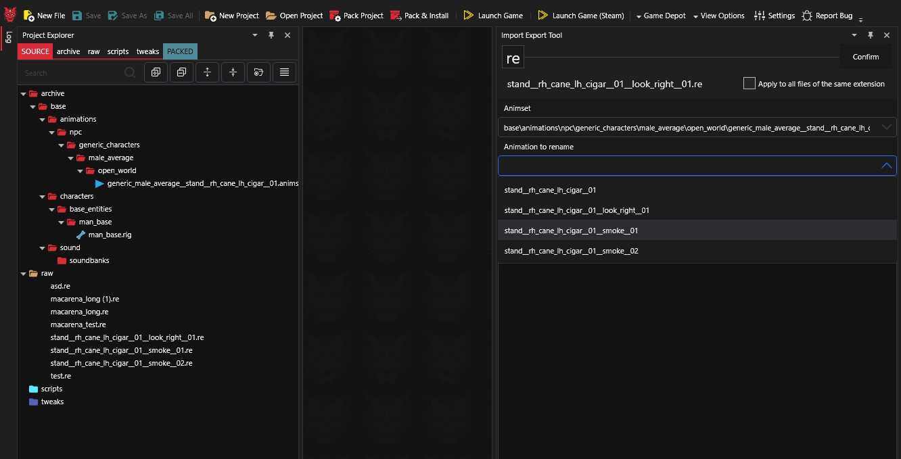
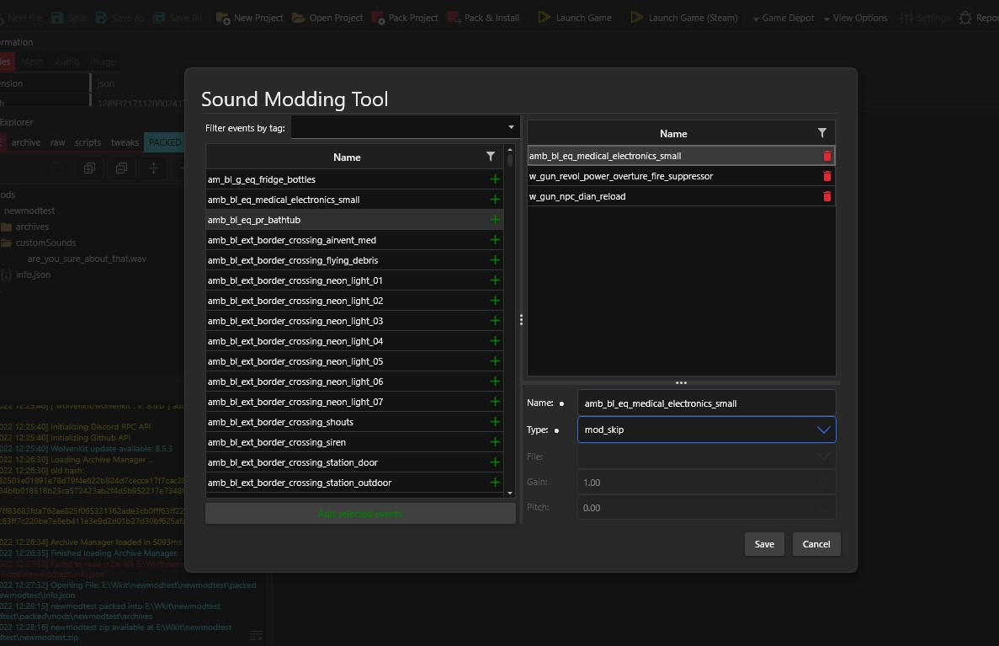

# Modding Guide

## Mod Structure

When creating a REDmod, there is a certain structure that you will want your mod to be in when sharing it with others so that it can be easily used by others. You will want to have a folder that is the name of the mod and in this folder you will have a file named `info.json` along with some other folder(s) which contain the animations, tweeks, sounds, or archives as you see fit. The structure will look somewhat like below

```
 * root_folder
 * | -📁 mods
 * | |-📁 <Mod Name>
 * | | |-📁 archives
 * | | |-📁 scripts
 * | | |-📁 tweaks
 * | | |-📁 customSounds
 * | | |-📄 info.json
```

When sharing you mod, you would package the folder that is the name of the mod. You couuld also package the mods folder with the "mod folder", but it is not necessary and it is assumed one might have other mods in their `mods` folder anyways.

### Subfolders

Whether you are doing [Animation Modding](quick-guide.md#animation-modding), [Script Modding](quick-guide.md#script-modding), [TweakDB Modding](quick-guide.md#tweakdb-modding), [Audio Modding](quick-guide.md#audio-modding), or other mods (archive mods), you will need at least _one_ subfolder for the mod files to go into. This subfolder should be located on the same level as the `info.json` file, and be nested directly inside the folder with the mod name.

### info.json

For a REDmod to be recognized as such by the game engine, the primary requirements incluse this `info.json` file. This file sits in the root folder of the mod's folder. There are two required entries and a few optional entries that can be in this json file. At minimum a `name` field and a `version` field are needed:

```json
{
    "name": "MODNAME",
    "description": "Description for the mod.",
    "version": "1.0.0",
    "customSounds":    [ ]
}
```

In the above:

* The `name` field is the mod's name and will generally be the same as the folder the `info.json` file sits in.
* The `version` field is the mod's version. The version should generally use "Semantic Versioning"
* The `description` field is optional for _all_ mods, but it is generally suggested one should include it so other tools have something to display for a given mod.
* The `customSounds` field is semi-optional. It _is_ required for [Audio Modding](quick-guide.md#audio-modding).

> INFO - Semantic Versioning is a method of versioning where each number gives meaning for a release based on their position. It uses the format `MAJOR.MINOR.PATCH` where a `MAJOR` release change is one which will break workflows, `MINOR` could break a workflow but is generally safe and might introduce deprecations, and a `PATCH` is a small non breaking change that all users on the same `MAJOR` and `MINOR` can update to without any issues.

## Animation Modding

### Animation Modding - WolvenKit Integration

The REDmod animation import tool can be used as a Plugin in [WolvenKit](https://github.com/WolvenKit/Wolvenkit).

* Add the `.re` animation file you wish to import to your **/Raw** folder in your mod project
* Add the `.anims` animation set file from the game with the _Asset Browser_
* Click View > Import/Export tool
* In the Import/Export tool, navigate to _Import_: a list of all `.re` animation file in your **/Raw** folder will appear
* Double click the entry to change the import options:
  * Select the `.anims` animation set file to import from the dropdown
  * Select the _animation name_ you wish to override from the dropdown
* Click _process_

> INFO - It is best to name `.re` animation correctly even if you replace an existing animation, because the imported animation will always have the filename of the `.re` file.

> INFO - You need to have the `.rig` file used by the `.anims` animationset present in your WolvenKit project.

<figure><figcaption></figcaption></figure>

### Animation Modding - Manually

> See also: **Import Command**

The `import` command imports an `.re` animation file into an existing `.anims` animation set file.

Optional parameters include specifying an existing animation name to rename inside the animset file (otherwise the filename of the `.re` animation file is used) or specifying a different output path (default is overwrite).

> INFO - It is best to name `.re` animation correctly even if you replace an existing animation, because the imported animation will always have the filename of the `.re` file.

> INFO - You need to have the `.rig` file used by the `.anims` animationset present in your depot path.

## Script Modding

To make a script mod in REDmod:

1. make a new mod and create a new folder here: `<Cyberpunk 2077>/mods/MODNAME/scripts`
2. copy the `.script` file(s) you want to change from `<Cyberpunk 2077>/tools/redmod/scripts`:exclamation: _preserving the folder structure!_
3. add an `info.json` file to `<Cyberpunk 2077>/mods/MODNAME/scripts` with some mod info

```json
{
    "name": "MODNAME",
    "description": "Description for the script mod.",
    "version": "1.0.0",
    "customSounds":    [ ]
}
```

:white\_check\_mark: Done. To test, launch the game with REDmod.

## TweakDB Modding

To make a tweak mod in REDmod:

1. make a new mod and create a new folder here: `<Cyberpunk 2077>/mods/MODNAME/tweaks`
2. copy the `.tweak` file(s) you want to change from `<Cyberpunk 2077>/tools/redmod/tweaks` :exclamation: _preserving the folder structure_!
3. add a `info.json` file to `<Cyberpunk 2077>/mods/MODNAME/tweaks` with some mod info

```json
{
    "name": "MODNAME",
    "description": "Description for the tweak mod.",
    "version": "1.0.0",
    "customSounds":    [ ]
}
```

:white\_check\_mark: Done. To test, launch the game with REDmod.

## Audio Modding

### Audio Modding - WolvenKit Integration

The REDmod animation import tool can be used as a Plugin in [WolvenKit](https://github.com/WolvenKit/Wolvenkit).

* Add the `.wav` sound files you wish to import to your **/customSounds** folder in your mod project
* Click View > _Sound Modding tool_
* In the Sound Modding tool, choose which to mod from the list of game sound events
* Adjust the parameters
* Click _Save_

<figure><figcaption></figcaption></figure>

### Audio Modding - Manually

Place raw `.wav` audio files inside `<Cyberpunk 2077>/mods/<name>/customSounds`. Include a **info.json** file with your mod (`<Cyberpunk 2077>/mods/<name>/customSounds/info.json`) where you sepcify how to use your custom sounds.

#### Example

```json
{
  "name": "newmodtest",
  "version": "1.0.0",
  "customSounds": [
    {
      "name": "amb_bl_eq_medical_electronics_small",
      "type": "mod_skip"
    },
    {
      "name": "w_gun_revol_power_overture_fire_suppressor",
      "type": "mod_skip"
    },
    {
      "name": "w_gun_npc_dian_reload",
      "type": "mod_sfx_2d",
      "file": "are_you_sure_about_that.wav",
      "gain": 1.0,
      "pitch": 0.1
    }
  ]
}
```

### Parameters

* **name** - the game audio event to override
* **type** - the sound type. Options are:
  * mod\_skip: do not play this sound event
  * mod\_sfx\_2d : will be played without any positions / attenuation
  * mod\_sfx\_city : has a longer attenuation that is suitable for city sounds
  * mod\_sfx\_low\_occlusion : has a long attenuation that isn't occluded much e.g. a VO or quest sound that you don't want to be muffled
  * mod\_sfx\_occlusion : medium attenuation with normal occlusion
  * mod\_sfx\_radio : needs to be tuned to a broadcast channel (e.g. radio)
  * mod\_sfx\_room : has a shorter attenuation suitable for something that can be heard across a room
  * mod\_sfx\_street : has a medium attenuation, good for something to be heard down a street
  * mod\_sfx\_ui: for menu and ui sound replacement
* **file** - the `.wav` file to use (inside `/customSounds`)
* **gain** and **pitch**
