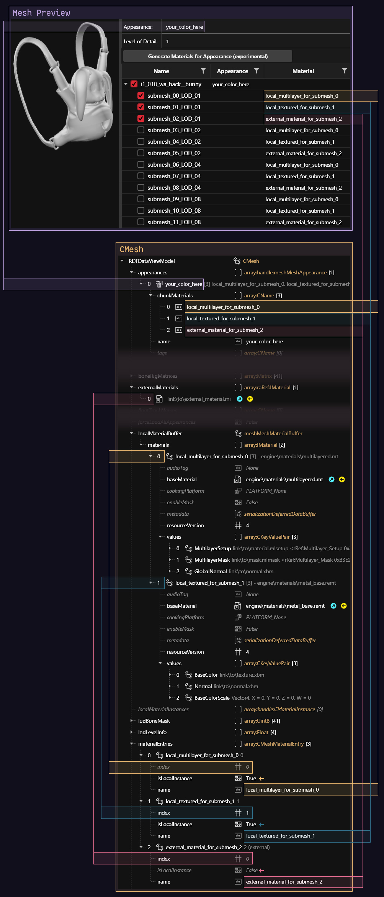

# 3d objects: .mesh files

## Summary

**Published:** ??? by [manavortex](https://app.gitbook.com/u/NfZBoxGegfUqB33J9HXuCs6PVaC3 "mention")\
**Last documented edit:** March 24 2024 by [yellingintothevoid](https://www.nexusmods.com/users/127630298?tab=user+files)

This page contains information on `.mesh` files and their properties.

### Wait, that's not what I want!

* See [wkit-blender-plugin-import-export.md](../../modding-tools/wolvenkit-blender-io-suite/wkit-blender-plugin-import-export.md "mention") -> [#meshes](../../modding-tools/wolvenkit-blender-io-suite/wkit-blender-plugin-import-export.md#meshes "mention") for a guide on export/import
* To edit a mesh's appearance, check [changing-materials-colors-and-textures.md](../../modding-guides/items-equipment/editing-existing-items/changing-materials-colors-and-textures.md "mention")
* To learn about mesh materials, see [textured-items-and-cyberpunk-materials.md](../../modding-guides/everything-else/textured-items-and-cyberpunk-materials.md "mention")
* To hide parts of a mesh under different circumstances, check [first-person-perspective-fixes.md](../../modding-guides/items-equipment/first-person-perspective-fixes.md "mention")

## What's a mesh?

In the context of Cyberpunk, a mesh is the file that defines the topology[^1] and the materials[^2] of an object in the game world.

A mesh can have several **submeshes**, each of which has own material assignments. You can learn more about this on the sub-page for [submeshes-materials-and-chunks.md](submeshes-materials-and-chunks.md "mention").

Mesh files for inanimate objects also tend to contain extensive physics parameters governing their physical weight and general behavior.

## How the mesh is loaded

Meshes are loaded via [components](../components/ "mention") (e.g. [#entgarmentskinnedmeshcomponent](../components/documented-components/#entgarmentskinnedmeshcomponent "mention")).  Components are defined either in [mesh entity](../entity-.ent-files/#mesh-component-entity-simple-entity) files or in an [.app file](../appearance-.app-files/), where each [appearance](../appearance-.app-files/#appearances) has its own [components](../appearance-.app-files/#components) array.

For more information on this, please check [submeshes-materials-and-chunks.md](submeshes-materials-and-chunks.md "mention") -> [#chunkmasks-partially-hiding-meshes](submeshes-materials-and-chunks.md#chunkmasks-partially-hiding-meshes "mention")

## Shadows

There are two ways of adding shadows to  meshes:&#x20;

### Component property

To make a mesh cast a real-time shadow, set the component's property `castShadows` to `Always`.


Depending on your geometry, this can impact performance.


### Shadow mesh

Many meshes have dedicated shadow meshes, which have a much lower level of detail and will be hidden by default. You can open any clothing item's mesh entity to see this in action.

## Mesh Preview

You can see which submesh is which in the `Mesh Preview` tab after opening the mesh file:

<figure><figcaption></figcaption></figure>

With the boxes on the left, you can toggle submeshes on and off.&#x20;


Submesh numbers correspond directly to a component's [#chunkmask](../components/#chunkmask "mention") property. For technical reasons, the chunkmask dropdown supports up to 64 entries — just ignore the missing numbers.


## Material assignment

This section describes how materials are assigned inside each mesh. To learn more about submeshes and chunkmasks, check [submeshes-materials-and-chunks.md](submeshes-materials-and-chunks.md "mention").

This page only contains mesh-specific information. Find more details on materials under [materials](../../materials/ "mention").

### Appearances

The way a 3D object looks in-game is defined by `appearances` within the `.mesh` file. These appearances are split up by the submeshes of said 3D object (explained above). Each submesh gets assigned a `chunkMaterial` with an arbitrary name. This arbitrary name in turn is defined in the `materialEntries` within the `.mesh` file. All `materialEntries` contain a property called `isLocalInstance` which decides which buffer the actual material is loaded from. If `isLocalInstance` is set to `True`, the material index points to `localMaterialBuffer` or `preloadLocalMaterialInstances`. If it is set to `False`, the material index points to `externalMaterials` or `preloadExternalMaterials`. To simplify, here's a little chart:

| `isLocalInstance: True` | `isLocalInstance: False` |
| --- | --- |
| `localMaterialBuffer` | `externalMaterials` |
| `preloadLocalMaterialInstances` | `preloadExternalMaterials` |

`localMaterialBuffer` and `preloadLocalMaterialInstances` are used interchangeably and everything explained about the `localMaterialBuffer` also applies to `preloadLocalMaterialInstances`. More on `externalMaterials` later.

The `localMaterialBuffer` contains the actual make up, the recipe if you will, of the material itself. `materials` within the `localMaterialBuffer` can either be textured materials, or multilayered materials. A textured material is a standard PBR shader that uses `engine\materials\metal_base.remt` as `baseMaterial`. Multilayered materials expand on PBR shaders by layering them. Multilayered materials use `engine\materials\multilayered.mt` as `baseMaterial` and contain a `GlobalNormal`, a `MultilayerMask`, and a `MultilayerSetup`. How these work exactly can be found in [this tutorial](../materials/multilayered).

Next to `localMaterialBuffer` there are also `externalMaterials`. These forgo storing properties on how the material is rendered inside the `.mesh` by storing them in a `.mi` file. This is a neat shortcut if you want to prevent having to adjust the same properties across lots of `appearances`. However, mixing local and external materials means you have to pay close attention to which material buffer you are using. See the chart above for reference. More info on `.mi` files and how the shortcut works exactly can be found [here](../re-using-materials-.mi.md#.mi-files-to-the-rescue).

All of this sounds very complicated in theory but becomes much, much clearer once seen in action:

<figure><figcaption>


You can find a guide about [texture editing](../../modding-guides/items-equipment/editing-existing-items/changing-materials-colors-and-textures.md) and [adding custom textures](../../modding-guides/items-equipment/editing-existing-items/changing-materials-colors-and-textures.md#step-4-optional-custompathing) in the [modding-guides](../../modding-guides/ "mention") section.

For an overview of materials that you might want to use for something, check [here](../../references-lists-and-overviews/cheat-sheet-materials.md).&#x20;

For how to find out which properties a material has, check [here](../../materials/#checking-material-properties).


[^1]: vertices, edges – everything that makes up the 3d object's surface information

[^2]: the surface shader and its properties
