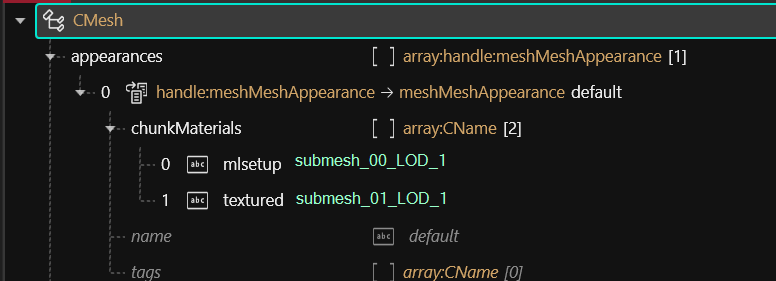
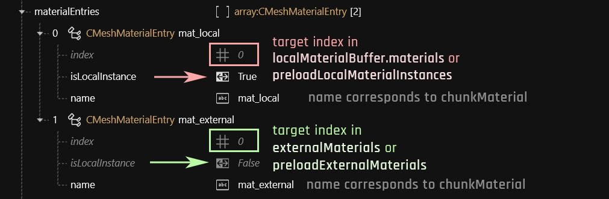
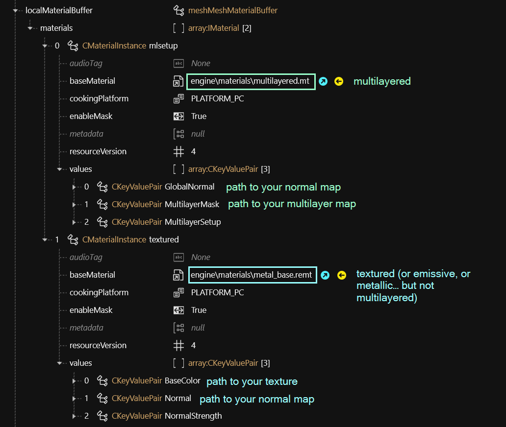

# 3d objects: .mesh files

This page contains information on .mesh files and their properties.

* If you want to export or import mesh files, see [here](../3d-modelling/exporting-and-importing-meshes/).
* If you want to learn how to edit a mesh's appearance, check [this guide.](../modding-guides/items-equipment/editing-existing-items/changing-materials-colors-and-textures.md)
* If you want to mess with a .mesh's materials, see [here](../modding-guides/everything-else/textured-items-and-cyberpunk-materials.md).
* A mesh file's shadow is defined in via .[component](components/#entgarmentskinnedmeshcomponent)


In the context of Cyberpunk, a mesh is the file that defines the topology[^1] and the materials[^2] of an object in the game world.

A mesh can have several **submeshes**, each of which has own material assignments.


## Material assignment

### Step 1: Appearances


This page only contains mesh-specific information. Find more details on materials, check [here](3d-objects-.mesh-files.md#materials).&#x20;


This is how to determine which parts of the mesh have which material:

<figure><figcaption>
Example: A mesh with two materials, one of them a local instance, one of them an external .mi file
</figcaption></figure>

### ChunkMaterials

You assign materials based on the "chunks" (the individual submeshes) inside a mesh. Open the mesh file in Wolvenkit and open the "appearances" array, then make sure that each of your submeshes has an entry inside the array.

<figure><figcaption>
You may have to create additional entries in "chunkMaterials": Either duplicate an existing entry from the right-click menu, or select the array and use the yellow (+) in the side panel.
</figcaption></figure>

### Material definition

Materials are defined in the array **`materialEntries`** inside your mesh:

<figure><figcaption>
For a detailed example, see <a href="../materials/re-using-materials-.mi.md#maximally-lazy-external-materials">re-using materials</a>
</figcaption></figure>

If you do not, then the materials outside of `preload`… will appear as transparent the first 1-2 times you trigger your item's appearance.

<table><thead><tr><th width="202">Property</th><th>Description</th></tr></thead><tbody><tr><td>index</td><td><strong>numerical index</strong> of corresponding material in target list (as defined by <code>isLocalInstance</code>)</td></tr><tr><td>isLocalInstance</td><td>Selects the material target list. <strong>True:</strong> <a href="3d-objects-.mesh-files.md#materialinstance-the-local-material">local material</a> in <code>localMaterialBuffer.materials</code> or <code>preloadLocalMaterialInstances</code> <strong>False:</strong> <a href="3d-objects-.mesh-files.md#material-reference-a-material-somewhere-else">material reference</a> in<code>externalMaterials</code> or <code>preloadExternalMaterials</code>  For more information on this, see the page for <a href="../materials/re-using-materials-.mi.md#maximally-lazy-external-materials">local/external materials</a>.</td></tr><tr><td>name</td><td><strong>unique</strong> name of material, used to select the material via <code>chunkMaterial</code></td></tr></tbody></table>

#### Preload… what?

Many of CDPR's early meshes use `preloadLocalMaterialInstances` instead of `localMaterialBuffer.materials`. As far as we are concerned, you can use the two interchangeably, **but**:&#x20;

If you are using **a mix of local and external materials**, you **must** use the corresponding list:

| local                           | external                   |
| ------------------------------- | -------------------------- |
| `localMaterialBuffer.materials` | `externalMaterials`        |
| `preloadLocalMaterialInstances` | `preloadExternalMaterials` |

### Step 3: Material definition

A material definition can be in a `CMaterialInstance` inside the mesh or in a [`.mi` file](../materials/re-using-materials-.mi.md) in the project. For local materials, Wolvenkit will display material names as defined in the `materialEntries`.

For more details on material definitions, [check here](../materials/).

### MaterialInstance: The local material

The materials themselves are inside the array `localMaterialBuffer.materials` (or `preloadLocalMaterials` in case of older meshes).&#x20;


You can't go wrong by using those. However, if you don't have any properties that are unique to your mesh or appearance (for example a custom normal map), you might consider [creating and using an external material instead](../materials/re-using-materials-.mi.md).


A material instance looks like this:

<figure><figcaption>
baseMaterial picks the material (shader), while "values" contains <a href="3d-objects-.mesh-files.md#checking-material-properties">properties</a> to adjust it.
</figcaption></figure>


For an overview of materials that you might want to use for something, check [here](../references-lists-and-overviews/cheat-sheet-materials.md).&#x20;

For how to find out which properties a material has, check [here](../materials/#checking-material-properties).


### Material reference: [reusing materials](../materials/re-using-materials-.mi.md#maximally-lazy-external-materials)

A relative path to an external material, usually encapsulated in a [.mi file](../materials/re-using-materials-.mi.md#.mi-files-to-the-rescue). Use this if you don't need to add extra properties.

[^1]: vertices, edges – everything that makes up the 3d object's surface information

[^2]: the surface shader and its properties
