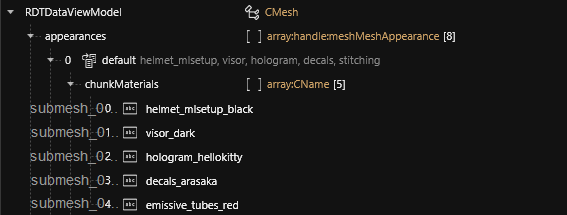
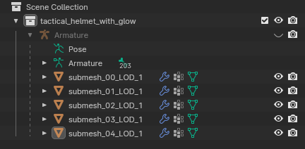

# Submeshes, Materials and Chunks

#### Summary

Published: January 06 2024 by [manavortex](https://app.gitbook.com/u/NfZBoxGegfUqB33J9HXuCs6PVaC3 "mention")

## Why are submeshes?

In Cyberpunk, you can assign **one material per submesh**.&#x20;


Material assignment is done in the .mesh file's [`appearances`](./#step-1-appearances) array via [chunkMaterials](./#chunkmaterials).&#x20;

The chunkMaterial entries correspond to [material entry](./#material-entry) names.

You can see which submesh is wich in the [#mesh-preview](./#mesh-preview "mention") tab.


At first, this seems a bit counter-intuitive, but keep in mind that Cyberpunk's entire material system is geared for **flexibility**. By altering **a single submesh material**, a black Arasaka helmet with red lights and a Hello Kitty hologram can become a black Militech helmet with red lights and a Hello Kitty hologram!

<figure><figcaption></figcaption></figure>

To learn how materials work, check the parent page: [.](./ "mention")

Example: the more detailed explanation

Our fictional helmet appearance uses the materials `helmet_mlsetup_black`, `visor_dark`, `hologram_hellokitty`, `decals_arasaka` and `emissive_tubes_red`. There are at least three more materials / variants defined for every possible slot, but the default appearance is a black helmet with red lights, Arasaka decals, and a Hello Kitty face projected on its black visor. Or in short: major-league professional tactical gear.

**Submesh 0** is the main body of the helmet. It uses a multilayered material (something incredibly cool and tech-y, no doubt). The default helmet is black, but by re-using the same [.mlmask](../../materials/multilayered/#what-is-the-mlmask), different colour schemes can easily be created with different [.mlsetup](../../materials/multilayered/#what-is-the-mlsetup)s.

**Submesh 1** is the visor. It uses a glass shader. There's also a transparent version, but this appearance isn't using it.

**Submesh 2** is a decal — a hologram projected on the visor. This one uses hello\_kitty. Alternative appearances use Venom and Pacman. (Or whatever else you can dream of)

**Submesh 3** are the regular decals - for this appearance, Arasaka style.&#x20;

**Submesh 4** are emissive tubes — they come in red, white, and blue.

## Submeshes in Blender

In Blender, our helmet would look like this:

<figure><figcaption></figcaption></figure>

You can create more submeshes by splitting off parts of a mesh, and incrementing the submesh index.&#x20;

#### Example:

You want red and blue glowing tubes on the example helmet.

1. [Split](../../modding-guides/everything-else/textured-items-and-cyberpunk-materials.md#splitting-off-submeshes-mildly-advanced) parts of `submesh_04_LOD_1` into `submesh_04_LOD_1.001`
2. Re-name `submesh_04_LOD_1.001` to `submesh_05_LOD_1`
3. [Export](../../modding-tools/wolvenkit-blender-io-suite/wkit-blender-plugin-import-export.md#exporting-from-blender) the new geometry and import it into Wolvenkit
4. Your mesh will now have **six** submeshes instead of its previous **five**
5. For each **appearance** that you have defined, add a chunkMaterial entry. \
   _If you skip this step, the new submesh will have no material assigned, and be invisible._

## Chunkmasks: partially hiding meshes

Imagine you want to hide the helmet's glowing parts (because you are being stealthy). You could just define another appearance where the glowing tubes are turned off — but you would have to add one for every variant you make. `arasaka_hellokitty_glow` and `arasaka_hellokitty_noglow`, the same for Militech, NightCorps and NCPD… ain't nobody got time for this.

That's why CDPR came up with **chunkmasks**.

The mesh is loaded via [**component**](../components/) in an [.ent](../entity-.ent-files/#mesh-component-entity-simple-entity) or [.app](../appearance-.app-files.md#components) file. Here, you will find the `chunkMask` attribute, which looks like this:

<figure><figcaption>
Set this to 0 to completely hide all parts of a mesh.
</figcaption></figure>

The numbers in the dropdown correspond to the submeshes: unchecking an entry will **hide** it, **regardless of the assigned materials**.


You can only use chunkMasks to **hide** submeshes. If you want to conditionally **show** them, you have to use custom ArchiveXL tags (see [archivexl-tags.md](../../core-mods-explained/archivexl/archivexl-tags.md "mention") -> [#adding-custom-tags](../../core-mods-explained/archivexl/archivexl-tags.md#adding-custom-tags "mention"))

