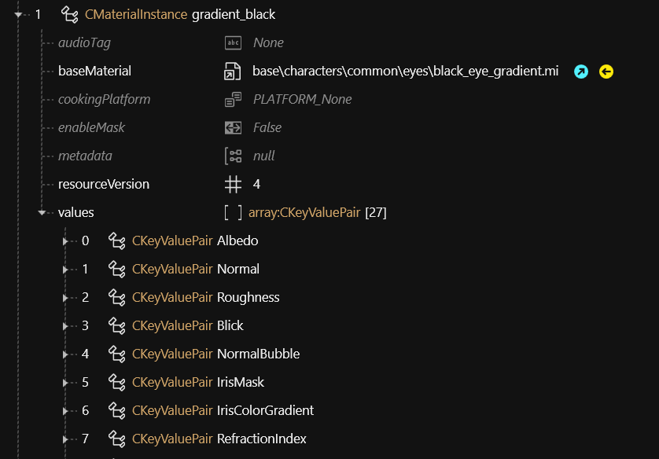

# 📂 Files and what they do

**Created by @manavortex**\
**Published April 10 2023**\
**Game version: 1.6.1\_DLSS**


For an exhaustive list, see the [W2RC File Format Table.](./#w2rc-file-format-table)


## .app (Appearance definition)

This file contains a list of appearances with their associated **components**. To load them, you require a [root entity](./#root-entity) .ent.


[appearance-.app-files.md](appearance-.app-files.md)


Holds a list of components.

## .ent (Entity)

### Root entity

The **entry point** for the game to display an [NPC](../modding-guides/npcs/appearances-change-the-looks.md#the-.ent-file) or [prop](../modding-guides/everything-else/custom-props.md). This kind of entity usually doesn't have components by itself, but only points towards the [.app file](./#.app-appearance-definition) where they are defined.&#x20;

From ArchiveXL item additions, this kind of file is usually called a **root entity**.

### Mesh entity / Component entity

**For player items**, an .ent file can serve as a **wrapper**, splitting components out of the .app file by putting them in their own file.


[entity-.ent-files](entity-.ent-files/)


## Components

Not a file type but an internal data structure and part of [.ent](./#.ent-entity) or [.app](./#.app-appearance-definition) files. Components are how the game adds anything to the in-game world, from pag3d data over player interaction prompts to explosion sounds.


[components](components/)


## .inkatlas (Texture mapping)

## .mesh (3d object)

A 3d object, holding [appearances](../modding-guides/npcs/appearances-change-the-looks.md), [materials](../materials/), and [rigging](../3d-modelling/meshes-and-armatures-rigging.md).&#x20;

A mesh can have several **submeshes**, which can be displayed or hidden via [chunkmasks](../modding-guides/items-equipment/influencing-other-items.md#partsoverrides).&#x20;

## .mi / .mt / .remt

A material definition for a shader. You can assign those to **CMaterialInstance** entries in your mesh and then define their qualities by changing their parameters.&#x20;


For further detes on materials, see [here](../materials/). \
For an explanation on .mi files, see [here](../materials/re-using-materials-.mi.md).


### Relevant properties:&#x20;

|                                                                       |                                                                                          |
| --------------------------------------------------------------------- | ---------------------------------------------------------------------------------------- |
| Different per material — see parameters/\[2] for a list of properties | 
e.g. BaseColor, Metalness, NormalStrength or VectorField, FresnelColor, Albedo
 |
|                                                                       |                                                                                          |

<figure><figcaption></figcaption></figure>

## .streaingsector (world data

This file holds world environment information and -properties. Due to its complexity, information is grouped on its sub-page.&#x20;


[the-whole-world-.streamingsector.md](the-whole-world-.streamingsector.md)


## .xbm (Texture)

A regular texture file. Can be exported to .png via WolvenKit, edited, and imported back into the game.&#x20;


If you stick to the game's naming schema, Wolvenkit will auto-detect the right import settings for you.


### Normal maps

Can be either blue or yellow (inverted), both exists. For a guide how to make your own, see [here](../3d-modelling/self-made-normal-maps/).&#x20;

Cyberpunk normal maps are swizzled (a technique originally employed in DTX-5).&#x20;

* The red channel stores the X axis
* The green channel stores the Y axis
* The blue channel is empty, since the Z-data will be calculated from red and blue.&#x20;

### Relevant properties:&#x20;

|         |                                                                                                                                              |
| ------- | -------------------------------------------------------------------------------------------------------------------------------------------- |
| IsGamma | 
Override in-game gamma (lighting)?   - Set to "false" for normals - Set to "true" for diffuse/albedo and any parts of the UI
 |
|         |                                                                                                                                              |

##

## W2RC File Format Table

| Extension                                                                                                               |                 Description                | Fully Parsed |
| ----------------------------------------------------------------------------------------------------------------------- | :----------------------------------------: | :----------: |
| [actionanimdb](https://github.com/DoctorPresto/Cyberpunk-File-Types/blob/main/actionanimdb.txt)                         |                  Animation                 |              |
| [acousticdata](https://github.com/DoctorPresto/Cyberpunk-File-Types/blob/main/acousticdata.txt)                         |                    Audio                   |              |
| [aiarch](https://github.com/DoctorPresto/Cyberpunk-File-Types/blob/main/aiarch.txt)                                     |               Pathfinding/AI               |              |
| [animgraph](https://github.com/DoctorPresto/Cyberpunk-File-Types/blob/main/animgraph.txt)                               |               Animation graph              |              |
| [anims](https://github.com/DoctorPresto/Cyberpunk-File-Types/blob/main/anims.txt)                                       |               Animation data               |              |
| [app](https://github.com/DoctorPresto/Cyberpunk-File-Types/blob/main/app.txt)                                           |       Mesh appearance configurations       |              |
| [archetypes](https://github.com/DoctorPresto/Cyberpunk-File-Types/blob/main/archetypes.txt)                             |                      ?                     |              |
| [areas](https://github.com/DoctorPresto/Cyberpunk-File-Types/blob/main/areas.txt)                                       |               Terrain related              |              |
| [audio\_metadata](https://github.com/DoctorPresto/Cyberpunk-File-Types/blob/main/audio\_metadata.txt)                   |                      ?                     |              |
| [audiovehcurveset](https://github.com/DoctorPresto/Cyberpunk-File-Types/blob/main/audiovehcurveset.txt)                 |                      ?                     |              |
| [behavior](https://github.com/DoctorPresto/Cyberpunk-File-Types/blob/main/behavior.txt)                                 |                      ?                     |              |
| [bikecurveset](https://github.com/DoctorPresto/Cyberpunk-File-Types/blob/main/bikecurveset.txt)                         |                      ?                     |              |
| [bk2](https://github.com/DoctorPresto/Cyberpunk-File-Types/blob/main/bk2.txt)                                           |                 Bink video                 |              |
| [bnk](https://github.com/DoctorPresto/Cyberpunk-File-Types/blob/main/bnk.txt)                                           |                 Bink video                 |              |
| [camcurveset](https://github.com/DoctorPresto/Cyberpunk-File-Types/blob/main/camcurveset.txt)                           |             Camera curve preset            |              |
| [cfoliage](https://github.com/DoctorPresto/Cyberpunk-File-Types/blob/main/cfoliage.txt)                                 |                      ?                     |              |
| [charcustpreset](https://github.com/DoctorPresto/Cyberpunk-File-Types/blob/main/charcustpreset.txt)                     |           Character editor preset          |              |
| [cminimap](https://github.com/DoctorPresto/Cyberpunk-File-Types/blob/main/cminimap.txt)                                 |                   Minimap                  |              |
| [community](https://github.com/DoctorPresto/Cyberpunk-File-Types/blob/main/community.txt)                               |                Quest related               |              |
| [conversations](https://github.com/DoctorPresto/Cyberpunk-File-Types/blob/main/conversations.txt)                       |              Cutscene related              |              |
| [cooked\_mlsetup](https://github.com/DoctorPresto/Cyberpunk-File-Types/blob/main/cooked\_mlsetup.txt)                   |                 See mlsetup                |              |
| [cooked\_anims](https://github.com/DoctorPresto/Cyberpunk-File-Types/blob/main/cookedanims.txt)                         |                  See anims                 |              |
| [cookedapp](https://github.com/DoctorPresto/Cyberpunk-File-Types/blob/main/cookedapp.txt)                               |                   See app                  |              |
| [credits](https://github.com/DoctorPresto/Cyberpunk-File-Types/blob/main/credits.txt)                                   |          Configuration for credits         |              |
| [cubemap](https://github.com/DoctorPresto/Cyberpunk-File-Types/blob/main/cubemap.txt)                                   |            6-sided cube texture            |              |
| [curveset](https://github.com/DoctorPresto/Cyberpunk-File-Types/blob/main/curveset.txt)                                 |                      ?                     |              |
| [devices](https://github.com/DoctorPresto/Cyberpunk-File-Types/blob/main/devices.txt)                                   |                      ?                     |              |
| [dtex](https://github.com/DoctorPresto/Cyberpunk-File-Types/blob/main/dtex.txt)                                         |                      ?                     |              |
| [effect](https://github.com/DoctorPresto/Cyberpunk-File-Types/blob/main/effect.txt)                                     |                      ?                     |              |
| [ent](https://github.com/DoctorPresto/Cyberpunk-File-Types/blob/main/ent.txt)                                           |                   Entity                   |              |
| [env](https://github.com/DoctorPresto/Cyberpunk-File-Types/blob/main/env.txt)                                           |           Environment definition           |              |
| [envparam](https://github.com/DoctorPresto/Cyberpunk-File-Types/blob/main/envparam.txt)                                 |                      ?                     |              |
| [envprobe](https://github.com/DoctorPresto/Cyberpunk-File-Types/blob/main/envprobe.txt)                                 |                      ?                     |              |
| [es](https://github.com/DoctorPresto/Cyberpunk-File-Types/blob/main/es.txt)                                             |                      ?                     |              |
| [facialcustom](https://github.com/DoctorPresto/Cyberpunk-File-Types/blob/main/facialcustom.txt)                         |                      ?                     |              |
| [facialsetup](https://github.com/DoctorPresto/Cyberpunk-File-Types/blob/main/facialsetup.txt)                           |                      ?                     |              |
| [fb2tl](https://github.com/DoctorPresto/Cyberpunk-File-Types/blob/main/fb2tl.txt)                                       |                      ?                     |              |
| [fnt](https://github.com/DoctorPresto/Cyberpunk-File-Types/blob/main/fnt.txt)                                           |                    Font                    |              |
| [folbrush](https://github.com/DoctorPresto/Cyberpunk-File-Types/blob/main/folbrush.txt)                                 |                Foliage brush               |              |
| [foldest](https://github.com/DoctorPresto/Cyberpunk-File-Types/blob/main/foldest.txt)                                   |        Destructible foliage element        |              |
| [fp](https://github.com/DoctorPresto/Cyberpunk-File-Types/blob/main/fp.txt)                                             |                      ?                     |              |
| [gamedef](https://github.com/DoctorPresto/Cyberpunk-File-Types/blob/main/gamedef.txt)                                   |        Game main configuration file        |              |
| [garmentlayerparams](https://github.com/DoctorPresto/Cyberpunk-File-Types/blob/main/garmentlayerparams.txt)             |                      ?                     |              |
| [genericanimdb](https://github.com/DoctorPresto/Cyberpunk-File-Types/blob/main/genericanimdb.txt)                       |                      ?                     |              |
| [gidata](https://github.com/DoctorPresto/Cyberpunk-File-Types/blob/main/gidata.txt)                                     |                      ?                     |              |
| [gradient](https://github.com/DoctorPresto/Cyberpunk-File-Types/blob/main/gradient.txt)                                 |                      ?                     |              |
| [hitrepresentation](https://github.com/DoctorPresto/Cyberpunk-File-Types/blob/main/hitrepresentation.txt)               |                      ?                     |              |
| [hp](https://github.com/DoctorPresto/Cyberpunk-File-Types/blob/main/hp.txt)                                             |                Hair profile                |              |
| [ies](https://github.com/DoctorPresto/Cyberpunk-File-Types/blob/main/ies.txt)                                           |                      ?                     |              |
| [inkanim](https://github.com/DoctorPresto/Cyberpunk-File-Types/blob/main/inkanim.txt)                                   |                UI animation                |              |
| [inkatlas](https://github.com/DoctorPresto/Cyberpunk-File-Types/blob/main/inkatlas.txt)                                 |              UI texture atlas              |              |
| [inkcharcustomization](https://github.com/DoctorPresto/Cyberpunk-File-Types/blob/main/inkcharcustomization.txt)         |            UI character related            |              |
| [inkfontfamily](https://github.com/DoctorPresto/Cyberpunk-File-Types/blob/main/inkfontfamily.txt)                       |                   UI font                  |              |
| [inkfullscreencomposition](https://github.com/DoctorPresto/Cyberpunk-File-Types/blob/main/inkfullscreencomposition.txt) |                     UI                     |              |
| [inkgamesettings](https://github.com/DoctorPresto/Cyberpunk-File-Types/blob/main/inkgamesettings.txt)                   |                 UI settings                |              |
| [inkhud](https://github.com/DoctorPresto/Cyberpunk-File-Types/blob/main/inkhud.txt)                                     |                     UI                     |              |
| [inklayers](https://github.com/DoctorPresto/Cyberpunk-File-Types/blob/main/inklayers.txt)                               |                     UI                     |              |
| [inkmenu](https://github.com/DoctorPresto/Cyberpunk-File-Types/blob/main/inkmenu.txt)                                   |                     UI                     |              |
| [inkshapecollection](https://github.com/DoctorPresto/Cyberpunk-File-Types/blob/main/inkshapecollection.txt)             |                     UI                     |              |
| [inkstyle](https://github.com/DoctorPresto/Cyberpunk-File-Types/blob/main/inkstyle.txt)                                 |                     UI                     |              |
| [inktypography](https://github.com/DoctorPresto/Cyberpunk-File-Types/blob/main/inktypography.txt)                       |                     UI                     |              |
| [inkwidget](https://github.com/DoctorPresto/Cyberpunk-File-Types/blob/main/inkwidget.txt)                               |                     UI                     |              |
| [interaction](https://github.com/DoctorPresto/Cyberpunk-File-Types/blob/main/interaction.txt)                           |                     UI                     |              |
| [journal](https://github.com/DoctorPresto/Cyberpunk-File-Types/blob/main/journal.txt)                                   |                 Quest info                 |              |
| [journaldesc](https://github.com/DoctorPresto/Cyberpunk-File-Types/blob/main/journaldesc.txt)                           |                 Quest info                 |              |
| [lane\_connections](https://github.com/DoctorPresto/Cyberpunk-File-Types/blob/main/lane\_connections.txt)               |                      ?                     |              |
| [lane\_polygons](https://github.com/DoctorPresto/Cyberpunk-File-Types/blob/main/lane\_connections.txt)                  |                      ?                     |              |
| [lane\_spots](https://github.com/DoctorPresto/Cyberpunk-File-Types/blob/main/lane\_spots.txt)                           |                      ?                     |              |
| [lights](https://github.com/DoctorPresto/Cyberpunk-File-Types/blob/main/lights.txt)                                     |                      ?                     |              |
| [lipmap](https://github.com/DoctorPresto/Cyberpunk-File-Types/blob/main/lipmap.txt)                                     |                      ?                     |              |
| [location](https://github.com/DoctorPresto/Cyberpunk-File-Types/blob/main/location.txt)                                 |                      ?                     |              |
| [locopaths](https://github.com/DoctorPresto/Cyberpunk-File-Types/blob/main/locopaths.txt)                               |                      ?                     |              |
| [loot](https://github.com/DoctorPresto/Cyberpunk-File-Types/blob/main/loot.txt)                                         |                      ?                     |              |
| [mappins](https://github.com/DoctorPresto/Cyberpunk-File-Types/blob/main/mappins.txt)                                   |                 Pins on map                |              |
| [mesh](https://github.com/DoctorPresto/Cyberpunk-File-Types/blob/main/mesh.txt)                                         |                 Mesh/model                 |              |
| [mi](https://github.com/DoctorPresto/Cyberpunk-File-Types/blob/main/mi.txt)                                             |    Instanced external shaders/materials    |              |
| [mlmask](https://github.com/DoctorPresto/Cyberpunk-File-Types/blob/main/mlmask.txt)                                     |      Masks for multilayer supershader      |              |
| [mlsetup](https://github.com/DoctorPresto/Cyberpunk-File-Types/blob/main/mlmask.txt)                                    |    Setup file for multilayer supershader   |              |
| [mltemplate](https://github.com/DoctorPresto/Cyberpunk-File-Types/blob/main/mltemplate.txt)                             |  Template file for multilayer supershader  |              |
| [morphtarget](https://github.com/DoctorPresto/Cyberpunk-File-Types/blob/main/morphtarget.txt)                           |           Blend shapes/shape keys          |              |
| [mt](https://github.com/DoctorPresto/Cyberpunk-File-Types/blob/main/mt.txt)                                             |                 Base shader                |              |
| navmesh                                                                                                                 |            AI navigation meshes            |              |
| [null\_areas](https://github.com/DoctorPresto/Cyberpunk-File-Types/blob/main/null\_areas.txt)                           |                      ?                     |              |
| [opusinfo](https://github.com/DoctorPresto/Cyberpunk-File-Types/blob/main/opusinfo.txt)                                 |                    Audio                   |              |
| [opuspak](https://github.com/DoctorPresto/Cyberpunk-File-Types/blob/main/opuspak.txt)                                   |                    Audio                   |              |
| [particle](https://github.com/DoctorPresto/Cyberpunk-File-Types/blob/main/particle.txt)                                 |                  Particles                 |              |
| [phys](https://github.com/DoctorPresto/Cyberpunk-File-Types/blob/main/phys.txt)                                         |            Nvidia PhysX related            |              |
| [physicalscene](https://github.com/DoctorPresto/Cyberpunk-File-Types/blob/main/physicalscene.txt)                       |            Nvidia PhysX related            |              |
| [physmatlib](https://github.com/DoctorPresto/Cyberpunk-File-Types/blob/main/physmatlib.txt)                             |            Nvidia PhysX related            |              |
| [poimappins](https://github.com/DoctorPresto/Cyberpunk-File-Types/blob/main/poimappins.txt)                             |          Point of Interest Map pin         |              |
| [psrep](https://github.com/DoctorPresto/Cyberpunk-File-Types/blob/main/psrep.txt)                                       |                      ?                     |              |
| [quest](https://github.com/DoctorPresto/Cyberpunk-File-Types/blob/main/quest.txt)                                       |                    Quest                   |              |
| [questphase](https://github.com/DoctorPresto/Cyberpunk-File-Types/blob/main/questphase.txt)                             |              Quest progression             |              |
| regionset                                                                                                               |                      ?                     |              |
| [remt](https://github.com/DoctorPresto/Cyberpunk-File-Types/blob/main/remt.txt)                                         |  Similar to **mt**, difference is unclear  |              |
| [reslist](https://github.com/DoctorPresto/Cyberpunk-File-Types/blob/main/reslist.txt)                                   |                Resource list               |              |
| [rig](https://github.com/DoctorPresto/Cyberpunk-File-Types/blob/main/rig.txt)                                           |         Rig/skeleton for animation         |              |
| [scene](https://github.com/DoctorPresto/Cyberpunk-File-Types/blob/main/scene.txt)                                       |                  Cutscene                  |              |
| [scenesversions](https://github.com/DoctorPresto/Cyberpunk-File-Types/blob/main/scenesversions.txt)                     |             Cutscene versioning            |              |
| [smartobject](https://github.com/DoctorPresto/Cyberpunk-File-Types/blob/main/smartobject.txt)                           |                      ?                     |              |
| [smartobjects](https://github.com/DoctorPresto/Cyberpunk-File-Types/blob/main/smartobjects.txt)                         |                      ?                     |              |
| [sp](https://github.com/DoctorPresto/Cyberpunk-File-Types/blob/main/sp.txt)                                             |                Skin profile                |              |
| [spatial\_representation](https://github.com/DoctorPresto/Cyberpunk-File-Types/blob/main/spatial\_representation.txt)   |                      ?                     |              |
| [streamingquerydata](https://github.com/DoctorPresto/Cyberpunk-File-Types/blob/main/streamingquerydata.txt)             |                   Terrain                  |              |
| [streamingsector](https://github.com/DoctorPresto/Cyberpunk-File-Types/blob/main/streamingsector.txt)                   |       The world in manageable pieces       |              |
| [streamingsector\_inplace](https://github.com/DoctorPresto/Cyberpunk-File-Types/blob/main/streamingsector\_inplace.txt) |                   Terrain                  |              |
| [streamingworld](https://github.com/DoctorPresto/Cyberpunk-File-Types/blob/main/streamingworld.txt)                     |            Links all the sectors           |              |
| [terrainsetup](https://github.com/DoctorPresto/Cyberpunk-File-Types/blob/main/terrainsetup.txt)                         |                   Terrain                  |              |
| [texarray](https://github.com/DoctorPresto/Cyberpunk-File-Types/blob/main/texarray.txt)                                 |              Multiple textures             |              |
| [traffic\_collisions](https://github.com/DoctorPresto/Cyberpunk-File-Types/blob/main/traffic\_collisions.txt)           |                      ?                     |              |
| [traffic\_persistent](https://github.com/DoctorPresto/Cyberpunk-File-Types/blob/main/traffic\_persistent.txt)           |                      ?                     |              |
| [voicetags](https://github.com/DoctorPresto/Cyberpunk-File-Types/blob/main/voicetags.txt)                               |                      ?                     |              |
| [w2mesh](https://github.com/DoctorPresto/Cyberpunk-File-Types/blob/main/w2mesh.txt)                                     | Leftover **mesh** file with RED3 extension |              |
| [w2mi](https://github.com/DoctorPresto/Cyberpunk-File-Types/blob/main/w2mi.txt)                                         |  Leftover **mi** file with RED3 extension  |              |
| [workspot](https://github.com/DoctorPresto/Cyberpunk-File-Types/blob/main/workspot.txt)                                 |                      ?                     |              |
| [xbm](https://github.com/DoctorPresto/Cyberpunk-File-Types/blob/main/xbm.txt)                                           |                   Texture                  |              |
| [xcube](https://github.com/DoctorPresto/Cyberpunk-File-Types/blob/main/xcube.txt)                                       |                   Texture                  |              |

## Generic Format

\<explanation>

### Generic FIle Format Table

| Extension                                                                     | Description       |
| ----------------------------------------------------------------------------- | ----------------- |
| [csv](https://github.com/DoctorPresto/Cyberpunk-File-Types/blob/main/csv.txt) | Standard CSV file |
| [wem](https://github.com/DoctorPresto/Cyberpunk-File-Types/blob/main/wem.txt) | Audio file        |

## Archive Format

#### File Structure

| Name        | Type/Size                   | Info                                                                    |
| ----------- | --------------------------- | ----------------------------------------------------------------------- |
| Header      | [Header](./#undefined)      | See [specification of Header](./#undefined) below.                      |
| Custom Data | [Custom Data](./#undefined) | WolvenKit only. See [specification of custom data](./#undefined) below. |
| Files       | data                        | Raw file data                                                           |
| File List   | [File List](./#undefined)   | See [specification of file list](./#undefined) below.                   |

#### Header

| Name             | Type/Size | Info                              |
| ---------------- | --------- | --------------------------------- |
| Magic            | char\[4]  | Constant: "RDAR"                  |
| Version          | uint32    | Currently 12                      |
| IndexPosition    | uint64    | Offset of beginning of file list  |
| IndexSize        | uint32    | Size of file list                 |
| DebugPosition    | uint64    | Always 0                          |
| DebugSize        | uint32    | Always 0                          |
| Filesize         | uint64    | Size of file (excluding Filesize) |
| CustomDataLength | uint32    | **WolvenKit only**                |

#### Custom Data (WolvenKit)

The following data only applies for archives created with WolvenKit

| Name        | Type/Size           | Info                      |
| ----------- | ------------------- | ------------------------- |
| Magic       | char\[4]            | Constant: "LXRS"          |
| Version     | uint32              | Currently 1               |
| Size        | int32               | Size of uncompressed data |
| ZSize       | int32               | Size of compressed data   |
| PathCount   | int32               | Number of custom paths    |
| PathStrings | zstring\[PathCount] | Custom file paths         |

#### File List

| Name                    | Type/Size                                       | Info                                                      |
| ----------------------- | ----------------------------------------------- | --------------------------------------------------------- |
| FileTableOffset         | uint32                                          | Always 8                                                  |
| FileTableSize           | uint32                                          |                                                           |
| CRC                     | uint64                                          | Checksum of ???                                           |
| FileEntryCount          | uint32                                          | Number of files                                           |
| FileSegmentCount        | uint32                                          | Number of file segments                                   |
| ResourceDependencyCount | uint32                                          | Number of resource dependencies                           |
| FileRecords             | [File Record](./#file-record)\[FileEntryCount]  | See [specification of file record](./#file-record) below. |
| FileSegments            | [File Segment](./#undefined)\[FileSegmentCount] | See [specification of file segment](./#undefined) below.  |
| ResourceDependencies    | uint64\[ResourceDependencyCount]                |                                                           |

#### File Record

| Name                      | Type/Size  | Info                                            |
| ------------------------- | ---------- | ----------------------------------------------- |
| NameHash64                | uint64     | FNV1A64 hash of the filename                    |
| Timestamp                 | int64      | Windows filetime of file creation               |
| NumInlineBufferSegments   | uint32     | Number of inline buffers                        |
| SegmentsStart             | uint32     | Index of the first [file segment](./#undefined) |
| SegmentsEnd               | uint32     | Index of the last [file segment](./#undefined)  |
| ResourceDependenciesStart | uint32     | Index of the first resource dependency          |
| ResourceDependenciesEnd   | uint32     | Index of the last resource dependency           |
| SHA1Hash                  | uint8\[20] | SHA1 hash of the file                           |

#### File Segment

| Name   | Type/Size | Info                      |
| ------ | --------- | ------------------------- |
| Offset | uint64    | Offset of the data        |
| ZSize  | uint32    | Size of compressed data   |
| Size   | uint32    | Size of uncompressed data |
