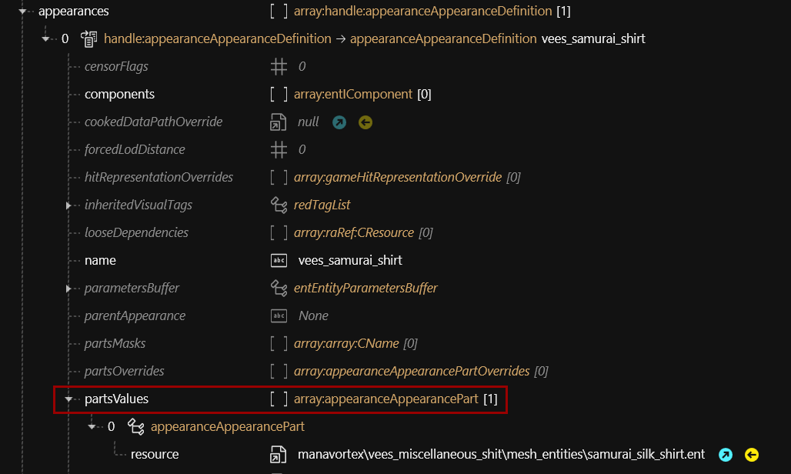

# Appearance: .app files


If you want to modify an .app file to change an NPC's appearance, check [here](../modding-guides/npcs/appearances-change-the-looks.md#the-.app-file)!


## Appearances

The real meat of the file: a list of appearance definitions, loaded via [root entity](entity-.ent-files/#root-entity).&#x20;

### components

A list of components that are part of your current appearance. There are various types of components,&#x20;


You can add components that will be included in every appearance to the root entity.


### partsValues


This only works for player equipment and weapons (April 2023)


Allows you to add one or more [component entities](entity-.ent-files/#mesh-component-entity-simple-entity) into your appearance. They will be treated as if the components were part of the appearance's `components` array.

<figure><figcaption></figcaption></figure>

### partsOverrides

Overrides component definitions via name. They can be defined in the appearance's own components array or loaded via [component entity](entity-.ent-files/#mesh-component-entity-simple-entity).&#x20;

For usage instructions, see [here](../modding-guides/items-equipment/influencing-other-items.md#partsoverrides).&#x20;

## commonCookData

To save a few processing cycles, CDPR doesn't evaluate .apps on load, but instead keeps a pre-cooked cache under `base\cookedappearances`. CommonCookData is the lookup path for such a file. As long as the file in question exists and isn't empty, your changes might not register, or components that you removed will still be displayed.

Once you start modding, you'll want to install the [cookedapps nulled](https://www.nexusmods.com/cyberpunk2077/mods/3051) mod to prevent such issues.&#x20;
