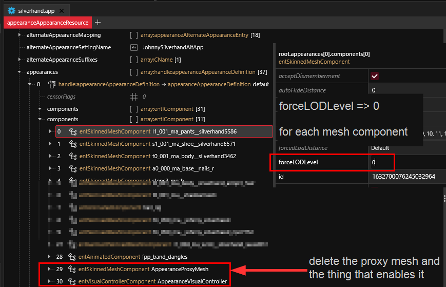

# Proxy Appearances

## Summary

**Published**: Mar 02 2024 by [manavortex](https://app.gitbook.com/u/NfZBoxGegfUqB33J9HXuCs6PVaC3 "mention")\
**Last documented update**: Mar 02 2024 by [manavortex](https://app.gitbook.com/u/NfZBoxGegfUqB33J9HXuCs6PVaC3 "mention")

This page explains what **Level of Detail** is and how it works.

### Wait, this is not what I want!

* To learn about [level-of-detail-lod.md](../level-of-detail-lod.md "mention"), check the corresponding wiki page.

## What is a proxy appearance?

When displaying a complex object, the game loads between 1 and e^x components, each of which includes extra logic. That's all fine and dandy as long as you're up-close — but as soon as you're far away and the details vanish in the distance, it's a complete and utter waste of processing power.

That is where proxy appearances come in: instead of all the complex components and the complex shaders, you will see a single mesh with a bunch of baked-in textures.&#x20;


All modern computergames do this in one way or another.

Fun fact: the human brain works the same way. Unless you have [aphantasia](https://en.wikipedia.org/wiki/Aphantasia), you can try it out: For an object at the edge of your vision, **imagine it** with as high-fidelity as you can. After a minute of that (your brain needs time to render), look at the object and compare.


## I hate it, how do I kill it?

If a proxy appearance fucks up your NPV, here's how you can disable it:

1. Open the appearance's [components array](./#components)
2. Find and delete the `AppearanceProxyMesh` component (it will be of the type `entSkinnedMeshComponent`)
3. Find and delete the `AppearanceVisualController` component (it will be of the type `AppearanceVisualControllerComponent`)
4. For each component with a mesh, set the `forceLodLevel` property to `0`

<figure><figcaption></figcaption></figure>
