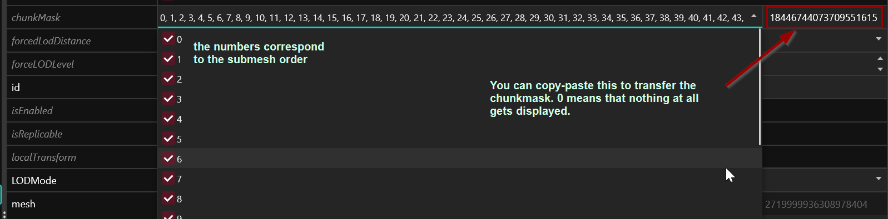

# Components


[documented-components.md](documented-components.md)



See the [Comprehensive Component Hierarchy List](comprehensive-components-list.md) for all possible components used in the game, organized by hierachy. Use for researching and documenting components.


Components are not a file type but an internal data structure and part of [.ent](./#.ent-entity) or [.app](./#.app-appearance-definition) files.&#x20;

Components are how the game adds anything to the in-game world, from pag3d data over player interaction prompts to explosion sounds.\
Entities and Appearances use **components** in order to slim down what data each game object has to carry, adding or removing them as needed.


In general, your components should have a **globally unique name** so you can target them via [partsOverrides](../../modding-guides/items-equipment/influencing-other-items.md#partsoverrides). Feel free to ignore this, almost everyone else does as well, but it is the reason behind the convoluted names of CDPR's components.


## Component Properties

A list of component properties with explanations.

#### chunkMask

Only used for [meshes](broken-reference): Determines which parts of a mesh will be displayed or hidden. Numeric indices correspond with the submeshes by index.

<figure><figcaption></figcaption></figure>

#### depotPath

Relative path to a resource within the game files. Used to load dependencies — meshes, rigs, animations, effects.

