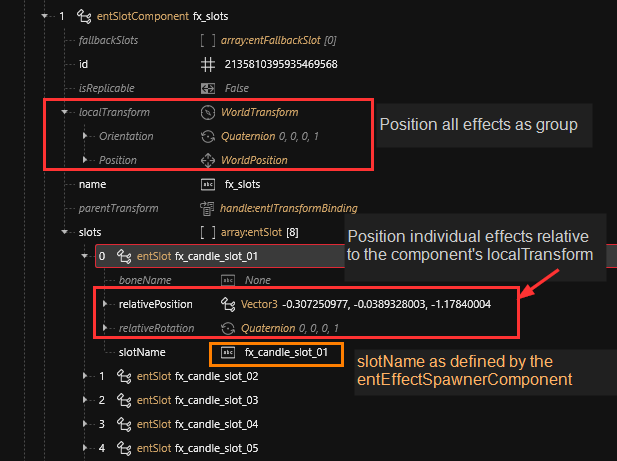
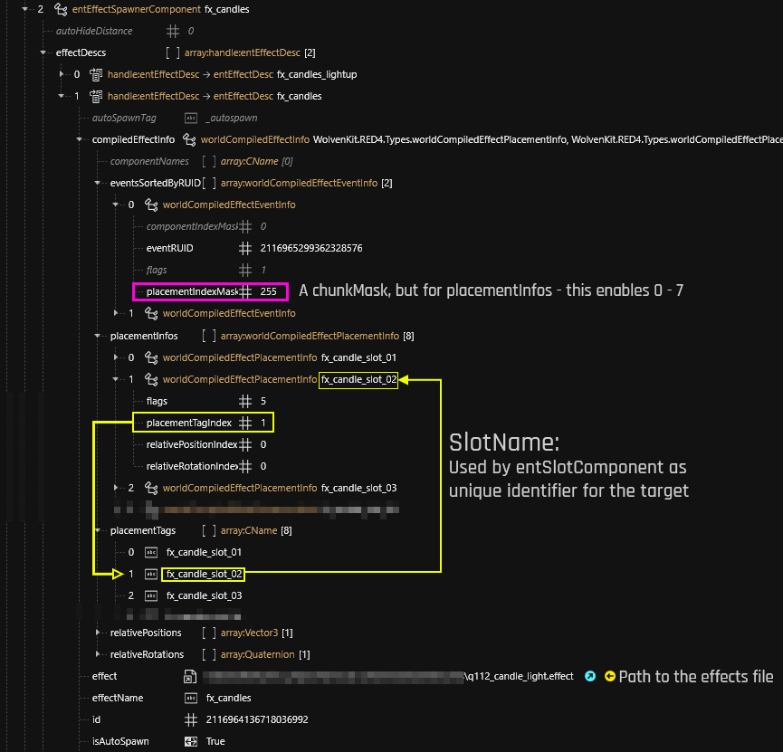

# Effect components

## Summary

Published: Feb 09 2024 by [manavortex](https://app.gitbook.com/u/NfZBoxGegfUqB33J9HXuCs6PVaC3 "mention")\
Last documented edit: Mar 4 2024 by [86maylin](https://app.gitbook.com/u/LhwshjuFJ4QwCwG11Ze4zIVyGqM2 "mention")

This page will tell you how effect components work and how they interact with each other.

### Wait, that's not what I want!

For an overview on existing effect materials, check [fx-material-properties.md](../../../materials/configuring-materials/fx-material-properties.md "mention")

For a guide on how to use effects, check [amm-light-components.md](../../../modding-guides/everything-else/custom-props/amm-light-components.md "mention")

## Effect component types

You will see two kinds of effect component types, which always occur in pairs.

### entSlotComponent

Usually called `fx_slots`, this component allows you to place your effects in the world. It requires the definitions in the [#enteffectspawnercomponent](effect-components.md#enteffectspawnercomponent "mention") to work.

<figure><figcaption></figcaption></figure>

If you want the position of your effects to follow the movement of parts of the object you can set the _`boneName`_ an existing bone of your object\

<figure><figcaption></figcaption></figure>

In this case the `relativePosition` will be relative to the bone's position

### entEffectSpawnerComponent

Usually called `fx_whateverTheEffectIs`, this component **defines** and **registers** effects which can then be placed via slots.&#x20;

<figure><figcaption></figcaption></figure>

## Adding and deleting effect slots

### Deletions

In the `entEffectSpawnerComponent`, delete:&#x20;

1. the `placementTag` entry that you want to get rid of
2. the corresponding entry in `placementInfos` (see the yellow arrows on the screenshot under [#enteffectspawnercomponent](effect-components.md#enteffectspawnercomponent "mention"))

In the `entSlotComponent`, delete:

1. The entry in `slots` referencing the previously deleted component by name.

### Additions

In the `entEffectSpawnerComponent`, add:&#x20;

1. a new `placementTag` at the end of the array with the name of your new entry (e.g. `fx_candle_slot_04`)
2. a new entry under `placementInfos` (by duplicating the last entry), setting the `placementTagIndex` to the numeric index of the `placementTag` you created in step 1

In the `entSlotComponent`, add:

1. a new entry in `slots` with the name that you created in Step 1

### **autoSpawnTag**

If you are making effects into equipment, having the same autoSpawnTag will make it so equipping one will despawn the other one.&#x20;

### eventRUID

eventRUID in the ent component must be the same as the effect particles ruid, and ideally should be unique across everything. You can right click on a RUID field and choose "Generate new CRUID" to generate a semi-random new CRUID and then copy it across so they match.&#x20;

<figure><figcaption>
Red square: autoSpawnTag, Yellow square: eventRUID
</figcaption></figure>

## Placing effect components

Please check [amm-light-components.md](../../../modding-guides/everything-else/custom-props/amm-light-components.md "mention") -> [#placing-your-light-components](../../../modding-guides/everything-else/custom-props/amm-light-components.md#placing-your-light-components "mention") for a detailed guide!

