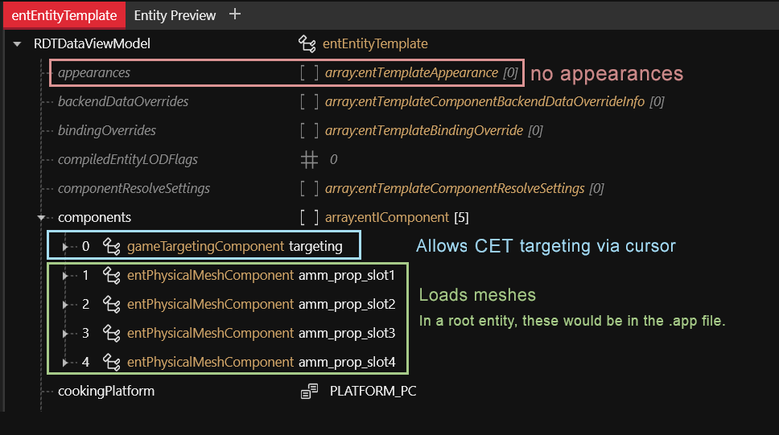
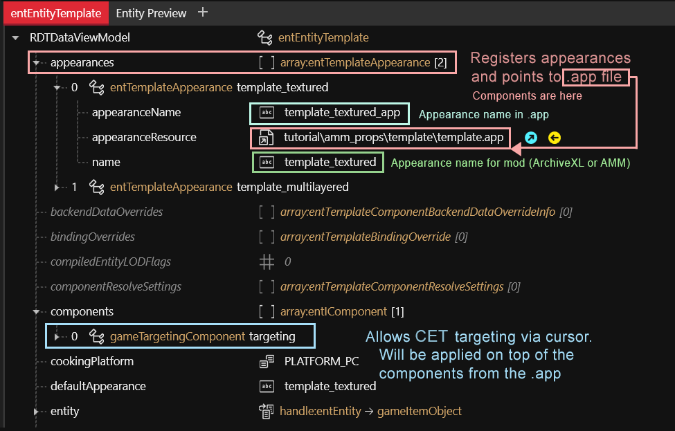

# Entity: .ent files

## Mesh/Component entity (simple entity)

Used to define game entities and the most straightforward way of adding a [custom prop](../../modding-guides/everything-else/custom-props.md) or [player clothing](../../modding-guides/items-equipment/adding-new-items/) to the game.

<figure><figcaption></figcaption></figure>

For **player equipment**, you can use entity files such as this one to **encapsulate** parts of your item. You load such .ent files via [partsValues](../../modding-guides/items-equipment/adding-new-items/#mesh\_entity.ent), and they will be added to the corresponding appearance as if the components had been in the .app file itself.

As of April 2023, this does **not** work for NPC appearances or custom props.

## Root entity

The **entry point** for the game to display an [NPC](../../modding-guides/npcs/appearances-change-the-looks.md#the-.ent-file) or [prop](../../modding-guides/everything-else/custom-props.md). This kind of entity usually doesn't have [components](../components/) by itself, but only points towards the [.app file](./#.app-appearance-definition) where they are defined.&#x20;

From ArchiveXL item additions, this kind of file is usually called a **root entity**.

<figure><figcaption></figcaption></figure>

* An entity file can define multiple appearances, which can point to different .app files.&#x20;
* For [creating props](../../modding-guides/everything-else/custom-props.md), **root entities** are used as the defining key (one entity => one item, which can have multiple appearances)
* Names support [suffixes](../../modding-guides/items-equipment/adding-new-items/#suffixes-and-whether-you-need-them), allowing you to load different appearances based on body gender or camera mode. These are only used for player clothing. They look like `&FPP`
* How you split your .app files is largely a matter of taste. At CDPR, they usually shove everything into one file.
