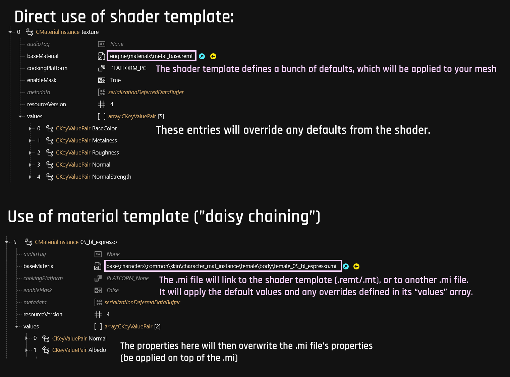

# 🔮 Textures, Materials and Shaders

This is the landing page for **materials** in Cyberpunk 2077. It contains a definition and a rough overview.&#x20;


Check the section's sub pages in the wiki's navigation tree for more detailed information about the different kinds of materials. Additional material-related information can be found here:


#### More intel and look-ups:

* [cheat-sheet-materials.md](../../modding-know-how/references-lists-and-overviews/cheat-sheet-materials.md "mention") for direct edits
* [3d-objects-.mesh-files.md](../files-and-what-they-do/3d-objects-.mesh-files.md "mention")and their materials
* [re-using-materials-.mi.md](re-using-materials-.mi.md "mention") – material template files explained

#### Hands-on:

* [changing-materials-colors-and-textures.md](../modding-guides/items-equipment/editing-existing-items/changing-materials-colors-and-textures.md "mention") (guide)

## Definition: Shader

In its original state, a 3d object ([mesh](../files-and-what-they-do/3d-objects-.mesh-files.md)) is a collection of **vertices** (pixels). The space between those vertices is filled by **faces**, which form the 3d object's surface.&#x20;

The shader is the thing that goes on top of the surface, rendering a **material** such as glass, skin, concrete, steel…


Without a shader, objects would be invisible in the game, the surface simply being transparent. In Cyberpunk, a default shader will be assigned in such cases (such as debug\_coloring.mt).


In Cyberpunk 2077, REDEngine shaders are implemented as `.mt`/`.remt` files.&#x20;

### How can I use shaders?

If you have ever messed with an item's materials, then you already have.&#x20;

To use a shader, you create a **Material Instance**, where you can configure the **parameters**. \
Not every parameter of a shader can be configured: since skin always has subsurface scattering, it makes no sense to tweak this. But since skin color already varies dramatically if you don't throw exotic chrome into the mix, you can change them easily via tint.

## Definition: Material&#x20;


For details how materials are used on a mesh, see the [corresponding wiki page](../files-and-what-they-do/3d-objects-.mesh-files.md), or learn how materials can be [loaded externally](../files-and-what-they-do/3d-objects-.mesh-files.md#material-reference-reusing-materials) from [material template files](re-using-materials-.mi.md).&#x20;


**In the context of Cyberpunk**, a material is the thing that lets the shader define the surface properties of a [3d-objects-.mesh-files.md](../files-and-what-they-do/3d-objects-.mesh-files.md "mention"). Typically, you create a local instance, which will then pull in a shader via `baseMaterial`.

The property `baseMaterial` can point at a `.mt` / `.remt` file directly, or to an intermediary `.mi` file:

<figure><figcaption></figcaption></figure>

The .mi file&#x20;


Each part of a mesh (submesh) can have a different material assigned.&#x20;

[Do you want  to know more?](../files-and-what-they-do/3d-objects-.mesh-files.md#chunkmaterials)



For a hands-on guide and something to play around/experiment with, check [here](../modding-guides/everything-else/textured-items-and-cyberpunk-materials.md).


## What kinds of material exist?

### Textured

If you have modded other games, you're used to PBR materials with a bunch of textures like **diffuse**, **normal,** **metalness** etc.&#x20;


To change a textured material, see [this guide](../modding-guides/items-equipment/editing-existing-items/changing-materials-colors-and-textures.md#step-2-finding-the-correct-appearance)



Did you know? You can make Cyberpunk's default textured material glow.


### Multilayered

This is specific to Cyberpunk, and it is incredibly cool. If you're used to textured materials, you're probably going to hate it at first, but it has incredible versatility and re-usability.&#x20;


* What is a [multilayered material](multilayered/) and how does it work?
* What are these [properties](multilayered/multilayered-material-properties.md), how do I use them?
* [Changing the colours](../modding-guides/items-equipment/editing-existing-items/changing-materials-colors-and-textures.md#multilayered-material)
* [Changing the mask](../textures/custom-multilayermasks.md)

