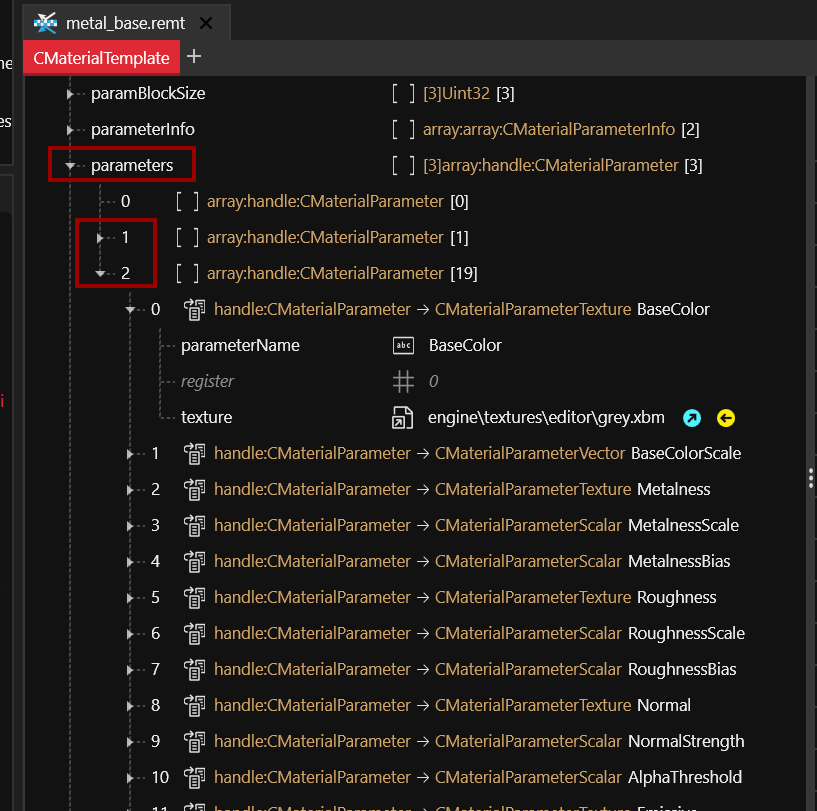
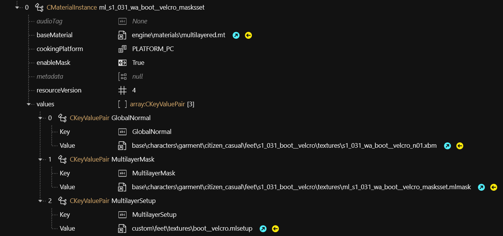

# Configuring materials

## Checking material properties

You can see a material's default properties by opening the `.(re)mt` file in WolvenKit and inspecting the parameters array. Any properties that you don't overwrite by adding them to your CMaterialInstance or .mi file will take the default properties specified in the file.

<figure><figcaption></figcaption></figure>

## Roughness/Metalness

<figure><figcaption>
A roughness/metalness preview. Yes, it's not a sphere. 
</figcaption></figure>

## Multilayered Material

For a full documentation, check the corresponding [page](multilayered.md).&#x20;

To set it up, use these keys for the "values" array of your material:

|                 |                                                                                                                     |
| --------------- | ------------------------------------------------------------------------------------------------------------------- |
| GlobalNormal    | path\to\normal.xbm                                                                                                  |
| MultilayerMask  | path\to\mask.mlmask ([white file](../references-lists-and-overviews/cheat-sheet-materials.md#white-multilayermask)) |
| MultilayerSetup | path\to\material.mlsetup                                                                                            |

<figure><figcaption>
an example multilayered material
</figcaption></figure>

## Textured Material

The most commonly used material for anything textured is `engine\materials\metal_base.remt`. Despite its name, this material isn't necessarily metallic.


You can also use this material as **emissive**, for a documentation, see [below](configuring-materials.md#emissive-material).&#x20;


To make your mesh load a texture, use the following `CKeyValuePair`s in your material's "values" array:

|           |                                                                                        |
| --------- | -------------------------------------------------------------------------------------- |
| BaseColor | path to your texture.xbm (Diffuse/Albedo)                                              |
| Roughness | path to your roughnessMap.xbm (if you have one)                                        |
| Metalness | path to your metalnessMap.xbm (if you have one)                                        |
| Normal    | path to your normalMap.xbm ([if you have one](../3d-modelling/self-made-normal-maps/)) |

<figure><figcaption>
example use of metal_base.remt as a textured material
</figcaption></figure>


The .xbm is a container around the texture. Export the xbm to png via WolvenKit.



If your texture has any brightness issues in-game, toggle around the isGamma flag during import.

The expected `isGamma` settings are:

normals: **false**\
diffuse/albedo: **true**\
anything that is used in .inkatlas files: **true**


### Further properties

|           |                                                                         |
| --------- | ----------------------------------------------------------------------- |
| LayerTile | 
Material scaling (zoom on surface) > 1 zooms in, >1 zooms out
 |

## Plastic

The most commonly used material for anything textured is `engine\materials\metal_base.remt`. Despite its name, this material isn't necessarily metallic.

To turn the material into plastic, use the following `CKeyValuePair`s in your material's "values" array:

<table><thead><tr><th width="232"></th><th></th></tr></thead><tbody><tr><td>BaseColor</td><td><code>base\materials\placeholder\white.xbm</code></td></tr><tr><td>Normal</td><td>optional: path to your normal map</td></tr><tr><td>Roughness</td><td>optional: path to your roughness map</td></tr><tr><td>RoughnessBias</td><td>0.200000003</td></tr><tr><td>BaseColorScale</td><td>Colour as x/y/z values (color picker blend file <a href="https://mega.nz/file/uE902LDQ#YmrHs0oAQBQqaFPjvYGazxI5s2LUlqzuNG14jU8Vgks">here</a>)</td></tr></tbody></table>

You can find a ready-to-download template [here](https://mega.nz/file/nElTyD6Z#LU5kYrd42ikOvWdWSVu51e0Brg0E-YqymCp5AgQdaLY).

## Emissive Material

You can make `engine\materials\metal_base.remt` glow by adding the correct parameters, or you can poke through the game files and search for `emissive > .mi` to find Cyberpunk material templates to learn from.&#x20;

For a list of such templates, check [here.](../references-lists-and-overviews/cheat-sheet-materials.md#emissive-materials)&#x20;

<table><thead><tr><th width="254"></th><th></th></tr></thead><tbody><tr><td>Emissive</td><td>path to emissive texture, e.g. <code>engine\textures\editor\white.xbm</code> The texture works like an alpha mask.</td></tr><tr><td>EmissiveEV</td><td>float, e.g. <code>2.0</code>: emissive brightness. Brightness varies depending on your colour. Unless you want to actively blind people, you might want to stay below 4.</td></tr><tr><td>EmissiveColor</td><td>Glow colour as RGB (copy from e.g. <code>mi_neokitsch_fridge_z_emissive.mi</code>)</td></tr></tbody></table>

Find a ready-to-use glowing .mi file [here](https://mega.nz/file/jZdCzRzT#7IJD9dQgBT11TCC2ckzD-FFvm0igbVOr19KqhxAx8Ag).

## Glass

Cyberpunk's glass material, such as `base\materials\glass_onesided.mt`


All glass materials can consider the vertex color attribute, which you can edit [directly in Blender](https://all3dp.com/2/blender-vertex-paint-simply-explained/).&#x20;


<table><thead><tr><th width="291"></th><th></th></tr></thead><tbody><tr><td>Opacity</td><td>float, <code>0.0 - 1.0</code>: Controls glass transparency. </td></tr><tr><td>GlassTint</td><td>A texture to tint your glass. (TBD: Does it work as a mask?)</td></tr><tr><td>TintColor</td><td>Glass tint as RGB (copy from e.g. <code>mi_neokitsch_fridge_z_emissive.mi</code>). </td></tr><tr><td>IOR</td><td><a href="https://pixelandpoly.com/ior.html">Index of refraction</a> as float, <code>1.0-2.0:</code> The refraction properties of your material.</td></tr><tr><td>Refraction Depth</td><td>float <code>0.0-10.0:</code> Control refraction amount here.</td></tr><tr><td>FresnelBias</td><td>float, <code>0.0 - 2.0</code>: How much does the glass behave like a lens (that is, warp the picture behind it)?</td></tr><tr><td>BlurRadius</td><td>float, <code>0.0 - 1.0</code>: Blur amount when looking through the glass</td></tr><tr><td>VertexColorTint</td><td>float, <code>0.0 - 1.0</code>: Transparency of vertex colour tint</td></tr></tbody></table>

Find a ready-to-use bottle glass .mi [here](https://mega.nz/file/XJshBTxT#OLiUH1UbZEBJG2izMX2egRxq7vVYzqjg9Tbj-7o2bYQ).&#x20;

### Non-warping glass

For a glass material without view distortion and warping, use `base\vehicles\common\materials\glass_windshield_tinted_black.mi`

<table><thead><tr><th width="291"></th><th></th></tr></thead><tbody><tr><td>Opacity/OpacityBackFace</td><td>float, <code>0.0 - 5.0</code>: Controls glass transparency. OpacityBackFace will only affect inside-facing normals.</td></tr><tr><td>FrontFacesReflectionPower / BackFacesReflectionPower</td><td>float, <code>0.0-10.0</code>: How strongly should the glass reflect?</td></tr><tr><td>TintColor/TintSurface</td><td>Surface and refraction color as RGB (copy from e.g. <code>mi_neokitsch_fridge_z_emissive.mi</code>). </td></tr></tbody></table>

Find a ready-to use glass .mi file [here](https://mega.nz/file/3UkRgJRJ#o8uHKkr1-LaHQ6eUwmbs9A08ZAE-pxYvlseQru9EGhg)&#x20;

### Half-transparent glass

`base\environment\decoration\electronics\devices\device_neokitsch\textures\device_neokitsch_glass_black.mi`

### Device screen glass

`base\fx\shaders\parallaxscreen.mt`

<table><thead><tr><th width="226"></th><th></th></tr></thead><tbody><tr><td>ParalaxTexture</td><td>Texture that your screen should display, e.g. <code>base\materials\placeholder\black.xbm</code></td></tr><tr><td>LayersSeparation</td><td>1</td></tr><tr><td>ScanlinesIntensity</td><td>0</td></tr><tr><td>ScanlinesDensity</td><td>0</td></tr><tr><td>Emissive</td><td>0</td></tr><tr><td>Roughness</td><td>0.200000003</td></tr><tr><td>Metalness</td><td>0</td></tr></tbody></table>

Find a ready-to-use example of a turned-off screen [here](https://mega.nz/file/mMsWlDja#QlZ-jsSHuIJ-E8jYmXRbzrk5wstsDOJXTK3pe7XP89I).

## Liquid

Cyberpunk has its own liquid shader(s) such as `base\materials\fillable_fluid_vertex.mt`. Projecting this material onto a submesh will turn the submesh into a transparent container filled with the liquid you specified. If you flip the container on its head, the fluid will drain to the bottom and fill it up again.

To control the offsets, you need to adjust the vectors FluidBoundingBoxMax and FluidBoundingBoxMin.

It shares various properties (such as IOR, FresnelBias, BlurRadius) with the [glass shader](configuring-materials.md#glass).

<table><thead><tr><th width="291"></th><th></th></tr></thead><tbody><tr><td>TintColor</td><td>liquid's color as RGB (copy from e.g. <code>mi_neokitsch_fridge_z_emissive.mi</code>). </td></tr><tr><td>FillAmount</td><td>float, e.g.<code>0.0</code>: Probably works in combination with the bounding box. You'll have to experiment.</td></tr><tr><td>FluidBoundingBoxMin FluidBoundingBoxMax</td><td>Vectors (X, Y, Z, W) controlling the maximum distance from the container's walls. Each value is a float (decimal) speficying the axis in question - you'll simply have to play around with them (you can ignore W).   For a bottle material I've used  Max: 0.03, 0.03, 0.155 Min: -0.03, -0.03, 0.09</td></tr></tbody></table>

Find a ready-to use (black) liquid .mi file [here](https://mega.nz/file/yVkkjRKS#ii5dB7P1OcwLk-VIBKiU9Ou31dloSO7k1hjEryAj9Ok).
