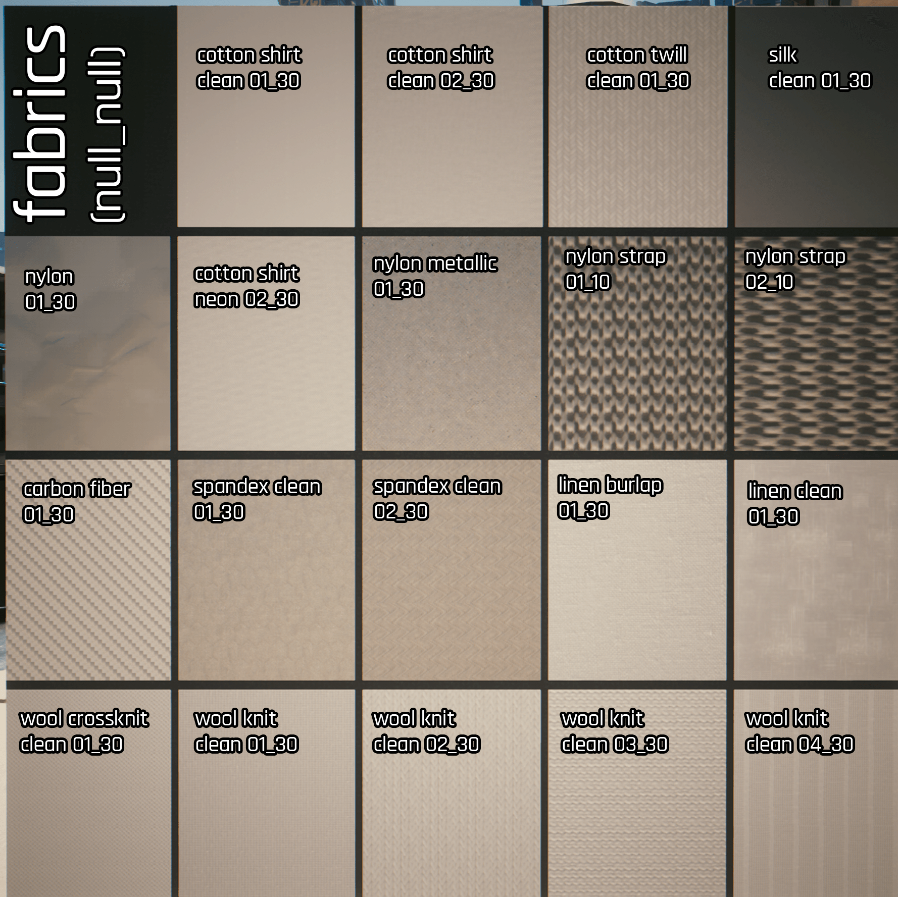

# Multilayered: Previews

## 3D Rendered Previews
@jato on the [Cyberpunk 2077 Modding Community Discord server](https://discord.gg/Epkq79kd96) has created 3D rendered previews as `.jpeg` files of all the `.mlsetups` in the game. Original post can be found [here](https://discord.com/channels/717692382849663036/1021790625265369218). A `.zip` is also [hosted](../../../.gitbook/assets/MLTEMPLATE_previews.zip) on this Wiki.


More accurate previews rendered in-game (as seen below) can be created with the [Material Preview AMM Prop](https://www.nexusmods.com/cyberpunk2077/mods/10515).&#x20;


## Assorted Misc

ToDo: These need to be grouped (one picture per type), and then they need to be linked with nice headers. But I'd rather put them on here before they rot away on my disk for a few more months

### fabric materials

<figure><figcaption></figcaption></figure>

<figure><figcaption></figcaption></figure>

<figure><figcaption></figcaption></figure>

<figure><figcaption></figcaption></figure>

## bronze\_roof\_tile\_bare

### roughness and colour

<figure><figcaption>
How roughness affects a material (the colour was not changed)
</figcaption></figure>

## Silver

### material variants

<figure><figcaption></figcaption></figure>

## Metals: rolled

<figure><figcaption></figcaption></figure>

## Plastic

### Plastic Tech HQ

<figure><figcaption></figcaption></figure>
