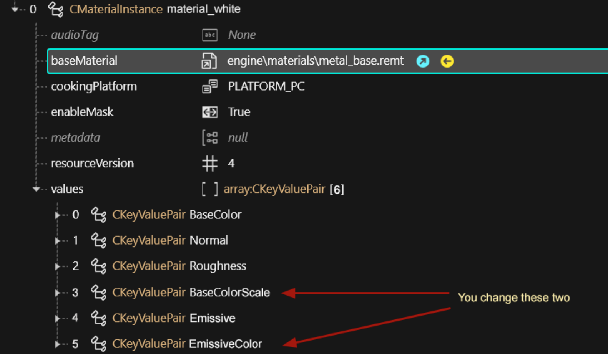
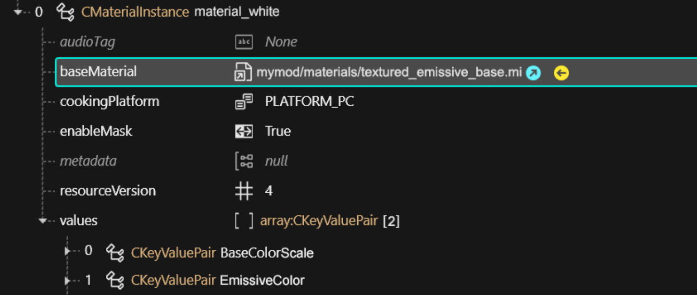
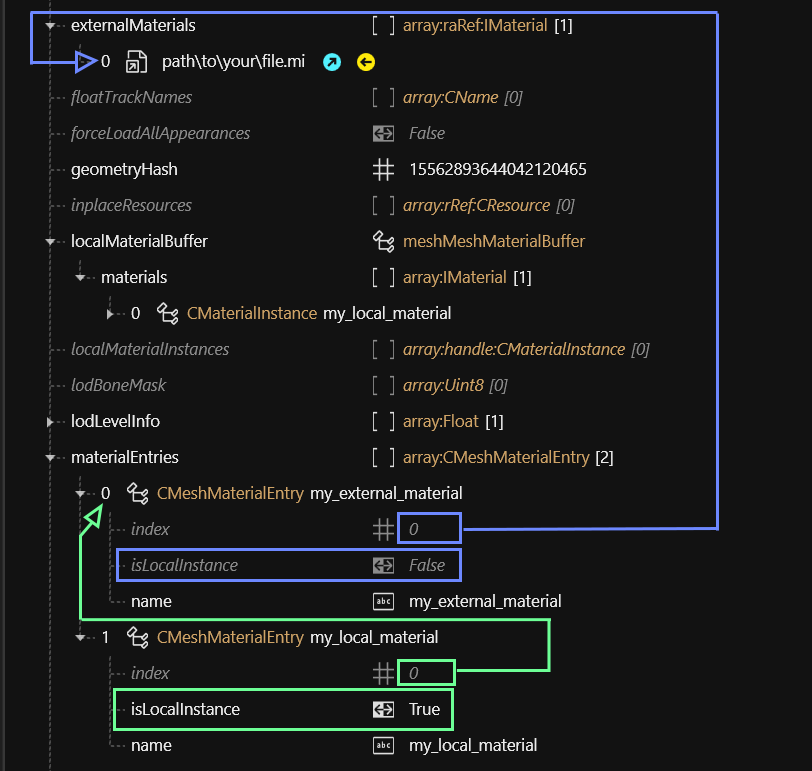

# Re-using materials: .mi

Put yourself in the shoes of a hypothetical modder.

* You are creating a mod that offers multiple versions of the same item (e.g. toy props or hair)&#x20;
* You have created a base material
* You duplicate and re-duplicate the material for each of your variants, changing the properties that defines the colour
* You wish that there was less copy-pasting involved

<figure><figcaption><p>You only change 2 of 6 properties, but you always have to copy all of them!!</p></figcaption></figure>

## .mi files to the rescue

A .mi file **encapsulates** a material in a **reusable** template file. Take any of them from the game, move them to your custom directory, and group all the properties that you keep copy-pasting into the .mi.&#x20;

Then, in your material, you can now use your .mi file as `baseMaterial`, and only change the properties that are actually different!


For a collection of example .mi files, check [manavortex's MEGA](https://mega.nz/folder/KJ8DnBhK#VG0KzRhedBMRRsfd0Cdc0A).


Instead of copy-pasting six properties, you now copy-paste only two.

<figure><figcaption><p>Only add the properties that you want to change in relation to the .mi file</p></figcaption></figure>

## Making material templates

Let's take it another step further – we can make a bunch of different colours to re-use across your files. An example for this are hair files, or the plastic materials I've used in my [toy prop pack](https://www.nexusmods.com/cyberpunk2077/mods/7391).

<figure><figcaption></figcaption></figure>

For this, I first created a `plastic_base.mi` with all the common properties, and then created one additional .mi file for each shade of plastic, **setting plastic\_base.mi as baseMaterial**, leaving me with the following folder structure:

```
- materials
  - plastic
    - _plastic_base.mi   << baseMaterial for all materials below
    - plastic_black.mi
    - plastic_yellow.mi
    - plastic_red.mi
    - plastic_green.mi
    - plastic_purple.mi
    - plastic_pink.mi
    - plastic_orange.mi
    - plastic_blue.mi
```

If I decide that my plastic is too shiny, I can edit `_plastic_base.mi` instead of touching every template individually. Pretty neat, isn't it?

<figure><figcaption><p>The technical term for doing this is "daisy chaining". (Image: Wikimedia commons)</p></figcaption></figure>

And if one of my items happens to have a custom normal map and/or texture, then I just add them in the `values` array of my material and call it a day.

## Maximally lazy: external materials

But we can take this approach even further! If you **don't** have any properties, your mesh doesn't even need materials! You can simply use the `externalMaterials` list instead. You do this by unticking the isLocal property in the materialEntries definition:

<figure><figcaption><p>material entries and indices</p></figcaption></figure>

## Warning

You can of course mix and match local and external materials! Just make sure that the materialEntries indices are pointing at the correct material.&#x20;

However:


If you are using `preloadLocalMaterials`, you need to use `preloadExternalMaterials` instead of `externalMaterials.`


