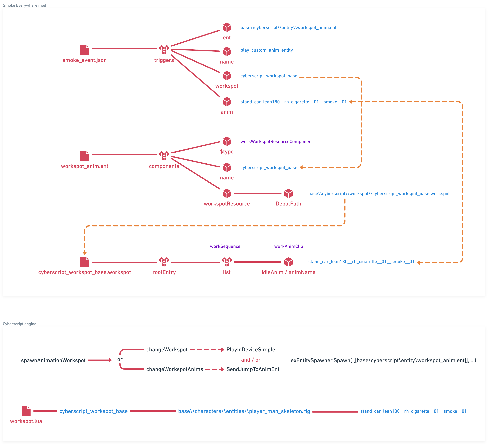

# Abusing workspots

### Credits

First of all, let's give credits to people out there:

* [Cyberscript](https://www.nexusmods.com/cyberpunk2077/mods/6475) and [Smoke Everywhere](https://www.nexusmods.com/cyberpunk2077/mods/7768) authors **donk7413** and **Eli**,\
  who originally found out how to play animation through workspots.\
  All credits to them in that regard.
* **psiberx** for his numerous hints and advices, as always.

### How to ?

It started from a talk with **@Eli** and **@donk7413** the authors of [Cyberscript](https://www.nexusmods.com/cyberpunk2077/mods/6475) and [Smoke Everywhere](https://www.nexusmods.com/cyberpunk2077/mods/7768) mods.

When asked details about how they managed to have V smokes a cigarette anywhere in-game, they mentioned having merged all `.workspot` files in a gigantic file for convenience (namely [Cyberscript Core Animation Archive](https://www.nexusmods.com/cyberpunk2077/mods/7691)), so that **Cyberscript** can play any animation in-game on V or any NPC.

At first it didn't ring a bell, but then **@psiberx** mentioned about modders "abusing" `.workspot` by spawning an invisible `.ent` to have the target being animated.

#### :thinking: ...

The trick is actually to spawn an invisible device (`.ent`) right onto your entity, which then allows to trigger animation(s).

#### WolvenKit

So it happens that we need a `.ent` file whose `components` contains a `workWorkspotResourceComponent` which references a `.workspot` by `name` and `DepotPath`.

In turn, `.workspot` file contains a list of `worksSequence`s containing `workAnimClip`s which are the animations to play with `idleName` and `animName`.

Of course the `.ent` must be made invisible and contain a set of specific properties, and this is where all hard work was already made by **Cyberscript** people.

[💡](https://emojipedia.org/light-bulb/) _Generally speaking if you need to play a ton of animations I would recommend you to use_ **Cyberscript** _directly, since it already does everything for you and also comes up with a ton of useful more features to build a mod with ease._

> On the other hand, if like me you only want to play 1 or 2 animations at most,\
> then it's probably a lot of overhead and you can keep reading.

What I personally did was to reuse **Cyberscript** archive `.ent` stripped of `components` that I don't need, and `.workspot` with only the animations that I'm interested into.

<figure><figcaption></figcaption></figure>

#### Redscript

Once archive is ready, we need something able to spawn an entity in **Redscript** (once again if your preference goes to **Lua**, I'd recommend you to use **Cyberscript** directly).

This is exactly what [Codeware](https://github.com/psiberx/cp2077-codeware) offers with `DynamicEntitySystem`: see ["Entities" in its wiki](https://github.com/psiberx/cp2077-codeware/wiki#entities)!

Here's a short example which will get us going:

```swift
// minimal example
// use in CET console like: Game.GetPlayer():Smoke();

@addMethod(PlayerPuppet)
public func Smoke() -> Void {

    // first listen for entity spawning events
    // this is because spawning happens asynchronously
    GameInstance
        .GetDynamicEntitySystem()
        .RegisterListener(n"MyMod", this, n"OnEntityUpdate");

    let spec = new DynamicEntitySpec();

    // then designate entity to spawn
    spec.templatePath = r"base\\mymod\\entity\\smoke.ent";
    
    // position it on the player
    spec.position = this.GetWorldPosition();
    spec.orientation = EulerAngles.ToQuat(Vector4.ToRotation(this.GetWorldPosition()));

    // add a tag to differentiate it once spawned
    // this is because DynamicEntitySystem listen to all the entities spawned
    // not just the ones it creates
    spec.tags = [n"MyMod"];

    // process with entity spawning ...
    GameInstance
        .GetDynamicEntitySystem()
        .CreateEntity(spec);
}

// and this is the method that will be called by DynamicEntitySystem
// with entity spawning events
@addMethod(PlayerPuppet)
private cb func OnEntityUpdate(event: ref<DynamicEntityEvent>) {

    // make sure this is our .ent and it has spawned succesfully
    if Equals(event.GetTag(), n"MyMod") && Equals(EnumInt(event.GetType()), EnumInt(DynamicEntityEventType.Spawned)) {

        // retrieve our invisible device
        let device = GameInstance
            .GetDynamicEntitySystem()
            .GetEntity(event.GetEntityID()) as GameObject;

        // make our player enter workspot
        GameInstance
            .GetWorkspotSystem(this.GetGame())
            .PlayInDevice(device, this);

        // when player smokes,
        // it probably need to own a cigarette and a lighter in the first place :)
        GameInstance
            .GetTransactionSystem(this.GetGame())
            .GiveItem(this, ItemID.FromTDBID(t"Items.crowd_cigarette_i_stick"), 1);
        GameInstance
            .GetTransactionSystem(this.GetGame())
            .GiveItem(this, ItemID.FromTDBID(t"Items.apparel_lighter_a"), 1);

        // and these objects better be in his/her hands too :)
        GameInstance
            .GetTransactionSystem(this.GetGame())
            .AddItemToSlot(this, t"AttachmentSlots.WeaponLeft", ItemID.FromTDBID(t"Items.crowd_cigarette_i_stick"));
        GameInstance
            .GetTransactionSystem(this.GetGame())
            .AddItemToSlot(this, t"AttachmentSlots.WeaponRight", ItemID.FromTDBID(t"Items.apparel_lighter_a"));
        let left = new AIEquipCommand();
        left.slotId = t"AttachmentSlots.WeaponLeft";
        left.itemId = t"Items.crowd_cigarette_i_stick";
        let right = new AIEquipCommand();
        right.slotId = t"AttachmentSlots.WeaponRight";
        right.itemId = t"Items.apparel_lighter_a";
        let controller = this.GetAIControllerComponent();
        controller.SendCommand(left);
        controller.SendCommand(right);
        
        // more steps eluded for simplicity:
        // you probably wanna play SFX and VFX too... 

        // finally start anim on player!
        GameInstance
            .GetWorkspotSystem(this.GetGame())
            .SendJumpToAnimEnt(this, n"stand_car_lean180__rh_cigarette__01__smoke__01", true);
            
        // from there on, you probably want to use Callback
        // and coordinate each step of the anim :)
    }
}
```

### Clearing misconceptions

Actually the ones I personally had before:

* `.ent` can be anything, not just a "living entity". it can be a cigarette, the act of smoking.. it can really be "whatever".
  * it contains `components` with e.g. `workspotMapper`, `entSlot`, etc
  * it also contains obviously a `workWorkspotResourceComponent` with points out to the `.workspot`.
* `.workspot` gets triggered throughout `.ent`: _you don't spawn a workspot and play it on a target_, you spawn an entity which references the workspot and plays the workspot through the entity (which in turn play the animation(s), and you can "jump" from one animation to another in the same workspot).

