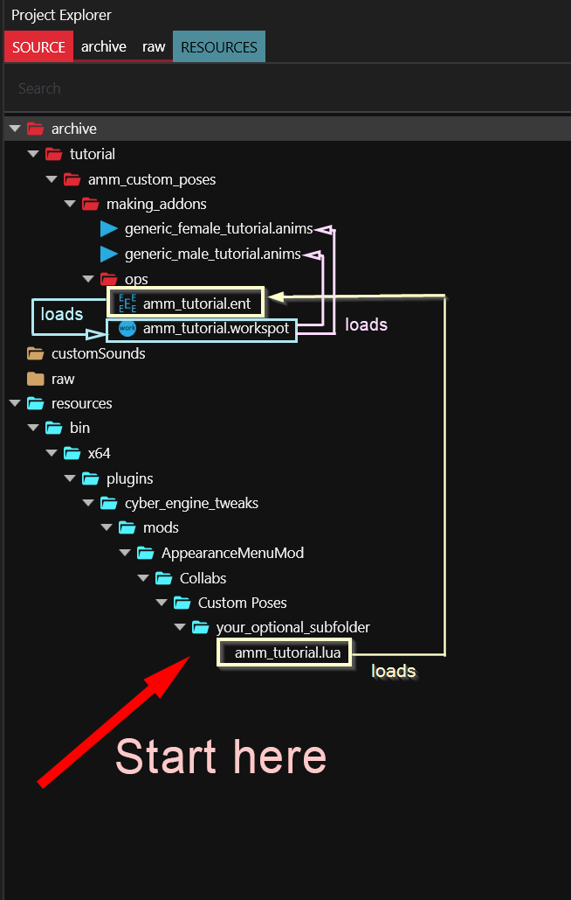
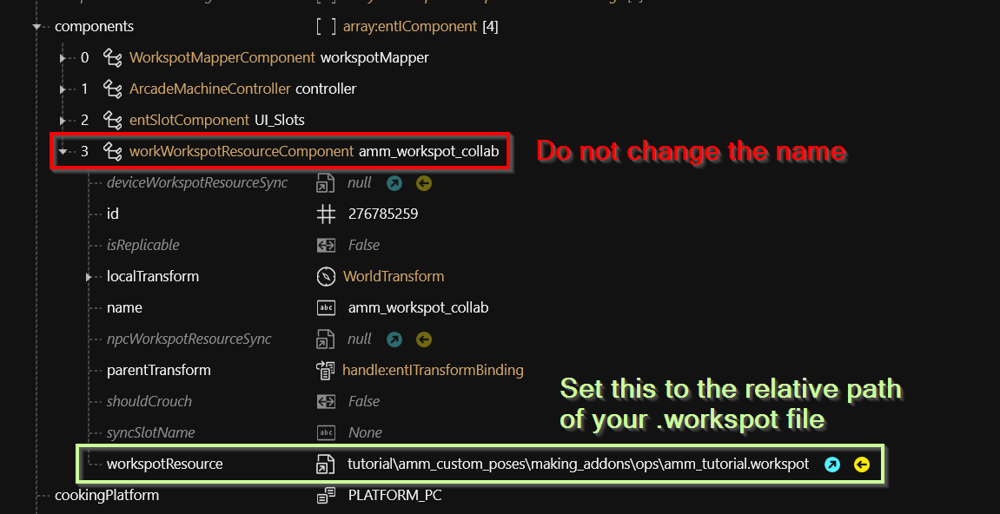
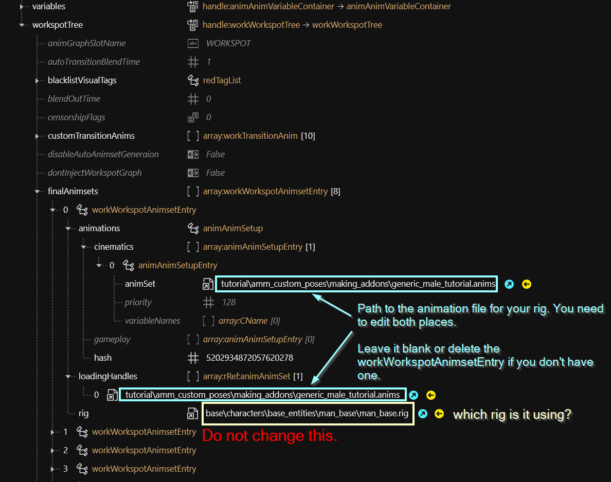
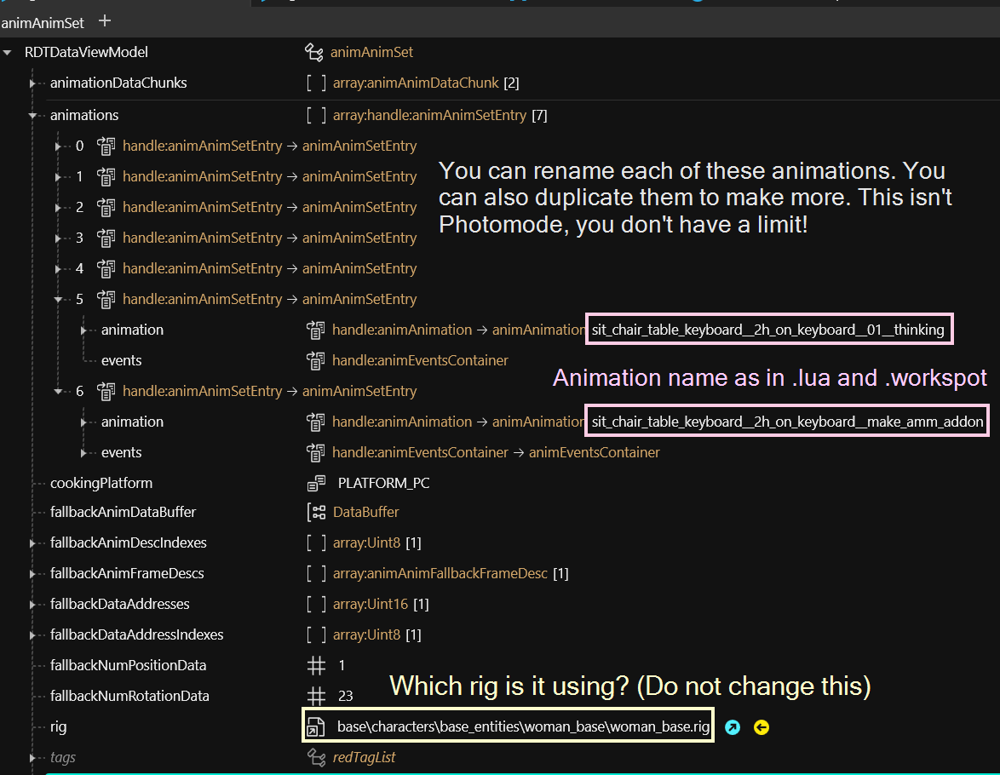

# AMM: Collab anims/poses

## Summary <a href="#summary" id="summary"></a>

**Created by @manavortex**\
**Published April 16 2023**

#### **Versions:**&#x20;

| Wolvenkit         | >= 8.9.0 (or whatever works for you)         |
| ----------------- | -------------------------------------------- |
| AppearanceMenuMod | >= 2.2 (earlier versions won't support this) |

This guide will teach you how to add custom animations to **AppearanceMenuMod**'s `Pose` tab.

**Difficulty level:** You know how to make [custom poses or animations](https://xbaebsae.jimdofree.com/cyberpunk-2077-tutorials/cp2077-custom-poses-and-animations/), and you're able to read. You don't even need to know your way around Wolvenkit for this one!



This tutorial will use `animation` and `pose` interchangeably. An animation is simply a pose that moves.


## Getting started

Create a new Wolvenkit project and download the prepared files from mana's mega, either

* the [source folder](https://mega.nz/file/fI9jUCqS#OeYhXBcb9EOnnPdtMmF08P9F8ki9yNdQWcg71CKRZiA) for a working project that you can use immediately
* the [files](https://mega.nz/file/fI9jUCqS#OeYhXBcb9EOnnPdtMmF08P9F8ki9yNdQWcg71CKRZiA) to set up your own structure and start from scratch

The screenshots show the example project, but it's absolutely no problem if you set up everything on your own: the guide will tell you which path goes where.

<figure><figcaption></figcaption></figure>


If you have downloaded the example Wolvenkit project, you can start it (the "Install" button has an "Install and launch" option in the dropdown) to see everything in action: \
\- Spawn an NPC (generic male or female)\
\- Switch to the `Poses` tab\
\- Find the `Netrunner making AMM mods` category and select one of the poses\
\- Your NPC should now move!


## Connecting the files

Start by customizing your file structure. If you leave it as it is and publish the mod and somebody else does the same, only one of the two will work. Create a folder structure that is unique to you.


It is good practice to leave `base` for the game files, and simply have a folder with your username at the root level of `archive`.&#x20;



Your file structure **must not** contain spaces, capital letters, or any funky characters, or the game might not find your files. Stick to `a-z`, `0-9`, `-` and `_`, and you're safe.


### File structure: The .lua

1. Rename `your_optional_subfolder` to something you want to group by, e.g. your username. You can also remove it, we only need the file
2. Rename `amm_tutorial.lua` to something that identifies your pose pack, e.g. `netrunner_coding`
3. Open the file in a text editor. Let's look at the entries (we'll ignore anims for now and look at it in the second part about customizing animations):

```lua
return {
  -- Your beautiful name :)
  modder = "your_name_here",
  
  -- A custom category for your poses that will appear on the list in the tab. 
  -- You could use your name or a description of your pose pack. 
  -- You can also add your stuff to a category that somebody else has already defined.
  category = "Netrunner making AMM mods",
  
  -- relative path to your ent file. You can copy this from Wolvenkit.
  -- Don't forget to add the extra slashes!
  entity_path = "tutorial\\amm_custom_poses\\making_addons\\ops\\amm_tutorial.ent",
  
  -- we'll get to these at "Custom Poses: The .lua"
  anims = { --[[ here be code ]]  }
}
```

4. Change `modder` to your name so people know who made this.
5. Change `category` to the name of your pose pack. This will be used for AMM to sort your poses into categories, which people will use to browse, so don't go overboard.
6. Change `entity_path`: Right-click on your .ent file in WKit and select `Copy relative Path` and paste it into the lua. \
   Don't forget the duplicate `\`.&#x20;

### File structure: The .ent

Open the `components` array, find the component with the name of `amm_workspot_collab`, and set the depotPath of workspotResource to the relative path of your [`.workspot`](amm-collab-anims-poses.md#file-structure-the-.workspot) file.

Do not change anything else — we're done here.

<figure><figcaption></figcaption></figure>

### File structure: The .anim


You don't need to change anything here yet, we'll be doing this [in the next step](amm-collab-anims-poses.md#custom-poses-the-.anims).


An .anims file is targeting a specific rig and holds a list of animations. These hold the pose data; they're what you overwrite when [importing from Blender](https://xbaebsae.jimdofree.com/cyberpunk-2077-tutorials/cp2077-custom-poses-and-animations/).

### File structure: The .workspot

Scroll to the bottom of the file and  find the node named `workspotTree`. Open it and find the list `finalAnimsets`.&#x20;

Each of the `workWorkspotAnimsetEntries` inside `finalAnimset` connects animation files and rigs.&#x20;


You can delete entries if you don't have animations for that rig.



The tutorial version uses the same .anim file for V's first person animations. Looks weird, but works. You can change it later on your own.


<figure><figcaption></figcaption></figure>

For each of the entries you keep, make sure that the following paths point at the right animset:

* `animations.cinematics[0].animSet`
* `loadingHandles[0]`


If you have launched the game before, make sure to delete the file&#x20;

`Cyberpunk 2077\bin\x64\plugins\cyber_engine_tweaks\mods\AppearanceMenuMod\Collabs\Custom Poses\your_optional_subfolder\amm_tutorial.lua`



A good time to check: make sure that everything works again and that the files are correctly connected. If not, check the [troubleshooting section](amm-collab-anims-poses.md#troubleshooting) of this guide.


## Custom poses

Now that we have the basic structure covered, let's talk about pose names. This time, we start at the end and make our way backwards.&#x20;

### Custom poses: The .anims


Files for each type of rig are included in the example files, but you can also find them yourself by searching Wolvenkit for `rigName > .anims` or `character > .anims` (e.g. `massive > .anims` or `Smasher > .anims`)


Find and open your .anims file. Here's what you're looking at:

<figure><figcaption></figcaption></figure>

Open the animations array to see data for all defined animations (poses). You can make more by duplicating them, delete obsolete entries and change their names; any other changes are coming from Blender.


An animation's name must match the `.lua` and the `.workspot`, spelling mistakes will break it. They must not contain spaces, use `_` instead. AMM will take care of that for you.


### Custom poses: The .workspot

Open your .workspot file and expand the following nodes:&#x20;

* workspotTree
  * rootEntry
    * list

This list contains two `workSequences`. This data type is used for pose transitions and -definitions (e.g. an NPC standing up). For our purpose, we don't need any of the fancy stuff. Here's how they look:

<figure><figcaption></figcaption></figure>

1. Open the `workSequence` and expand both `id` and `list`.
2. Expand the first list entry (`workAnimClip`) and its proprety `id`.
3. Point it at the right animation: Change the `workAnimClip`'s property `animName` to the name of your animation (_green on screenshot_)
4. Skip this for the two default entries.
   1. Find the `workSequence`'s property `id` and add two to its numeric value (_orange on screenshot_)
   2. Find the `workAnimClip`'s property `id` and add two to its numeric value (_orange on screenshot_)
5. **Optional, but recommended:** Set the `workSequence`'s property `idleAnim`  to the name of your appearance (_purple on screenshot_). This is purely for your convenience, as you can see which is which when scrolling through the list.


The numeric values for the `id` properties need to be **unique** within the scope of the `workspotTree`. As soon as you have duplications here, things will be out of order.


### Custom poses: The .lua

As of version 2.2, AMM doesn't know anything about the file structure. For that reason, you need to tell it about the poses you added, and the anims array is how you do that.

```lua
  anims = {        
      ["Man Average"] = {                       -- male body gender, e.g. spawned masc V, Johnny, Viktor, Takemura…
        "sit_chair_table_keyboard__2h_on_keyboard__make_amm_addon",
        "sit_chair_table_keyboard__2h_on_keyboard__01__thinking",
      },                    
      ["Woman Average"] = {                     -- female body gender, e.g. spawned femme V, Panam, Judy, Mamá Welles…
        "sit_chair_table_keyboard__2h_on_keyboard__make_amm_addon",
        "sit_chair_table_keyboard__2h_on_keyboard__01__thinking",      
      },                   
      ["Big"] = {},                             -- any body gender: big folks, e.g. Jackie, River, Rhino…
      ["Child"] = {},                           -- any body gender: children
      ["Fat"] = {},                             -- any body gender: fat folks, e.g. Dexter
      ["Man Massive"] = {},                     -- Smasher      
      ["Player Man"] = {},                      -- first person: male body gender V
      ["Player Woman"] = {},                    -- first person: female body gender V
  }
```

The lists tell AMM which poses belong to which rig, allowing to hide them when they aren't supported. As you can see, it's no problem if there are duplicate names, and you can even reuse entries in the workspotTree — the game knows which animation to use because of the [file structure above](amm-collab-anims-poses.md#connecting-the-files).

## Troubleshooting


If you have launched the project in its default state before starting to customize it, delete the file&#x20;

`Cyberpunk 2077\bin\x64\plugins\cyber_engine_tweaks\mods\AppearanceMenuMod\Collabs\Custom Poses\your_optional_subfolder\amm_tutorial.lua`



A pose gets correctly added by AMM if you see it in the list and can delete it.


### AMM doesn't show my poses

The problem is in your `.lua`, AMM fails to pick up the pose information you provided. You can check `AppearanceMenuMod.log`, which might tell you what's wrong, but it's probably fastest to just start over from the template `.lua` file.&#x20;


Make sure that you don't add or delete any commas or quotation marks.


### I click, but nothing happens (no pose shows up in AMM)

The problem is between your `.lua` and your `.ent` file: the poses were registered correctly with AMM, but Cyberpunk can find nothing to spawn.&#x20;

### The NPC briefly T-poses, and then the game crashes

Check your [`.workspot` file](amm-collab-anims-poses.md#file-structure-the-.workspot) for copy-paste mistakes when hooking up your .anim files.

### My custom pose changes are ignored

The error is between Blender and your .anims file. Double-check names and make sure that you actually imported.

### The wrong pose is triggered

You messed up the indices in the `.workspot` file. [Go back](amm-collab-anims-poses.md#custom-poses-the-.workspot) and make sure that they're all unique.


