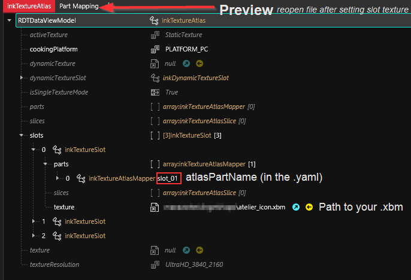
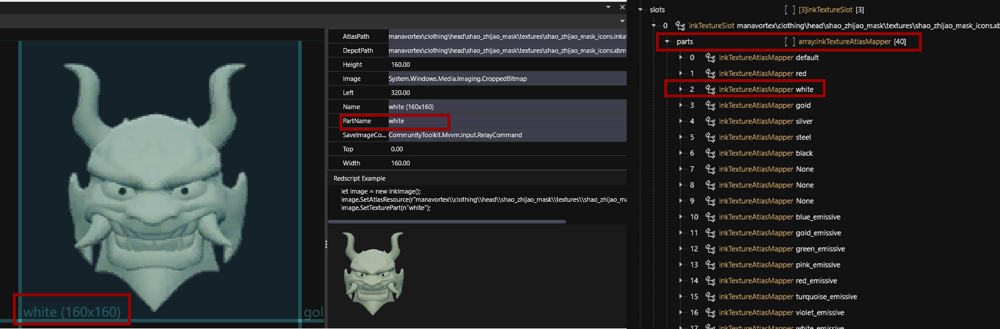

# Your own preview icons

## Summary

**Created by** [manavortex](https://app.gitbook.com/u/NfZBoxGegfUqB33J9HXuCs6PVaC3 "mention")\
**Updated July 27. 2023**

The guide below will teach you how to make preview icons. While it's a technically a subsection of the [ArchiveXL item additions guide](../../items-equipment/adding-new-items/), you can use the steps below to make any kind of preview item.

**Difficulty Level**: You know how to read and can either edit images or make use of [the corresponding guide](../../textures-and-luts/images-importing-editing-exporting.md). It's easy!


If you want to have gendered preview icons, check [here](gendered-preview-icons.md).


## The required files

If you downloaded the example project ([#getting-the-files](../../animations/archivexl-adding-photo-mode-poses.md#getting-the-files "mention")), the preview is already hooked up. Otherwise, [download](https://www.mediafire.com/file/3slvnkhjbz0jt65/inkatlas\_templates\_apart\_v1.zip/file) the template archive (kindly provided by Apart).

### Go away with your examples, I'll do everything by hand!

Okay, you do you. Here's how:

<details>

<summary>Finding the files by hand</summary>

1. search in Wolvenkit for `icons > .inkatlas`
2. Pick one of CDPR's icon files (look inside first, you want the right kind of icon — weapons have different icons than equipment) and add it to your project
3. Right-click on the file in the asset browser and select "`find used files`"
4. Find the `.xbm` file and add it to your project as well
5. **Move** both of these files to your custom folder, as you don't want to overwrite game default icons
6. Optionally: Re-name them. This guide assumes that they're named `preview_icons.inkatlas` and `preview_icons.xbm`

</details>

You should now have a structure like this:&#x20;

```
tutorial  
	ops		   
      	- my_tshirt_factory.csv 
      	- translation_strings.json  
      	- preview_icons.inkatlas       <<<  
      	- preview_icons.xbm            <<<  
```

## Taking preview pictures

You have two options on taking preview pictures. Both are relatively tedious, since you have to do it by hand. This is not a step-by-step, but you can find a few pointers here:

### Blender

You [can export your mesh with all its materials](../../../modding-tools/wolvenkit-blender-io-suite/wkit-blender-plugin-import-export.md#export-from-wolvenkit) to Blender and take your preview pictures there:

<figure><figcaption></figcaption></figure>

### In-game

* Make sure V isn't on the screenshots with [Appearance Menu Mod](https://www.nexusmods.com/cyberpunk2077/mods/790)'s `invisible V` toggle, [Invisible Character](https://www.nexusmods.com/cyberpunk2077/mods/6449), or the [ArchiveXL Invisibility Cloak](https://www.nexusmods.com/cyberpunk2077/mods/8412)
* Get an outfit manager like [Wardrobe](https://www.nexusmods.com/cyberpunk2077/mods/2176?tab=files\&file\_id=32757\&nmm=1) to create outfits where V is wearing nothing but the item
* Optional: Use [AMM Photo Studio Props](https://www.nexusmods.com/cyberpunk2077/mods/7436) for backgrounds — it has black, white, or greenscreen

## Fixing up your texture

1. Export the original .xbm file via Tools -> Export Tool
2. Find the resulting file under "raw"&#x20;
3. Open it in your image editor
4. Edit it to your heart's content
5. Overwrite the png file with your edited one. [Mind the transparency](../../textures-and-luts/images-importing-editing-exporting.md#editing-a-texture)!
6. [Import it back](../../textures-and-luts/images-importing-editing-exporting.md#importing-a-texture).

## Hooking up the inkatlas

1. Open the file in WolvenKit.
2. Open the list `slots`.
3. For the first two `inkTextureSlot` items, set the value for `DepotPath` to the relative path of your xbm (`tutorial\torso\my_custom_shirt\ops\preview_icons.xbm`):

<figure><figcaption></figcaption></figure>

4. Save the file. If it doesn't update, close and re-open it.
5. You now have a tab "PartMapping". You can see which texture corresponds to which slot by selecting it in the other tab and checking the `partsName`, which corresponds to the entry in the slot's  `parts` array:

<figure><figcaption></figcaption></figure>


Congratulations! You now have a preview icon!


## Using it

You can now hook up your preview icon(s) to whatever mod you are making.&#x20;


If you want to use gendered preview icons, check [here](gendered-preview-icons.md). In this case, you do **not** add an icon record to your item.


### ArchiveXL: Add it to the .yaml

Check the code box below — the last three lines add a preview icon.

```
Items.my_custom_shirt_redwhite:
  $base: Items.GenericInnerChestClothing
  entityName: my_custom_shirt_factory_name
  appearanceName: appearance_root_entity_white_red
  displayName: my_shirt_localization_name_white_red
  localizedDescription: my_shirt_localization_desc
  quality: Quality.Legendary
  appearanceSuffixes: []
  icon:
    atlasResourcePath: tutorial\torso\my_custom_shirt\ops\preview_icons.inkatlas
    atlasPartName: slot_01
```

Please refer to the [ArchiveXL guide](../../animations/archivexl-adding-photo-mode-poses.md) for an explanation of the other properties, as this page will only hold information about preview icons.

* `atlasResourcePath`: relative path to your .inkatlas file
* `atlasPartName`: slot name in your .inkatlas file (which you can see in the `PartsMapping` tab)


Again, please note that indent is **crucial** here, as it determines the node structure. The first line needs to have an indent of 0, the lines from `$base` to `icon` need to have two spaces, and the lines `atlasResourcePath` and `atlasPartName` need to have four.


## That's it! Time to test!

If you run into any issues with your texture's transparency, please [check the textures import/export guide!](../../textures-and-luts/images-importing-editing-exporting.md)
