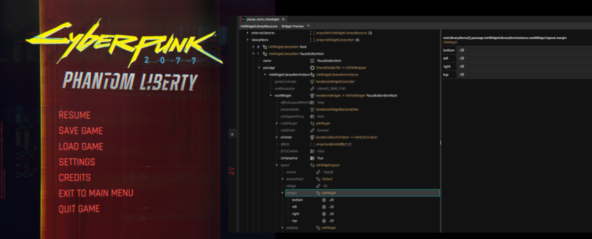

# Menu editing

## File paths

The root menu when you start the game:

```
base\gameplay\gui\fullscreen\main_menu\singleplayer_menu.inkwidget
```

The pause menu when you press ESC:

```
base\gameplay\gui\fullscreen\pause_menu\pause_menu.inkwidget
```

## Button height:

You can pull items further together by setting a negative margin. This won't influence the size of the background boxes, so you'll have to edit the child items as well:

<figure><figcaption></figcaption></figure>
